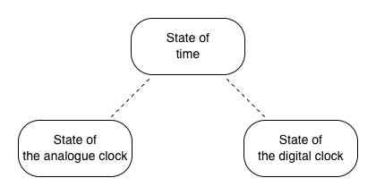

# Review of state management in React: getting started with an MVC example

To develop a good React app, doing good state management is necessary. Today in React, we have kinds of practices about state management and some of them have ended up as widely-accepted libraries. Though, there is no clear winner yet and new wheels are still being invented actively, which means none of the widely-accepted libraries is obviously better than the rest in the view of the user devs. And, it drives me to think about 2 questions:

1. How good are today's widely-accepted libraries of state management in React?
1. What does a better library of state management in React look like?

To answer the question #1, I would find a most commonly used way of doing state management before any library of state management emerged to build a complicated enough example module as a baseline. Then, for each today's widely-accepted library, I rebuild the same example module with it and review how good it is in comparison with the baseline.

To answer the question #2, I would try best to think up a way of doing state management by making the best of today's widely-accepted libraries based on the answer to the question #1. But at this stage, only the idea is described, by which I wish the posibility for better ways gets sown.

To complete the work, a series of articles entitled with 'Review of state management in React: ...' are getting written. And, this article, as the starting of the series, states the introduction as above and the former part of the answer to the question #1 as below.

## Model-view-controller(MVC) pattern

Since MVC pattern was [formally introduced](https://scholar.google.com/scholar?q=A+Description+of+the+Model-View-Controller+User+Interface+Paradigm+in+the+Smalltalk-80+System), it along with its variants has been dominating the engineering method of developing interactive systems. And, it says:

> _Models_ are those components of the system application that actually do the work (simulation of the application domain). They are kept quite distinct from _views_, which display aspects of the models. _Controllers_ are used to send messages to the model, and provide the interface between the model with its associated views and the interactive user interface devices (e.g., keyboard, mouse).


As models simulate the app domain, the states of models can directly represent the states of the app, which indicates MVC pattern is doing state management.

So, I would select MVC pattern as the previously mentioned 'most commonly used way of doing state management before any library of state management emerged' to build the example module.

## Requirement of the example module

To make effective comparisons, the example module should be complicated enough. It should consist of at least 2 components with multiple related states handling user interactions to a certain degree. Though, to avoid getting lost in details, it should also not be too complicated. Then, a composite clock looks appropriate.


A composite clock is an interactive module that has 2 components, an analogue clock and a digital clock. The 2 child clocks always tick synchronously and can be set to new time by users. The analogue one can have its minute hand dragged. The digital one can have its text edited.

Although it's doable to use single big shared state for this example module, it's not always a good idea to use single big shared state for a real-world app because it brings poor maintainability of quality attributes([ISO/IEC 9126-1:2001](https://www.iso.org/standard/22749.html)). So, to closely emulate real-world situations, multiple related states are used here.

Then, there would be 3 related states seperately for the analogue clock, the digital clock and time itself. The state of time keeps a timestamp for the whole module. The states of the child clocks derive display data from the timestamp and accept user input data for setting the timestamp.



## Example module built with MVC pattern

Now, let me build the baseline example module with MVC pattern. Here, `create-react-app` is used to initialize the React app. The option `--template typescript` is used to enable TypeScript:

```sh
$ npx create-react-app 01-getting-started-with-an-mvc-example --template typescript
# ...
$ cd 01-getting-started-with-an-mvc-example
```

The version of CRA in use is `5.0.1` and the generated directory structure looks as follows:

```sh
$ tree -I node_modules
.
├── README.md
├── package-lock.json
├── package.json
├── public
│   ├── favicon.ico
│   ├── index.html
│   ├── logo192.png
│   ├── logo512.png
│   ├── manifest.json
│   └── robots.txt
├── src
│   ├── App.css
│   ├── App.test.tsx
│   ├── App.tsx
│   ├── index.css
│   ├── index.tsx
│   ├── logo.svg
│   ├── react-app-env.d.ts
│   ├── reportWebVitals.ts
│   └── setupTests.ts
└── tsconfig.json

2 directories, 19 files
```

Then, `src/App.tsx` is cleared for later use:

```tsx
// src/App.tsx
import { FC } from 'react';

const App: FC = () => {
  return null;
};

export default App;
```

Following files are unused so removed:

```sh
$ rm src/App.css src/App.test.tsx src/logo.svg
```

Also, to help with time parsing and formating, `date-fns` is installed:

```sh
$ npm i date-fns
```

The example module, the composite clock, would be all placed in `src/CompositeClock`. To match the 3 requried states, there would be 3 models, `TimeModel`, `AnalogueModel` and `DigitalModel`. They provide methods for changing and getting their states, and broadcast events for subscribers on these states changed. Also, they fulfill the relation of the 3 states as required.

And for controllers and views, `TimeModel` has none, `AnalogueModel` has `AnalogueView` and `AnalogueController`, `DigitalModel` as `DigitalView` and `DigitalController`. Then, all these parts are glued together by `CompositeView` and `CompositeController` to fulfill the functionality.


The 3 models are coded as follows:

```ts
// src/CompositeClock/TimeModel.ts
import { EventEmitter } from 'events';

export interface TimeState {
  timestamp: number;
}

export class TimeModel extends EventEmitter {
  static readonly EVENTS = {
    TIMESTAMP_CHANGED: 'timestamp-changed',
  } as const;

  private timestamp: number;

  constructor(timestamp?: number) {
    super();
    this.timestamp = timestamp ?? Date.now();
  }

  getState(): TimeState {
    return {
      timestamp: this.timestamp,
    };
  }

  changeTimestamp(timestamp: number) {
    this.timestamp = timestamp;
    this.emit(TimeModel.EVENTS.TIMESTAMP_CHANGED);
  }
}
```

```ts
// src/CompositeClock/AnalogueModel.ts
import { EventEmitter } from 'events';
import { TimeModel } from './TimeModel';

const TWO_PI = 2 * Math.PI;

export interface AnalogueAngles {
  hour: number;
  minute: number;
  second: number;
}

export interface AnalogueState {
  displayAngles: AnalogueAngles;
  isEditMode: boolean;
  editModeAngles: AnalogueAngles;
}

export class AnalogueModel extends EventEmitter {
  static readonly EVENTS = {
    DISPLAY_ANGLES_CHANGED: 'display-angles-changed',
    IS_EDIT_MODE_CHANGED: 'is-edit-mode-changed',
    EDIT_MODE_ANGLES_CHANGED: 'edit-mode-angles-changed',
  } as const;

  private timeModel: TimeModel;
  private displayAngles: AnalogueAngles;
  private isEditMode: boolean;
  private editModeAngles: AnalogueAngles;

  constructor(timeModel: TimeModel) {
    super();
    this.timeModel = timeModel;
    this.displayAngles = this.calcDisplayAngles();
    this.isEditMode = false;
    this.editModeAngles = { ...this.displayAngles };
    this.timeModel.addListener(TimeModel.EVENTS.TIMESTAMP_CHANGED, () => this.syncDisplayAngles());
  }

  getState(): AnalogueState {
    return {
      displayAngles: this.displayAngles,
      isEditMode: this.isEditMode,
      editModeAngles: this.editModeAngles,
    };
  }

  calcDisplayAngles(): AnalogueAngles {
    const d = new Date(this.timeModel.getState().timestamp);
    return {
      hour: ((d.getHours() % 12) / 12) * TWO_PI + (d.getMinutes() / 60) * (TWO_PI / 12),
      minute: (d.getMinutes() / 60) * TWO_PI + (d.getSeconds() / 60) * (TWO_PI / 60),
      second: (d.getSeconds() / 60) * TWO_PI,
    };
  }

  syncDisplayAngles(): void {
    this.displayAngles = this.calcDisplayAngles();
    this.emit(AnalogueModel.EVENTS.DISPLAY_ANGLES_CHANGED);
  }

  enterEditMode(): void {
    if (this.isEditMode) return;
    this.isEditMode = true;
    this.editModeAngles = { ...this.displayAngles };
    this.emit(AnalogueModel.EVENTS.IS_EDIT_MODE_CHANGED);
  }

  exitEditMode(submit: boolean = true): void {
    if (!this.isEditMode) return;
    this.isEditMode = false;
    if (submit) {
      const d = new Date(this.timeModel.getState().timestamp);
      d.setHours(
        Math.floor((this.editModeAngles.hour / TWO_PI) * 12) + 12 * Math.floor(d.getHours() / 12)
      );
      d.setMinutes((this.editModeAngles.minute / TWO_PI) * 60);
      d.setSeconds((this.editModeAngles.second / TWO_PI) * 60);
      this.timeModel.changeTimestamp(d.getTime());
    }
    this.emit(AnalogueModel.EVENTS.IS_EDIT_MODE_CHANGED);
  }

  changeEditModeMinuteAngle(minuteAngle: number): void {
    this.editModeAngles.minute = (minuteAngle + TWO_PI) % TWO_PI;
    this.editModeAngles.hour =
      (Math.floor((this.editModeAngles.hour / TWO_PI) * 12) + minuteAngle / TWO_PI) * (TWO_PI / 12);
    this.emit(AnalogueModel.EVENTS.EDIT_MODE_ANGLES_CHANGED);
  }
}
```

```ts
// src/CompositeClock/DigitalModel.ts
import { format, isMatch, parse } from 'date-fns';
import { EventEmitter } from 'events';
import { TimeModel } from './TimeModel';

export interface DigitalState {
  displayText: string;
  isEditMode: boolean;
  editModeText: string;
}

export class DigitalModel extends EventEmitter {
  static readonly EVENTS = {
    DISPLAY_TEXT_CHANGED: 'display-text-changed',
    IS_EDIT_MODE_CHANGED: 'is-edit-mode-changed',
    EDIT_MODE_TEXT_CHANGED: 'edit-mode-text-changed',
  } as const;

  static readonly FORMAT = 'HH:mm:ss';

  private timeModel: TimeModel;
  private displayText: string;
  private isEditMode: boolean;
  private editModeText: string;

  constructor(timeModel: TimeModel) {
    super();

    this.timeModel = timeModel;
    this.displayText = this.calcDisplayText();
    this.isEditMode = false;
    this.editModeText = this.displayText;

    this.timeModel.addListener(TimeModel.EVENTS.TIMESTAMP_CHANGED, () => this.syncDisplayText());
  }

  getState(): DigitalState {
    return {
      displayText: this.displayText,
      isEditMode: this.isEditMode,
      editModeText: this.editModeText,
    };
  }

  calcDisplayText(): string {
    return format(this.timeModel.getState().timestamp, DigitalModel.FORMAT);
  }

  syncDisplayText(): void {
    this.displayText = this.calcDisplayText();
    this.emit(DigitalModel.EVENTS.DISPLAY_TEXT_CHANGED);
  }

  enterEditMode(): void {
    if (this.isEditMode) return;
    this.isEditMode = true;
    this.editModeText = this.displayText;
    this.emit(DigitalModel.EVENTS.IS_EDIT_MODE_CHANGED);
  }

  exitEditMode(submit: boolean = true): void {
    if (!this.isEditMode) return;
    this.isEditMode = false;
    if (submit && this.isEditModeTextValid()) {
      this.timeModel.changeTimestamp(
        parse(this.editModeText, DigitalModel.FORMAT, this.timeModel.getState().timestamp).getTime()
      );
    }
    this.emit(DigitalModel.EVENTS.IS_EDIT_MODE_CHANGED);
  }

  changeEditModeText(editModeText: string): void {
    this.editModeText = editModeText;
    this.emit(DigitalModel.EVENTS.EDIT_MODE_TEXT_CHANGED);
  }

  isEditModeTextValid(): boolean {
    return isMatch(this.editModeText, DigitalModel.FORMAT);
  }
}
```

And, the controllers and views are coded as follows:

```tsx
// src/CompositeClock/AnalogueView.tsx
import { FC, useEffect, useState } from 'react';
import { AnalogueController } from './AnalogueController';
import { AnalogueModel } from './AnalogueModel';
import styles from './AnalogueView.module.css';

interface Props {
  className?: string;
  model: AnalogueModel;
  controller: AnalogueController;
}

export const AnalogueView: FC<Props> = ({ className, model, controller }) => {
  const [{ displayAngles, isEditMode, editModeAngles }, setState] = useState(model.getState());

  const angles = isEditMode ? editModeAngles : displayAngles;

  useEffect(() => {
    [
      AnalogueModel.EVENTS.DISPLAY_ANGLES_CHANGED,
      AnalogueModel.EVENTS.IS_EDIT_MODE_CHANGED,
      AnalogueModel.EVENTS.EDIT_MODE_ANGLES_CHANGED,
    ].forEach((event) => {
      model.addListener(event, () => setState(model.getState()));
    });
  }, [model]);

  useEffect(() => {
    window.addEventListener('keydown', controller.onKeyDown);
    return () => window.removeEventListener('keydown', controller.onKeyDown);
  }, [controller]);

  return (
    <div
      className={`${className ?? ''} ${styles.root} ${isEditMode ? styles.editMode : ''}`}
      onMouseLeave={controller.onMouseLeave}
      onMouseUp={controller.onMouseUp}
      onMouseMove={controller.onMouseMove}
    >
      <div className={styles.axis} />
      <div
        className={`${styles.hand} ${styles.hour}`}
        style={{ transform: `rotateZ(${angles.hour}rad)` }}
      />
      <div
        className={`${styles.hand} ${styles.minute}`}
        style={{ transform: `rotateZ(${angles.minute}rad)` }}
        onMouseDown={controller.onMinuteHandMouseDown}
      />
      <div
        className={`${styles.hand} ${styles.second}`}
        style={{ transform: `rotateZ(${angles.second}rad)` }}
      />
    </div>
  );
};
```

```css
/* src/CompositeClock/AnalogueView.module.css */
.root {
  margin: 12px;
  padding: 8px;
  width: 160px;
  height: 160px;
  border-radius: 100%;
  border: 1px solid black;
  position: relative;
}

.axis {
  position: absolute;
  background-color: black;
  left: 47.5%;
  top: 47.5%;
  width: 5%;
  height: 5%;
  border-radius: 100%;
}

.hand {
  position: absolute;
  background-color: black;
  transform-origin: bottom center;
}

.hand.hour {
  left: 48.5%;
  top: 25%;
  height: 25%;
  width: 3%;
}

.hand.minute {
  left: 49%;
  top: 10%;
  height: 40%;
  width: 2%;
  z-index: 10;
  cursor: pointer;
}

.hand.second {
  left: 49.5%;
  top: 10%;
  height: 40%;
  width: 1%;
}

.editMode.root {
  outline: 2px solid skyblue;
}
```

```tsx
// src/CompositeClock/AnalogueController.ts
import type React from 'react';
import { AnalogueModel } from './AnalogueModel';

const TWO_PI = 2 * Math.PI;

export class AnalogueController {
  private model: AnalogueModel;

  constructor(model: AnalogueModel) {
    this.model = model;
  }

  onMinuteHandMouseDown = (e: React.MouseEvent<HTMLDivElement>): void => {
    e.preventDefault();
    this.model.enterEditMode();
  };

  onMouseLeave = (): void => {
    this.model.exitEditMode();
  };

  onMouseUp = (): void => {
    this.model.exitEditMode();
  };

  onKeyDown = (e: KeyboardEvent): void => {
    if (this.model.getState().isEditMode && e.key === 'Escape') {
      this.model.exitEditMode(false);
    }
  };

  onMouseMove = (e: React.MouseEvent<HTMLDivElement>): void => {
    const { isEditMode } = this.model.getState();
    if (!isEditMode) return;

    const boundingBox = e.currentTarget.getBoundingClientRect();
    const originX = boundingBox.x + boundingBox.width / 2;
    const originY = boundingBox.y + boundingBox.height / 2;

    const pointX = e.clientX - originX;
    const pointY = originY - e.clientY;

    this.model.changeEditModeMinuteAngle(this.calcEditModeMinuteAngle(pointX, pointY));
  };

  calcEditModeMinuteAngle(pointX: number, pointY: number): number {
    const pointLen = Math.sqrt(Math.pow(pointX, 2) + Math.pow(pointY, 2));

    const normalizedX = pointX / pointLen;
    const normalizedY = pointY / pointLen;

    const { editModeAngles } = this.model.getState();
    const oldX = Math.sin(editModeAngles.minute);
    const oldY = Math.cos(editModeAngles.minute);

    const rawMinuteAngle = Math.acos(normalizedY);

    const minuteAngle =
      normalizedY > 0 && oldY > 0
        ? normalizedX >= 0
          ? oldX < 0
            ? rawMinuteAngle + TWO_PI
            : rawMinuteAngle
          : oldX >= 0
          ? -rawMinuteAngle
          : -rawMinuteAngle + TWO_PI
        : normalizedX >= 0
        ? rawMinuteAngle
        : -rawMinuteAngle + TWO_PI;

    return minuteAngle;
  }
}
```

```tsx
// src/CompositeClock/DigitalView.tsx
import { FC, useEffect, useRef, useState } from 'react';
import { DigitalController } from './DigitalController';
import { DigitalModel } from './DigitalModel';
import styles from './DigitalView.module.css';

interface Props {
  className?: string;
  model: DigitalModel;
  controller: DigitalController;
}

export const DigitalView: FC<Props> = ({ className, model, controller }) => {
  const [{ displayText, isEditMode, editModeText }, setState] = useState(model.getState());

  const refEditor = useRef<HTMLInputElement | null>(null);

  useEffect(() => {
    [
      DigitalModel.EVENTS.DISPLAY_TEXT_CHANGED,
      DigitalModel.EVENTS.IS_EDIT_MODE_CHANGED,
      DigitalModel.EVENTS.EDIT_MODE_TEXT_CHANGED,
    ].forEach((event) => {
      model.addListener(event, () => setState(model.getState()));
    });
  }, [model]);

  useEffect(() => {
    if (isEditMode && refEditor.current) {
      refEditor.current.select();
    }
  }, [isEditMode]);

  return (
    <div className={`${className ?? ''} ${styles.root} ${isEditMode ? styles.editMode : ''}`}>
      {isEditMode ? (
        <>
          <input
            className={styles.editor}
            type="text"
            ref={refEditor}
            value={editModeText}
            onBlur={controller.onEditorBlur}
            onChange={controller.onEditorChange}
            onKeyDown={controller.onEditorKeyDown}
          />
          {!model.isEditModeTextValid() && (
            <div className={styles.invalidHint}>
              The input time doesn't match the expected format which is '{DigitalModel.FORMAT}'.
            </div>
          )}
        </>
      ) : (
        <div onClick={controller.onDisplayClick}>{displayText}</div>
      )}
    </div>
  );
};
```

```css
/* src/CompositeClock/DigitalView.module.css */
.root {
  border: 1px solid black;
  width: 200px;
  line-height: 30px;
  text-align: center;
}

.editor {
  width: 100%;
  text-align: center;
  font-size: inherit;
  padding: 0;
  border: none;
  outline: none;
}

.invalidHint {
  line-height: 1.2;
}

.editMode.root {
  outline: 2px solid skyblue;
}
```

```tsx
// src/CompositeClock/DigitalController.ts
import type React from 'react';
import { DigitalModel } from './DigitalModel';

export class DigitalController {
  private model: DigitalModel;

  constructor(model: DigitalModel) {
    this.model = model;
  }

  onDisplayClick = (): void => {
    this.model.enterEditMode();
  };

  onEditorBlur = (): void => {
    this.model.exitEditMode(false);
  };

  onEditorChange = (e: React.ChangeEvent<HTMLInputElement>): void => {
    this.model.changeEditModeText(e.target.value);
  };

  onEditorKeyDown = (e: React.KeyboardEvent): void => {
    if (e.key === 'Enter') {
      this.model.exitEditMode();
    }
  };
}
```

```tsx
// src/CompositeClock/CompositeView.tsx
import { FC, useEffect, useMemo } from 'react';
import { AnalogueController } from './AnalogueController';
import { AnalogueModel } from './AnalogueModel';
import { AnalogueView } from './AnalogueView';
import { CompositeController } from './CompositeController';
import styles from './CompositeView.module.css';
import { DigitalController } from './DigitalController';
import { DigitalModel } from './DigitalModel';
import { DigitalView } from './DigitalView';
import { TimeModel } from './TimeModel';

export const CompositeView: FC = () => {
  const timeModel = useMemo(() => new TimeModel(), []);
  const analogueModel = useMemo(() => new AnalogueModel(timeModel), [timeModel]);
  const analogueController = useMemo(() => new AnalogueController(analogueModel), [analogueModel]);
  const digitalModel = useMemo(() => new DigitalModel(timeModel), [timeModel]);
  const digitalController = useMemo(() => new DigitalController(digitalModel), [digitalModel]);
  const compositeController = useMemo(
    () => new CompositeController({ analogueModel, digitalModel, timeModel }),
    [analogueModel, digitalModel, timeModel]
  );

  useEffect(() => {
    const tickHandler = setInterval(() => {
      compositeController.tick();
    }, 100);
    return () => clearInterval(tickHandler);
  }, [compositeController]);

  return (
    <div className={styles.root}>
      <AnalogueView model={analogueModel} controller={analogueController} />
      <DigitalView model={digitalModel} controller={digitalController} />
    </div>
  );
};
```

```css
/* src/CompositeClock/CompositeView.module.css */
.root {
  margin: 16px 8px;
  font-size: 16px;
}
```

```tsx
// src/CompositeClock/CompositeController.ts
import { AnalogueModel } from './AnalogueModel';
import { DigitalModel } from './DigitalModel';
import { TimeModel } from './TimeModel';

export class CompositeController {
  private analogueModel: AnalogueModel;
  private digitalModel: DigitalModel;
  private timeModel: TimeModel;
  private timestampCorrection: number;

  constructor(models: {
    analogueModel: AnalogueModel;
    digitalModel: DigitalModel;
    timeModel: TimeModel;
  }) {
    this.analogueModel = models.analogueModel;
    this.digitalModel = models.digitalModel;
    this.timeModel = models.timeModel;
    this.timestampCorrection = this.calcTimestampCorrection();

    this.analogueModel.addListener(AnalogueModel.EVENTS.IS_EDIT_MODE_CHANGED, () => {
      if (!this.analogueModel.getState().isEditMode) {
        this.timestampCorrection = this.calcTimestampCorrection();
      }
    });

    this.digitalModel.addListener(DigitalModel.EVENTS.IS_EDIT_MODE_CHANGED, () => {
      if (!this.digitalModel.getState().isEditMode) {
        this.timestampCorrection = this.calcTimestampCorrection();
      }
    });
  }

  calcTimestampCorrection(): number {
    return this.timeModel.getState().timestamp - Date.now();
  }

  tick(): void {
    this.timeModel.changeTimestamp(Date.now() + this.timestampCorrection);
  }
}
```

Afterwards, `CompositeView` is exported and used in `App.tsx`:

```ts
// src/CompositeClock/index.ts
export { CompositeView as CompositeClock } from './CompositeView';
```

```diff
// src/App.tsx
import { FC } from 'react';
+import { CompositeClock } from './CompositeClock';

const App: FC = () => {
-  return null;
+  return <CompositeClock />;
};

export default App;
```

Then, the example module built with MVC pattern is complete. It can be previewed with the command `npm start` and its codebase is hosted at [review-of-state-management-in-react/01-getting-started-with-an-mvc-example](https://github.com/licg9999/review-of-state-management-in-react/tree/master/01-getting-started-with-an-mvc-example).

## Review of state management with MVC pattern

In terms of state management, the brightest pro of MVC pattern is, every state leads to a model directly, then a model leads to its view and controller as needed, which makes the app domain clearly split. It can be perceived by checking how `TimeModel`, `AnalogueModel`, `DigitalModel` and their views and controllers are structured. This benefits maintainability.


But meanwhile, the biggest con of MVC pattern is, as models can invoke each other's state-changing methods and subscribe each other's state-changing events, the states changing becomes somehow unpredictable.

Taking `AnalogueModel` as an example, when `AnalogueModel#exitEditMode` gets invoked, `TimeModel#changeTimestamp` gets invoked. And, `TimeModel#changeTimestamp` emits event `TimeModel.EVENTS.TIMESTAMP_CHANGED`, so `AnalogueModel#syncDisplayAngles` gets invoked as one of the event's subscribers. Then, `AnalogueModel#syncDisplayAngles` emits event `AnalogueModel.EVENTS.DISPLAY_ANGLES_CHANGED`. Finally, `AnalogueModel#exitEditMode` emits event `AnalogueModel.EVENTS.IS_EDIT_MODE_CHANGED`.

As `AnalogueView` subscribes events `AnalogueModel.EVENTS.DISPLAY_ANGLES_CHANGED` and `AnalogueModel.EVENTS.IS_EDIT_MODE_CHANGED` at the same time, on `AnalogueModel#exitEditMode` invoked, it has to refresh itself 2 times, which harms efficiency. Besides, if there is any circular subscription to state-changing events and any state-changing method hits the circle, the whole app can easily go down, which harms reliability. To prevent that happening, the chain of state-changing events has to be carefully checked on developing models, which harms maintainability.


In an app with a limited number of states, the chain of state-changing events can be easily tracked, so the pro's benefit wins over the con's harm. But in an app with a bigger number of states, the chain of state-changing events can hardly be fully tracked, so the con's harm wins over the pro's benefit. As a sum-up, doing state management with MVC pattern can actually bring trouble in scaling up an app as the states changing becomes unpredictable.

## What's next

By far, the baseline example module has been built with MVC pattern. Meanwhile, MVC pattern is reviewed based on it. Then, in the next article, continuing to answer the question #1, I would look into reducer-like solutions of state management in React - Redux and its family.
