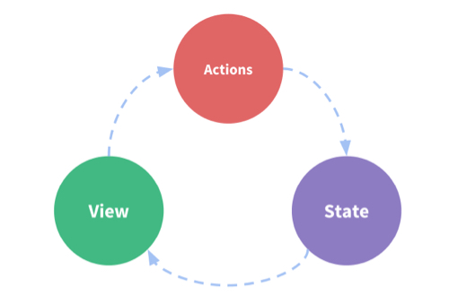
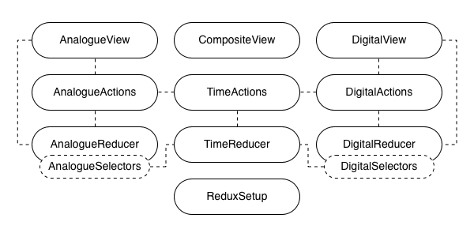
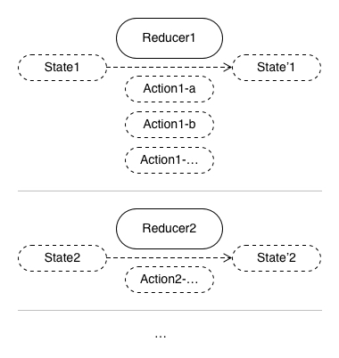
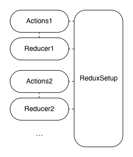

# Review of state management in React: reducer-like solutions - Redux and its family

Continuing to answer the question #1 in [the last article](../01-getting-started-with-an-mvc-example/README.md), _How good are today's widely-accepted libraries of state management in React?_, I would look into reducer-like solutions of state management in React by this article, because they have become so widely accepted that the most well-known one, Redux, is used in [1/3](https://npmtrends.com/react-vs-react-redux) of all React projects and even React itself provides a built-in hook `useReducer`.

As mentioned previously, with [the example of the composite clock built with MVC pattern](https://github.com/licg9999/review-of-state-management-in-react/tree/master/01-getting-started-with-an-mvc-example) from the last article as a baseline, for each reducer-like solution, I would rebuild the same example module with it and review how good it is in comparison with the baseline.

## Table of contents

- [Reduce function](#reduce_function)
- [Recalling the example module](#recalling_the_example_module)
- [Example module built with Redux](#example_module_built_with_redux)
- [Review of state management with Redux](#review_of_state_management_with_redux)
- [Example module built with Redux Toolkit](#example_module_built_with_redux_toolkit)
- [Review of state management with Redux Toolkit](#review_of_state_management_with_redux_toolkit)
- [Example module built with Flux](#example_module_built_with_flux)
- [Review of state management with Flux](#review_of_state_management_with_flux)
- [Example module built with `useReducer`](#example_module_built_with_usereducer)
- [Review of state management with `useReducer`](#review_of_state_management_with_usereducer)
- [Summary](#summary)
- [What's next](#what_s_next)

## Reduce function<a id="reduce_function"></a>

Reduce function was [formally introduced](https://scholar.google.com/scholar?q=Why+Functional+Programming+Matters) as a general higher-order function in functional programming. It takes a binary operator and an initial result to produce a function that can process a list of values to return a final result. The binary operator is able to process a result and a value at a time to return a new result, so values in a list can be processed in sequence to return the final result from the initial result. And, this operator is called **reducer**, which can be depicted as follows:

```ts
type Reducer<TResult, TValue> = (result: TResult, value: TValue) => TResult;
```

By reducer-like solutions of state management, I mean those libraries that do states changing in state management by using reducers or some similar ways. Reducers of them treat states as results and actions of user interactions as values, so actions can be processed in sequence to return the next state from the previous state:

```ts
type Reducer<TState, TAction> = (state: TState, action: TAction) => TState;
```

In the perspective of the data flow, view components handle user interactions to dispatch actions to reducers and get the states back to render themselves in a timely manner. By the way, an action can also be dispatched anywhere except reducers.



Among reducer-like solutions, Redux and its family are the most widely accepted. For a comprehensive understanding, I would look into every important member in this family and my focus includes Redux itself, its child Redux Toolkit(RTK), its parent Flux and its nephew `useReducer`.

## Recalling the example module<a id="recalling_the_example_module"></a>

Before that, let me recall the requirement of the example module a bit in case a reader might not have time to fully read the last article. If the last article has been read, this section can be skipped:


A composite clock is an interactive module that has 2 components, an analogue clock and a digital clock. The 2 child clocks always tick synchronously and can be set to new time by users. The analogue one can have its minute hand dragged. The digital one can have its text edited.

Although it's doable to use single big shared state for this example module, it's not always a good idea to use single big shared state for a real-world app because it brings poor maintainability of quality attributes([ISO/IEC 9126-1:2001](https://www.iso.org/standard/22749.html)). So, to closely emulate real-world situations, multiple related states are used here.

Then, there would be 3 related states seperately for the analogue clock, the digital clock and time itself. The state of time keeps a timestamp for the whole module. The states of the child clocks derive display data from the timestamp and accept user input data for setting the timestamp.


## Example module built with Redux<a id="example_module_built_with_redux"></a>

Now, I would look into Redux first. Again, `create-react-app` is used to initialize the React app. The option `--template typescript` is used to enable TypeScript:

```sh
$ npx create-react-app 02-reducer-like-solutions-redux-and-its-family/77ed362 --template typescript
# ...
$ cd 02-reducer-like-solutions-redux-and-its-family/77ed362
```

The version of CRA in use is `5.0.1` and the generated directory structure looks as follows:

```sh
$ tree -I node_modules
.
├── README.md
├── package-lock.json
├── package.json
├── public
│   ├── favicon.ico
│   ├── index.html
│   ├── logo192.png
│   ├── logo512.png
│   ├── manifest.json
│   └── robots.txt
├── src
│   ├── App.css
│   ├── App.test.tsx
│   ├── App.tsx
│   ├── index.css
│   ├── index.tsx
│   ├── logo.svg
│   ├── react-app-env.d.ts
│   ├── reportWebVitals.ts
│   └── setupTests.ts
└── tsconfig.json

2 directories, 19 files
```

Then, `src/App.tsx` is cleared for later use:

```tsx
// 77ed362/src/App.tsx
import { FC } from 'react';

const App: FC = () => {
  return null;
};

export default App;
```

Following files are unused so removed:

```sh
$ rm src/App.css src/App.test.tsx src/logo.svg
```

Also, to help with time parsing and formating, `date-fns` is installed:

```sh
$ npm i date-fns
```

Then, to use Redux, `redux` and `react-redux` are installed:

```sh
$ npm i redux react-redux
```

The example module, the composite clock, would be all placed in `src/CompositeClock`. To match the 3 requried states, there would be 3 reducers with their actions, `TimeReducer.ts` with `TimeActions.ts`, `AnalogueReducer.ts` with `AnalogueActions.ts` and `DigitalReducer.ts` with `DigitalActions.ts`. For data deriving in Redux, it's achieved by using selectors which are basically getters on states and usually placed together with reducers.

And for view components, there are `AnalogueView.ts` for the analogue clock, `DigitalView.ts` for the digital clock, and `CompositeView.ts` as a glue. Besides, a Redux setup of a root store and related helpers is needed.



In terms of coding, all reducers are dependent on their actions for using the action types, some actions are dependent on the Redux setup for accessing the root store, the Redux setup is dependent on reducers for building the root store, which constitutes circular dependency in some cases. To get this coded, I would start from the Redux setup, then evolve it along with the rest parts step by step.

The Redux setup is initially coded as follows:

```ts
// 77ed362/src/reduxStore.ts
import { AnyAction, combineReducers, createStore, Store } from 'redux';

export type AppAction = AnyAction;

export interface AppState {}

export type AppStore = Store<AppState, AppAction>;

export type AppDispatch = AppStore['dispatch'];

export function createAppStore(initialState: Partial<AppState> = {}): AppStore {
  const store = createStore(combineReducers({}), initialState);
  return store;
}
```

```ts
// 77ed362/src/reduxHooks.ts
import { TypedUseSelectorHook, useDispatch, useSelector, useStore } from 'react-redux';
import type { AppAction, AppDispatch, AppState } from './reduxStore';

export const useAppDispatch = () => useDispatch<AppDispatch>();
export const useAppSelector: TypedUseSelectorHook<AppState> = useSelector;
export const useAppStore = () => useStore<AppState, AppAction>();
```

```tsx
// 77ed362/src/index.tsx
import React from 'react';
import ReactDOM from 'react-dom/client';
import { Provider } from 'react-redux';
import App from './App';
import './index.css';
import { createAppStore } from './reduxStore';
import reportWebVitals from './reportWebVitals';

const appStore = createAppStore();

const root = ReactDOM.createRoot(document.getElementById('root') as HTMLElement);
root.render(
  <React.StrictMode>
    <Provider store={appStore}>
      <App />
    </Provider>
  </React.StrictMode>
);

// If you want to start measuring performance in your app, pass a function
// to log results (for example: reportWebVitals(console.log))
// or send to an analytics endpoint. Learn more: https://bit.ly/CRA-vitals
reportWebVitals();
```

The reducer with its actions for the state of time and the integration with the Redux setup are coded as follows:

```ts
// 77ed362/src/CompositeClock/TimeActions.ts
const NS = 'COMPOSITE_CLOCK-TIME';

export const ActionTypes = {
  CHANGE_TIMESTAMP: `${NS}-CHANGE_TIMESTAMP`,
} as const;

export type TimeAction = { type: typeof ActionTypes['CHANGE_TIMESTAMP']; timestamp: number };

export function changeTimestamp(timestamp: number): TimeAction {
  return {
    type: ActionTypes.CHANGE_TIMESTAMP,
    timestamp,
  };
}
```

```ts
// 77ed362/src/CompositeClock/TimeReducer.ts
import { ActionTypes, TimeAction } from './TimeActions';

export interface TimeState {
  timestamp: number;
}

export function timeReducer(
  state: TimeState = {
    timestamp: 0,
  },
  action: TimeAction
): TimeState {
  switch (action.type) {
    case ActionTypes.CHANGE_TIMESTAMP:
      return { ...state, timestamp: action.timestamp };
  }
  return state;
}
```

```ts
// 77ed362/src/CompositeClock/index.ts
export type { TimeAction } from './TimeActions';
export * from './TimeReducer';
```

```diff
// 77ed362/src/reduxStore.ts
-import { AnyAction, combineReducers, createStore, Store } from 'redux';
+import { combineReducers, createStore, Store } from 'redux';
+import { TimeAction, timeReducer, TimeState } from './CompositeClock';

-export type AppAction = AnyAction;
+export type AppAction = TimeAction;

-export interface AppState {}
+export interface AppState {
+  timeOfClock: TimeState;
+}

...

export function createAppStore(initialState: Partial<AppState> = {}): AppStore {
-  const store = createStore(combineReducers({}), initialState);
+  const store = createStore(combineReducers({
+    timeOfClock: timeReducer,
+  }), initialState);
  return store;
}
```

```diff
// 77ed362/src/index.tsx
...

-const appStore = createAppStore();
+const appStore = createAppStore({
+  timeOfClock: {
+    timestamp: Date.now(),
+  },
+});

...
```

The reducer with its actions for the state of the analogue clock and the integration with the Redux setup are coded as follows. Because `AnalogueReducer.ts` is dependent on `AnalogueActions.ts`, `AnalogueActions.ts` is dependent on `reduxStore.ts`, `reduxStore.ts` is dependent on `AnalogueReducer.ts` and they constitue circle dependency, I would code `AnalogueActions.ts` and `AnalogueReducer.ts` partially at first, adjust `reduxStore.ts` next, code `AnalogueActions.ts` and `AnalogueReducer.ts` completely in the end:

```ts
// 77ed362/src/CompositeClock/AnalogueActions.ts
const NS = 'COMPOSITE_CLOCK-ANALOGUE';

export const ActionTypes = {
  ENTER_EDIT_MODE: `${NS}-ENTER_EDIT_MODE`,
  EXIT_EDIT_MODE: `${NS}-EXIT_EDIT_MODE`,
  CHANGE_EDIT_MODE_MINUTE_ANGLE: `${NS}-CHANGE_EDIT_MODE_MINUTE_ANGLE`,
} as const;

export type AnalogueAction =
  | { type: typeof ActionTypes['ENTER_EDIT_MODE'] }
  | { type: typeof ActionTypes['EXIT_EDIT_MODE'] }
  | { type: typeof ActionTypes['CHANGE_EDIT_MODE_MINUTE_ANGLE'] };
```

```ts
// 77ed362/src/CompositeClock/AnalogueReducer.ts
import { ActionTypes, AnalogueAction } from './AnalogueActions';
import type { TimeState } from './TimeReducer';

const TWO_PI = 2 * Math.PI;

export interface AnalogueAngles {
  hour: number;
  minute: number;
  second: number;
}

export interface AnalogueState {
  isEditMode: boolean;
  editModeAngles: AnalogueAngles;
}

export function analogueReducer(
  state: AnalogueState = {
    isEditMode: false,
    editModeAngles: { hour: 0, minute: 0, second: 0 },
  },
  action: AnalogueAction
): AnalogueState {
  switch (action.type) {
    case ActionTypes.ENTER_EDIT_MODE:
    case ActionTypes.EXIT_EDIT_MODE:
    case ActionTypes.CHANGE_EDIT_MODE_MINUTE_ANGLE:
  }
  return state;
}

export function getDisplayAngles(timeState: TimeState): AnalogueAngles {
  const d = new Date(timeState.timestamp);
  return {
    hour: ((d.getHours() % 12) / 12) * TWO_PI + (d.getMinutes() / 60) * (TWO_PI / 12),
    minute: (d.getMinutes() / 60) * TWO_PI + (d.getSeconds() / 60) * (TWO_PI / 60),
    second: (d.getSeconds() / 60) * TWO_PI,
  };
}
```

```diff
// 77ed362/src/CompositeClock/index.ts
+export type { AnalogueAction } from './AnalogueActions';
+export * from './AnalogueReducer';
export type { TimeAction } from './TimeActions';
export * from './TimeReducer';
```

```diff
// 77ed362/src/reduxStore.ts
import { combineReducers, createStore, Store } from 'redux';
-import { TimeAction, timeReducer, TimeState } from './CompositeClock';
+import {
+  AnalogueAction,
+  analogueReducer,
+  AnalogueState,
+  TimeAction,
+  timeReducer,
+  TimeState,
+} from './CompositeClock';

-export type AppAction = TimeAction;
+export type AppAction = TimeAction | AnalogueAction;

export interface AppState {
  timeOfClock: TimeState;
+  analogueClock: AnalogueState;
}

...

export function createAppStore(initialState: Partial<AppState> = {}): AppStore {
  const store = createStore(
    combineReducers({
      timeOfClock: timeReducer,
+      analogueClock: analogueReducer,
    }),
    initialState
  );
  return store;
}
```

```diff
// 77ed362/src/CompositeClock/AnalogueActions.ts
+import type { AppStore } from '../reduxStore';
+import { AnalogueAngles, getDisplayAngles } from './AnalogueReducer';
+import { changeTimestamp } from './TimeActions';
+
+const TWO_PI = 2 * Math.PI;
+
const NS = 'COMPOSITE_CLOCK-ANALOGUE';

export const ActionTypes = {
  ENTER_EDIT_MODE: `${NS}-ENTER_EDIT_MODE`,
  EXIT_EDIT_MODE: `${NS}-EXIT_EDIT_MODE`,
  CHANGE_EDIT_MODE_MINUTE_ANGLE: `${NS}-CHANGE_EDIT_MODE_MINUTE_ANGLE`,
} as const;

export type AnalogueAction =
-  | { type: typeof ActionTypes['ENTER_EDIT_MODE'] }
+  | { type: typeof ActionTypes['ENTER_EDIT_MODE']; editModeAngles: AnalogueAngles }
  | { type: typeof ActionTypes['EXIT_EDIT_MODE'] }
-  | { type: typeof ActionTypes['CHANGE_EDIT_MODE_MINUTE_ANGLE'] };
+  | { type: typeof ActionTypes['CHANGE_EDIT_MODE_MINUTE_ANGLE']; minuteAngle: number };
+
+export function dispatchEnterEditMode(store: AppStore): void {
+  const { timeOfClock, analogueClock } = store.getState();
+  if (analogueClock.isEditMode) return;
+  const editModeAngles = getDisplayAngles(timeOfClock);
+  store.dispatch({
+    type: ActionTypes.ENTER_EDIT_MODE,
+    editModeAngles,
+  });
+}
+
+export function dispatchExitEditMode(store: AppStore, submit: boolean = true): void {
+  const { timeOfClock, analogueClock } = store.getState();
+  if (!analogueClock.isEditMode) return;
+  if (submit) {
+    const d = new Date(timeOfClock.timestamp);
+    d.setHours(
+      Math.floor((analogueClock.editModeAngles.hour / TWO_PI) * 12) +
+        12 * Math.floor(d.getHours() / 12)
+    );
+    d.setMinutes((analogueClock.editModeAngles.minute / TWO_PI) * 60);
+    d.setSeconds((analogueClock.editModeAngles.second / TWO_PI) * 60);
+    store.dispatch(changeTimestamp(d.getTime()));
+  }
+  store.dispatch({ type: ActionTypes.EXIT_EDIT_MODE });
+}
+
+export function changeEditModeMinuteAngle(minuteAngle: number): AnalogueAction {
+  return { type: ActionTypes.CHANGE_EDIT_MODE_MINUTE_ANGLE, minuteAngle };
+}
```

```diff
// 77ed362/src/CompositeClock/AnalogueReducer.ts
...

export function analogueReducer(
  state: AnalogueState = {
    isEditMode: false,
    editModeAngles: { hour: 0, minute: 0, second: 0 },
  },
  action: AnalogueAction
): AnalogueState {
  switch (action.type) {
    case ActionTypes.ENTER_EDIT_MODE:
+      return { ...state, isEditMode: true, editModeAngles: action.editModeAngles };
    case ActionTypes.EXIT_EDIT_MODE:
+      return { ...state, isEditMode: false };
    case ActionTypes.CHANGE_EDIT_MODE_MINUTE_ANGLE:
+      return {
+        ...state,
+        editModeAngles: {
+          ...state.editModeAngles,
+          minute: (action.minuteAngle + TWO_PI) % TWO_PI,
+          hour:
+            (Math.floor((state.editModeAngles.hour / TWO_PI) * 12) + action.minuteAngle / TWO_PI) *
+            (TWO_PI / 12),
+        },
+      };
  }
  return state;
}

...
```

The reducer with its actions for the state of the digital clock and the integration with the Redux setup are coded as follows. Again, because `DigitalReducer.ts` is dependent on `DigitalActions.ts`, `DigitalActions.ts` is dependent on `reduxStore.ts`, `reduxStore.ts` is dependent on `DigitalReducer.ts` and they constitue circular dependency, I would code `DigitalActions.ts` and `DigitalReducer.ts` partially at first, adjust `reduxStore.ts` next, code `DigitalActions.ts` and `DigitalReducer.ts` completely in the end:

```ts
// 77ed362/src/CompositeClock/DigitalActions.ts
const NS = 'COMPOSITE_CLOCK-DIGITAL';

export const ActionTypes = {
  ENTER_EDIT_MODE: `${NS}-ENTER_EDIT_MODE`,
  EXIT_EDIT_MODE: `${NS}-EXIT_EDIT_MODE`,
  CHANGE_EDIT_MODE_TEXT: `${NS}-CHANGE_EDIT_MODE_TEXT`,
} as const;

export type DigitalAction =
  | { type: typeof ActionTypes['ENTER_EDIT_MODE'] }
  | { type: typeof ActionTypes['EXIT_EDIT_MODE'] }
  | { type: typeof ActionTypes['CHANGE_EDIT_MODE_TEXT'] };
```

```ts
// 77ed362/src/CompositeClock/DigitalReducer.ts
import { format, isMatch } from 'date-fns';
import { ActionTypes, DigitalAction } from './DigitalActions';
import type { TimeState } from './TimeReducer';

export interface DigitalState {
  isEditMode: boolean;
  editModeText: string;
}

export const DIGITAL_TEXT_FORMAT = 'HH:mm:ss';

export function digitalReducer(
  state: DigitalState = {
    isEditMode: false,
    editModeText: '',
  },
  action: DigitalAction
): DigitalState {
  switch (action.type) {
    case ActionTypes.ENTER_EDIT_MODE:
    case ActionTypes.EXIT_EDIT_MODE:
    case ActionTypes.CHANGE_EDIT_MODE_TEXT:
  }
  return state;
}

export function isEditModeTextValid(state: DigitalState): boolean {
  return isMatch(state.editModeText, DIGITAL_TEXT_FORMAT);
}

export function getDisplayText(timeState: TimeState): string {
  return format(timeState.timestamp, DIGITAL_TEXT_FORMAT);
}
```

```diff
// 77ed362/src/CompositeClock/index.ts
export type { AnalogueAction } from './AnalogueActions';
export * from './AnalogueReducer';
+export type { DigitalAction } from './DigitalActions';
+export * from './DigitalReducer';
export type { TimeAction } from './TimeActions';
export * from './TimeReducer';
```

```diff
// 77ed362/src/reduxStore.ts
import { combineReducers, createStore, Store } from 'redux';
import {
  AnalogueAction,
  analogueReducer,
  AnalogueState,
+  DigitalAction,
+  digitalReducer,
+  DigitalState,
  TimeAction,
  timeReducer,
  TimeState,
} from './CompositeClock';

-export type AppAction = TimeAction | AnalogueAction;
+export type AppAction = TimeAction | AnalogueAction | DigitalAction;

export interface AppState {
  timeOfClock: TimeState;
  analogueClock: AnalogueState;
+  digitalClock: DigitalState;
}

export type AppStore = Store<AppState, AppAction>;

export type AppDispatch = AppStore['dispatch'];

export function createAppStore(initialState: Partial<AppState> = {}): AppStore {
  const store = createStore(
    combineReducers({
      timeOfClock: timeReducer,
      analogueClock: analogueReducer,
+      digitalClock: digitalReducer,
    }),
    initialState
  );
  return store;
}
```

```diff
// 77ed362/src/CompositeClock/DigitalActions.ts
+import { parse } from 'date-fns';
+import type { AppStore } from '../reduxStore';
+import { DIGITAL_TEXT_FORMAT, getDisplayText, isEditModeTextValid } from './DigitalReducer';
+import { changeTimestamp } from './TimeActions';
+
const NS = 'COMPOSITE_CLOCK-DIGITAL';

export const ActionTypes = {
  ENTER_EDIT_MODE: `${NS}-ENTER_EDIT_MODE`,
  EXIT_EDIT_MODE: `${NS}-EXIT_EDIT_MODE`,
  CHANGE_EDIT_MODE_TEXT: `${NS}-CHANGE_EDIT_MODE_TEXT`,
} as const;

export type DigitalAction =
-  | { type: typeof ActionTypes['ENTER_EDIT_MODE'] }
+  | { type: typeof ActionTypes['ENTER_EDIT_MODE']; editModeText: string }
  | { type: typeof ActionTypes['EXIT_EDIT_MODE'] }
-  | { type: typeof ActionTypes['CHANGE_EDIT_MODE_TEXT'] };
+  | { type: typeof ActionTypes['CHANGE_EDIT_MODE_TEXT']; editModeText: string };
+
+export function dispatchEnterEditMode(store: AppStore): void {
+  const { timeOfClock, digitalClock } = store.getState();
+  if (digitalClock.isEditMode) return;
+  const editModeText = getDisplayText(timeOfClock);
+  store.dispatch({
+    type: ActionTypes.ENTER_EDIT_MODE,
+    editModeText,
+  });
+}
+
+export function dispatchExitEditMode(store: AppStore, submit: boolean = true): void {
+  const { timeOfClock, digitalClock } = store.getState();
+  if (!digitalClock.isEditMode) return;
+  if (submit && isEditModeTextValid(digitalClock)) {
+    store.dispatch(
+      changeTimestamp(
+        parse(digitalClock.editModeText, DIGITAL_TEXT_FORMAT, timeOfClock.timestamp).getTime()
+      )
+    );
+  }
+  store.dispatch({ type: ActionTypes.EXIT_EDIT_MODE });
+}
+
+export function changeEditModeText(editModeText: string): DigitalAction {
+  return { type: ActionTypes.CHANGE_EDIT_MODE_TEXT, editModeText };
+}
```

```diff
// 77ed362/src/CompositeClock/DigitalReducer.ts
...

export function digitalReducer(
  state: DigitalState = {
    isEditMode: false,
    editModeText: '',
  },
  action: DigitalAction
): DigitalState {
  switch (action.type) {
    case ActionTypes.ENTER_EDIT_MODE:
+      return { ...state, isEditMode: true, editModeText: action.editModeText };
    case ActionTypes.EXIT_EDIT_MODE:
+      return { ...state, isEditMode: false };
    case ActionTypes.CHANGE_EDIT_MODE_TEXT:
+      return { ...state, editModeText: action.editModeText };
  }
  return state;
}

...
```

After that, the view components are coded as follows:

```tsx
// 77ed362/src/CompositeClock/AnalogueView.tsx
import { FC, useCallback, useEffect } from 'react';
import { useAppDispatch, useAppSelector, useAppStore } from '../reduxHooks';
import {
  changeEditModeMinuteAngle,
  dispatchEnterEditMode,
  dispatchExitEditMode,
} from './AnalogueActions';
import { getDisplayAngles } from './AnalogueReducer';
import styles from './AnalogueView.module.css';

const TWO_PI = 2 * Math.PI;

interface Props {
  className?: string;
}

export const AnalogueView: FC<Props> = ({ className }) => {
  const store = useAppStore();
  const dispatch = useAppDispatch();
  const state = useAppSelector((appState) => appState.analogueClock);
  const { isEditMode, editModeAngles } = state;
  const displayAngles = useAppSelector((appState) => getDisplayAngles(appState.timeOfClock));

  const angles = isEditMode ? editModeAngles : displayAngles;

  const calcEditModeMinuteAngle = useCallback(
    (pointX: number, pointY: number): number => {
      const pointLen = Math.sqrt(Math.pow(pointX, 2) + Math.pow(pointY, 2));

      const normalizedX = pointX / pointLen;
      const normalizedY = pointY / pointLen;

      const oldX = Math.sin(editModeAngles.minute);
      const oldY = Math.cos(editModeAngles.minute);

      const rawMinuteAngle = Math.acos(normalizedY);

      const minuteAngle =
        normalizedY > 0 && oldY > 0
          ? normalizedX >= 0
            ? oldX < 0
              ? rawMinuteAngle + TWO_PI
              : rawMinuteAngle
            : oldX >= 0
            ? -rawMinuteAngle
            : -rawMinuteAngle + TWO_PI
          : normalizedX >= 0
          ? rawMinuteAngle
          : -rawMinuteAngle + TWO_PI;

      return minuteAngle;
    },
    [editModeAngles]
  );

  const onMinuteHandMouseDown = useCallback(
    (e: React.MouseEvent<HTMLDivElement>) => {
      e.preventDefault();
      dispatchEnterEditMode(store);
    },
    [store]
  );

  const onMouseLeave = useCallback(() => dispatchExitEditMode(store), [store]);

  const onMouseUp = useCallback(() => dispatchExitEditMode(store), [store]);

  const onKeyDown = useCallback(
    (e: KeyboardEvent): void => {
      if (isEditMode && e.key === 'Escape') {
        dispatchExitEditMode(store, false);
      }
    },
    [isEditMode, store]
  );

  const onMouseMove = useCallback(
    (e: React.MouseEvent<HTMLDivElement>): void => {
      if (!isEditMode) return;

      const boundingBox = e.currentTarget.getBoundingClientRect();
      const originX = boundingBox.x + boundingBox.width / 2;
      const originY = boundingBox.y + boundingBox.height / 2;

      const pointX = e.clientX - originX;
      const pointY = originY - e.clientY;

      dispatch(changeEditModeMinuteAngle(calcEditModeMinuteAngle(pointX, pointY)));
    },
    [calcEditModeMinuteAngle, dispatch, isEditMode]
  );

  useEffect(() => {
    window.addEventListener('keydown', onKeyDown);
    return () => window.removeEventListener('keydown', onKeyDown);
  }, [onKeyDown]);

  return (
    <div
      className={`${className ?? ''} ${styles.root} ${isEditMode ? styles.editMode : ''}`}
      onMouseLeave={onMouseLeave}
      onMouseUp={onMouseUp}
      onMouseMove={onMouseMove}
    >
      <div className={styles.axis} />
      <div
        className={`${styles.hand} ${styles.hour}`}
        style={{ transform: `rotateZ(${angles.hour}rad)` }}
      />
      <div
        className={`${styles.hand} ${styles.minute}`}
        style={{ transform: `rotateZ(${angles.minute}rad)` }}
        onMouseDown={onMinuteHandMouseDown}
      />
      <div
        className={`${styles.hand} ${styles.second}`}
        style={{ transform: `rotateZ(${angles.second}rad)` }}
      />
    </div>
  );
};
```

```css
/* 77ed362/src/CompositeClock/AnalogueView.module.css */
.root {
  margin: 12px;
  padding: 8px;
  width: 160px;
  height: 160px;
  border-radius: 100%;
  border: 1px solid black;
  position: relative;
}

.axis {
  position: absolute;
  background-color: black;
  left: 47.5%;
  top: 47.5%;
  width: 5%;
  height: 5%;
  border-radius: 100%;
}

.hand {
  position: absolute;
  background-color: black;
  transform-origin: bottom center;
}

.hand.hour {
  left: 48.5%;
  top: 25%;
  height: 25%;
  width: 3%;
}

.hand.minute {
  left: 49%;
  top: 10%;
  height: 40%;
  width: 2%;
  z-index: 10;
  cursor: pointer;
}

.hand.second {
  left: 49.5%;
  top: 10%;
  height: 40%;
  width: 1%;
}

.editMode.root {
  outline: 2px solid skyblue;
}
```

```tsx
// 77ed362/src/CompositeClock/DigitalView.tsx
import { FC, useCallback, useEffect, useRef } from 'react';
import { useAppDispatch, useAppSelector, useAppStore } from '../reduxHooks';
import { changeEditModeText, dispatchEnterEditMode, dispatchExitEditMode } from './DigitalActions';
import { DIGITAL_TEXT_FORMAT, getDisplayText, isEditModeTextValid } from './DigitalReducer';
import styles from './DigitalView.module.css';

interface Props {
  className?: string;
}

export const DigitalView: FC<Props> = ({ className }) => {
  const store = useAppStore();
  const dispatch = useAppDispatch();
  const state = useAppSelector((appState) => appState.digitalClock);
  const { isEditMode, editModeText } = state;
  const displayText = useAppSelector((appState) => getDisplayText(appState.timeOfClock));

  const refEditor = useRef<HTMLInputElement | null>(null);

  const onDisplayClick = useCallback(() => dispatchEnterEditMode(store), [store]);

  const onEditorBlur = useCallback(() => dispatchExitEditMode(store, false), [store]);

  const onEditorChange = useCallback(
    (e: React.ChangeEvent<HTMLInputElement>) => dispatch(changeEditModeText(e.target.value)),
    [dispatch]
  );

  const onEditorKeyDown = useCallback(
    (e: React.KeyboardEvent) => {
      if (e.key === 'Enter') {
        dispatchExitEditMode(store);
      }
    },
    [store]
  );

  useEffect(() => {
    if (isEditMode && refEditor.current) {
      refEditor.current.select();
    }
  }, [isEditMode]);

  return (
    <div className={`${className ?? ''} ${styles.root} ${isEditMode ? styles.editMode : ''}`}>
      {isEditMode ? (
        <>
          <input
            className={styles.editor}
            type="text"
            ref={refEditor}
            value={editModeText}
            onBlur={onEditorBlur}
            onChange={onEditorChange}
            onKeyDown={onEditorKeyDown}
          />
          {!isEditModeTextValid(state) && (
            <div className={styles.invalidHint}>
              The input time doesn't match the expected format which is '{DIGITAL_TEXT_FORMAT}'.
            </div>
          )}
        </>
      ) : (
        <div onClick={onDisplayClick}>{displayText}</div>
      )}
    </div>
  );
};
```

```css
/* 77ed362/src/CompositeClock/DigitalView.module.css */
.root {
  border: 1px solid black;
  width: 200px;
  line-height: 30px;
  text-align: center;
}

.editor {
  width: 100%;
  text-align: center;
  font-size: inherit;
  padding: 0;
  border: none;
  outline: none;
}

.invalidHint {
  line-height: 1.2;
}

.editMode.root {
  outline: 2px solid skyblue;
}
```

```tsx
// 77ed362/src/CompositeClock/CompositeView.tsx
import { FC, useCallback, useEffect, useRef } from 'react';
import { useAppDispatch, useAppSelector, useAppStore } from '../reduxHooks';
import { AnalogueView } from './AnalogueView';
import styles from './CompositeView.module.css';
import { DigitalView } from './DigitalView';
import { changeTimestamp } from './TimeActions';

export const CompositeView: FC = () => {
  const dispatch = useAppDispatch();
  const store = useAppStore();
  const isEditModeInAnalogueClock = useAppSelector((appState) => appState.analogueClock.isEditMode);
  const isEditModeInDigitalClock = useAppSelector((appState) => appState.digitalClock.isEditMode);

  const calcTimestampCorrection = useCallback(
    () => store.getState().timeOfClock.timestamp - Date.now(),
    [store]
  );

  const refTimeCorrection = useRef<number>(calcTimestampCorrection());

  useEffect(() => {
    if (!isEditModeInAnalogueClock || !isEditModeInDigitalClock) {
      refTimeCorrection.current = calcTimestampCorrection();
    }
  }, [calcTimestampCorrection, isEditModeInAnalogueClock, isEditModeInDigitalClock]);

  useEffect(() => {
    const tickHandler = setInterval(
      () => dispatch(changeTimestamp(Date.now() + refTimeCorrection.current)),
      100
    );
    return () => clearInterval(tickHandler);
  }, [dispatch]);

  return (
    <div className={styles.root}>
      <AnalogueView />
      <DigitalView />
    </div>
  );
};
```

```css
/* 77ed362/src/CompositeClock/CompositeView.module.css */
.root {
  margin: 16px 8px;
  font-size: 16px;
}
```

```diff
// 77ed362/src/CompositeClock/index.ts
export type { AnalogueAction } from './AnalogueActions';
export * from './AnalogueReducer';
+export { CompositeView as CompositeClock } from './CompositeView';
export type { DigitalAction } from './DigitalActions';
export * from './DigitalReducer';
export type { TimeAction } from './TimeActions';
export * from './TimeReducer';
```

```diff
// 77ed362/src/App.tsx
import { FC } from 'react';
+import { CompositeClock } from './CompositeClock';

const App: FC = () => {
-  return null;
+  return <CompositeClock />;
};

export default App;
```

Then, the example module built with Redux is complete. It can be previewed with the command `npm start` and its codebase is hosted at [review-of-state-management-in-react/02-reducer-like-solutions-redux-and-its-family/77ed362](https://github.com/licg9999/review-of-state-management-in-react/tree/master/02-reducer-like-solutions-redux-and-its-family/77ed362).

## Review of state management with Redux<a id="review_of_state_management_with_redux"></a>

In terms of state management, compared with MVC pattern, the brightest pro of Redux is, available state-changing logics on each state are clearly defined in each reducer, actions don't do anything more than invoking defined state-changing logics in reducers, reducers process old states and actions for new states as pure functions without any side effect like events emitting in models, and there is no chance for state-changing logics in a reducer to get more state-changing logics somewhere else invoked regardless of how actions are dispatched to it, so states changing becomes predictable despite the scale of the app. It can be perceived by checking how `TimeReducer.ts`, `AnalogueReducer.ts` and `DigitalReducer.ts` work with their actions. This benefits maintainability.



But on the other hand, the biggest con of Redux is, as getting one state managed requires a reducer, its actions, its selectors and the Redux setup coded simultaneously and a reducer and its actions are high-coupling, cost of development is high. (When some parts are high-coupling, building or maintaining one of them always involves building or maintaining the rest parts, which brings difficulties in development.) Especially, when reducers, their actions and the Redux setup constitue circular dependency and they have to be coded iteratively, the cost can be even higher, which can be seen in the steps of coding states of the analogue clock and the digital clock.

Besides, another major con of Redux is, a module built with Redux is actually not completely modularized by default, because when a module gets instantiated multiple times, these instances are sharing exactly the same state in the the app-wide Redux setup in fact. To resolve the modularity issue, a module-wide Redux setup needs to be introduced per module. But this brings extra cost.



To sum up, doing state management with Redux achieves predictable states changing despite the scale of the app but with quite high cost of development.

## Example module built with Redux Toolkit<a id="example_module_built_with_redux_toolkit"></a>

Now that using Redux is costly, let me check out its next-generation solution, Redux Toolkit(RTK), whose goal is to decrease the cost. As the view components in every example module built with a reducer-like solution would all be similarly coded and relate little to state managemenet, I would not list them in the following sections but they can still be found in the hosted codebase.

Again, `create-react-app` is used to initialize the React app with the option `--template typescript`:

```sh
$ npx create-react-app 02-reducer-like-solutions-redux-and-its-family/d1b2fad --template typescript
# ...
$ cd 02-reducer-like-solutions-redux-and-its-family/d1b2fad
```

Then, `src/App.tsx` is cleared for later use, unused files are removed, the package of time helpers is installed:

```tsx
// d1b2fad/src/App.tsx
import { FC } from 'react';

const App: FC = () => {
  return null;
};

export default App;
```

```sh
$ rm src/App.css src/App.test.tsx src/logo.svg
```

```sh
$ npm i date-fns
```

Then, to use RTK, `@reduxjs/toolkit` and `react-redux` are installed:

```sh
$ npm i @reduxjs/toolkit react-redux
```

RTK is a set of helpers simplifying logics in Redux to different levels. I would use the helpers that simplify the logics most to decrease the cost, so `createSlice` is used to simplify reducers and actions, and `configureStore` is used for the Redux setup. By a slice, it's an easily definable combination of a reducer with its basic actions. And for advanced actions that access the root store and dispatch other actions, they can be coded by using [thunks](https://github.com/reduxjs/redux-thunk) and placed together with slices.

In terms of coding, slices are almost independent, advanced actions are dependent on the Redux setup for accessing the root store, the Redux setup is dependent on slices for building the root store. So, I would start from slices and evolve the rest parts afterwards.

The slices are coded as follows. Thinking of the needed advanced actions, the basic actions whose function names starting with `_` are prepared ahead:

```ts
// d1b2fad/src/CompositeClock/TimeSlice.ts
import { createSlice, PayloadAction } from '@reduxjs/toolkit';

export interface TimeState {
  timestamp: number;
}

const initialState: TimeState = {
  timestamp: 0,
};

const timeSlice = createSlice({
  name: 'COMPOSITE_CLOCK-TIME',
  initialState,
  reducers: {
    changeTimestamp(state, action: PayloadAction<number>) {
      state.timestamp = action.payload;
    },
  },
});

export const { changeTimestamp } = timeSlice.actions;

export const timeReducer = timeSlice.reducer;
```

```ts
// d1b2fad/src/CompositeClock/AnalogueSlice.ts
import { createSlice, PayloadAction } from '@reduxjs/toolkit';

const TWO_PI = 2 * Math.PI;

export interface AnalogueAngles {
  hour: number;
  minute: number;
  second: number;
}

export interface AnalogueState {
  isEditMode: boolean;
  editModeAngles: AnalogueAngles;
}

const initialState: AnalogueState = {
  isEditMode: false,
  editModeAngles: { hour: 0, minute: 0, second: 0 },
};

const analogueSlice = createSlice({
  name: 'COMPOSITE_CLOCK-ANALOGUE',
  initialState,
  reducers: {
    _enterEditMode(state, action: PayloadAction<AnalogueAngles>) {
      state.isEditMode = true;
      state.editModeAngles = action.payload;
    },

    _exitEditMode(state) {
      state.isEditMode = false;
    },

    changeEditModeMinuteAngle(state, action: PayloadAction<number>) {
      const minuteAngle = action.payload;
      state.editModeAngles.minute = (minuteAngle + TWO_PI) % TWO_PI;
      state.editModeAngles.hour =
        (Math.floor((state.editModeAngles.hour / TWO_PI) * 12) + minuteAngle / TWO_PI) *
        (TWO_PI / 12);
    },
  },
});

const { _enterEditMode, _exitEditMode } = analogueSlice.actions;

export const { changeEditModeMinuteAngle } = analogueSlice.actions;

export const analogueReducer = analogueSlice.reducer;
```

```ts
// d1b2fad/src/CompositeClock/DigitalSlice.ts
import { createSlice, PayloadAction } from '@reduxjs/toolkit';

export const DIGITAL_TEXT_FORMAT = 'HH:mm:ss';

export interface DigitalState {
  isEditMode: boolean;
  editModeText: string;
}

const initialState: DigitalState = {
  isEditMode: false,
  editModeText: '',
};

const digitalSlice = createSlice({
  name: 'COMPOSITE_CLOCK-DIGITAL',
  initialState,
  reducers: {
    _enterEditMode(state, action: PayloadAction<string>) {
      state.isEditMode = true;
      state.editModeText = action.payload;
    },

    _exitEditMode(state) {
      state.isEditMode = false;
    },

    changeEditModeText(state, action: PayloadAction<string>) {
      state.editModeText = action.payload;
    },
  },
});

const { _enterEditMode, _exitEditMode } = digitalSlice.actions;

export const { changeEditModeText } = digitalSlice.actions;

export const digitalReducer = digitalSlice.reducer;
```

```ts
// d1b2fad/src/CompositeClock/index.ts
export { analogueReducer } from './AnalogueSlice';
export type { AnalogueState } from './AnalogueSlice';
export { digitalReducer } from './DigitalSlice';
export type { DigitalState } from './DigitalSlice';
export { timeReducer } from './TimeSlice';
export type { TimeState } from './TimeSlice';
```

Then, the Redux setup is coded as follows:

```ts
// d1b2fad/src/reduxStore.ts
import { AnyAction, configureStore } from '@reduxjs/toolkit';
import {
  analogueReducer,
  AnalogueState,
  digitalReducer,
  DigitalState,
  timeReducer,
  TimeState,
} from './CompositeClock';

export interface AppState {
  timeOfClock: TimeState;
  analogueClock: AnalogueState;
  digitalClock: DigitalState;
}

export function createAppStore(initialState: Partial<AppState> = {}) {
  const store = configureStore<AppState, AnyAction>({
    reducer: {
      timeOfClock: timeReducer,
      analogueClock: analogueReducer,
      digitalClock: digitalReducer,
    },
    preloadedState: initialState,
  });
  return store;
}

export type AppStore = ReturnType<typeof createAppStore>;

export type AppDispatch = AppStore['dispatch'];

export type AppThunk = (dispatch: AppDispatch, getState: () => AppState) => void;
```

```ts
// d1b2fad/src/reduxHooks.ts
import { AnyAction } from '@reduxjs/toolkit';
import { TypedUseSelectorHook, useDispatch, useSelector, useStore } from 'react-redux';
import type { AppDispatch, AppState } from './reduxStore';

export const useAppDispatch = () => useDispatch<AppDispatch>();
export const useAppSelector: TypedUseSelectorHook<AppState> = useSelector;
export const useAppStore = () => useStore<AppState, AnyAction>();
```

```tsx
// d1b2fad/src/index.tsx
import React from 'react';
import ReactDOM from 'react-dom/client';
import { Provider } from 'react-redux';
import App from './App';
import './index.css';
import { createAppStore } from './reduxStore';
import reportWebVitals from './reportWebVitals';

const appStore = createAppStore({
  timeOfClock: {
    timestamp: Date.now(),
  },
});

const root = ReactDOM.createRoot(document.getElementById('root') as HTMLElement);
root.render(
  <React.StrictMode>
    <Provider store={appStore}>
      <App />
    </Provider>
  </React.StrictMode>
);

// If you want to start measuring performance in your app, pass a function
// to log results (for example: reportWebVitals(console.log))
// or send to an analytics endpoint. Learn more: https://bit.ly/CRA-vitals
reportWebVitals();
```

And, the advanced actions and the selectors are coded as follows. The advanced actions would use the previously prepared basic actions whose function names start with `_`:

```diff
// d1b2fad/src/CompositeClock/AnalogueSlice.ts
import { createSlice, PayloadAction } from '@reduxjs/toolkit';
+import type { AppThunk } from '../reduxStore';
+import { changeTimestamp, TimeState } from './TimeSlice';

...

+export function enterEditMode(): AppThunk {
+  return (dispatch, getState) => {
+    const { timeOfClock, analogueClock } = getState();
+    if (analogueClock.isEditMode) return;
+    const editModeAngles = getDisplayAngles(timeOfClock);
+    dispatch(_enterEditMode(editModeAngles));
+  };
+}
+
+export function exitEditMode(submit: boolean = true): AppThunk {
+  return (dispatch, getState) => {
+    const { timeOfClock, analogueClock } = getState();
+    if (!analogueClock.isEditMode) return;
+    if (submit) {
+      const d = new Date(timeOfClock.timestamp);
+      d.setHours(
+        Math.floor((analogueClock.editModeAngles.hour / TWO_PI) * 12) +
+          12 * Math.floor(d.getHours() / 12)
+      );
+      d.setMinutes((analogueClock.editModeAngles.minute / TWO_PI) * 60);
+      d.setSeconds((analogueClock.editModeAngles.second / TWO_PI) * 60);
+      dispatch(changeTimestamp(d.getTime()));
+    }
+    dispatch(_exitEditMode());
+  };
+}
+
+export function getDisplayAngles(timeState: TimeState): AnalogueAngles {
+  const d = new Date(timeState.timestamp);
+  return {
+    hour: ((d.getHours() % 12) / 12) * TWO_PI + (d.getMinutes() / 60) * (TWO_PI / 12),
+    minute: (d.getMinutes() / 60) * TWO_PI + (d.getSeconds() / 60) * (TWO_PI / 60),
+    second: (d.getSeconds() / 60) * TWO_PI,
+  };
+}
```

```diff
// d1b2fad/src/CompositeClock/DigitalSlice.ts
import { createSlice, PayloadAction } from '@reduxjs/toolkit';
+import { format, isMatch, parse } from 'date-fns';
+import type { AppThunk } from '../reduxStore';
+import { changeTimestamp, TimeState } from './TimeSlice';

...

+export function enterEditMode(): AppThunk {
+  return (dispatch, getState) => {
+    const { timeOfClock, digitalClock } = getState();
+    if (digitalClock.isEditMode) return;
+    const editModeText = getDisplayText(timeOfClock);
+    dispatch(_enterEditMode(editModeText));
+  };
+}
+
+export function exitEditMode(submit: boolean = true): AppThunk {
+  return (dispatch, getState) => {
+    const { timeOfClock, digitalClock } = getState();
+    if (!digitalClock.isEditMode) return;
+    if (submit && isEditModeTextValid(digitalClock)) {
+      dispatch(
+        changeTimestamp(
+          parse(digitalClock.editModeText, DIGITAL_TEXT_FORMAT, timeOfClock.timestamp).getTime()
+        )
+      );
+    }
+    dispatch(_exitEditMode());
+  };
+}
+
+export function isEditModeTextValid(state: DigitalState): boolean {
+  return isMatch(state.editModeText, DIGITAL_TEXT_FORMAT);
+}
+
+export function getDisplayText(timeState: TimeState): string {
+  return format(timeState.timestamp, DIGITAL_TEXT_FORMAT);
+}
```

For the view components, along with the app, they can be found at [review-of-state-management-in-react/02-reducer-like-solutions-redux-and-its-family/d1b2fad](https://github.com/licg9999/review-of-state-management-in-react/tree/master/02-reducer-like-solutions-redux-and-its-family/d1b2fad).

## Review of state management with Redux Toolkit<a id="review_of_state_management_with_redux_toolkit"></a>

Compared with Redux, in RTK, getting one state managed requires a slice, its advanced actions, its selectors and the Redux setup coded in turn and they don't constitue circular dependency, so the cost of development is decreased.

But, as a slice and its advanced actions are still high-coupling, the cost is still a bit high. Besides, the modularity issue is not resolved, which means getting different instances of a module having independent states still needs an extra module-wide Redux setup that is costly.

To sum up, doing state management with RTK receives the same benefits as with Redux at lower cost of development but the cost is still a bit high.

## Example module built with Flux<a id="example_module_built_with_flux"></a>

RTK has done a lot to decrease cost of development but using it is still costly. The 2 cons, high coupling between reducers and their actions and the modularity issue that a module can't have multiple instances with independent states, seem to be intrinsic characters of reducer-like solutions. To figure out how these cons come into being, I would take a look at Redux's parent solution, Flux.

Again, the React app is initialized with `create-react-app --template typescript`, `src/App.tsx` is cleared for later use, unused files are removed, the package of time helpers is installed:

```sh
$ npx create-react-app 02-reducer-like-solutions-redux-and-its-family/cdaed68 --template typescript
# ...
$ cd 02-reducer-like-solutions-redux-and-its-family/cdaed68
```

```tsx
// cdaed68/src/App.tsx
import { FC } from 'react';

const App: FC = () => {
  return null;
};

export default App;
```

```sh
$ rm src/App.css src/App.test.tsx src/logo.svg
```

```sh
$ npm i date-fns
```

Then, to use Flux, `flux` is installed. Notice that, Flux has been in maintenance mode and is declared not to be compatible with the latest React(v18), so installing it requires the option `--force`:

```sh
$ npm i --force flux @types/flux
```

Also, some part of Flux is really not working with the latest React, so a helper `createFunctional` for Flux is introduced as a replacement of the broken part as follows:

```tsx
// cdaed68/src/fluxHelpers.tsx
import type { Container } from 'flux/utils';
import React, { FC, useEffect, useState } from 'react';

export function createFunctional<TProps extends React.Attributes, TState>(
  TheFC: FC<TProps & TState>,
  getStores: () => Container.StoresList,
  getState: () => TState
): FC<TProps> {
  return (props) => {
    const [state, setState] = useState(getState());

    useEffect(() => {
      getStores().forEach((s) => s.addListener(() => setState(getState())));
    }, []);

    return <TheFC {...{ ...props, ...state }} />;
  };
}
```

Then, to match the 3 required states, there would be 3 stores with their actions, `TimeStore.ts` with `TimeActions.ts`, `AnalogueStore.ts` with `AnalogueActions.ts`, `DigitalStore.ts` with `DigitalActions.ts`. And, a dispatcher, `ClockDispatcher.ts`, is needed for dispatching actions to stores. For data deriving in Flux, it's achieved as a part of stores with the help of the dispatcher's waiting function.

In terms of coding, all stores are dependent on their actions for using the action types and some actions are dependent on stores for accessing states in them, which constitutes circular dependency in some cases. Meanwhile, all stores are dependent on the dispatcher for receiving actions and the dispatcher is dependent on all actions for declaring available actions. To get this coded, I would start from the dispatcher, then evolve the rest parts along with it step by step.

The dispatcher is initially coded as follows:

```ts
// cdaed68/src/CompositeClock/ClockDispatcher.ts
import { Dispatcher } from 'flux';

export type ClockAction = {};

export const clockDispatcher = new Dispatcher<ClockAction>();
```

The store with its actions for the state of time and the adjustment for the dispatcher are coded as follows:

```ts
// cdaed68/src/CompositeClock/TimeActions.ts
const NS = 'TIME';

export const ActionTypes = {
  CHANGE_TIMESTAMP: `${NS}-CHANGE_TIMESTAMP`,
} as const;

export type TimeAction = { type: typeof ActionTypes['CHANGE_TIMESTAMP']; timestamp: number };

export function changeTimestamp(timestamp: number): TimeAction {
  return {
    type: ActionTypes.CHANGE_TIMESTAMP,
    timestamp,
  };
}
```

```diff
// cdaed68/src/CompositeClock/ClockDispatcher.ts
import { Dispatcher } from 'flux';
+import type { TimeAction } from './TimeActions';

-export type ClockAction = {};
+export type ClockAction = TimeAction;

export const clockDispatcher = new Dispatcher<ClockAction>();
```

```ts
// cdaed68/src/CompositeClock/TimeStore.ts
import { ReduceStore } from 'flux/utils';
import { ClockAction, clockDispatcher } from './ClockDispatcher';
import { ActionTypes } from './TimeActions';

export interface TimeState {
  timestamp: number;
}

class TimeStore extends ReduceStore<TimeState, ClockAction> {
  constructor() {
    super(clockDispatcher);
  }

  getInitialState(): TimeState {
    return {
      timestamp: 0,
    };
  }

  reduce(state: TimeState, action: ClockAction): TimeState {
    switch (action.type) {
      case ActionTypes.CHANGE_TIMESTAMP:
        return { ...state, timestamp: action.timestamp };
    }
    return state;
  }
}

export const timeStore = new TimeStore();
```

The store with its actions for the state of the analogue clock and the adjustment for the dispatcher are coded as follows. Because `AnalogueStore.ts` and `AnalogueActions.ts` are dependent on each other and they constitue circle dependency, I would code the two iteratively:

```ts
// cdaed68/src/CompositeClock/AnalogueActions.ts
const NS = 'ANALOGUE';

export const ActionTypes = {
  ENTER_EDIT_MODE: `${NS}-ENTER_EDIT_MODE`,
  EXIT_EDIT_MODE: `${NS}-EXIT_EDIT_MODE`,
  CHANGE_EDIT_MODE_MINUTE_ANGLE: `${NS}-CHANGE_EDIT_MODE_MINUTE_ANGLE`,
} as const;

export type AnalogueAction =
  | { type: typeof ActionTypes['ENTER_EDIT_MODE'] }
  | { type: typeof ActionTypes['EXIT_EDIT_MODE'] }
  | { type: typeof ActionTypes['CHANGE_EDIT_MODE_MINUTE_ANGLE'] };
```

```diff
// cdaed68/src/CompositeClock/ClockDispatcher.ts
import { Dispatcher } from 'flux';
+import type { AnalogueAction } from './AnalogueActions';
import type { TimeAction } from './TimeActions';

-export type ClockAction = TimeAction;
+export type ClockAction = TimeAction | AnalogueAction;

export const clockDispatcher = new Dispatcher<ClockAction>();
```

```ts
// cdaed68/src/CompositeClock/AnalogueStore.ts
import { ReduceStore } from 'flux/utils';
import { ActionTypes } from './AnalogueActions';
import { ClockAction, clockDispatcher } from './ClockDispatcher';
import { ActionTypes as TimeActionTypes } from './TimeActions';
import { timeStore } from './TimeStore';

const TWO_PI = 2 * Math.PI;

export interface AnalogueAngles {
  hour: number;
  minute: number;
  second: number;
}

export interface AnalogueState {
  displayAngles: AnalogueAngles;
  isEditMode: boolean;
  editModeAngles: AnalogueAngles;
}

class AnalogueStore extends ReduceStore<AnalogueState, ClockAction> {
  constructor() {
    super(clockDispatcher);
  }

  getInitialState(): AnalogueState {
    const displayAngles = this.calcDisplayAngles();
    return {
      displayAngles,
      isEditMode: false,
      editModeAngles: displayAngles,
    };
  }

  reduce(state: AnalogueState, action: ClockAction): AnalogueState {
    switch (action.type) {
      case TimeActionTypes.CHANGE_TIMESTAMP:
        clockDispatcher.waitFor([timeStore.getDispatchToken()]);
        return { ...state, displayAngles: this.calcDisplayAngles() };

      case ActionTypes.ENTER_EDIT_MODE:
      case ActionTypes.EXIT_EDIT_MODE:
      case ActionTypes.CHANGE_EDIT_MODE_MINUTE_ANGLE:
    }
    return state;
  }

  calcDisplayAngles(): AnalogueAngles {
    const d = new Date(timeStore.getState().timestamp);
    return {
      hour: ((d.getHours() % 12) / 12) * TWO_PI + (d.getMinutes() / 60) * (TWO_PI / 12),
      minute: (d.getMinutes() / 60) * TWO_PI + (d.getSeconds() / 60) * (TWO_PI / 60),
      second: (d.getSeconds() / 60) * TWO_PI,
    };
  }
}

export const analogueStore = new AnalogueStore();
```

```diff
// cdaed68/src/CompositeClock/AnalogueActions.ts
+import { analogueStore } from './AnalogueStore';
+import { clockDispatcher } from './ClockDispatcher';
+import { changeTimestamp } from './TimeActions';
+import { timeStore } from './TimeStore';
+
+const TWO_PI = 2 * Math.PI;
+
const NS = 'ANALOGUE';

export const ActionTypes = {
  ENTER_EDIT_MODE: `${NS}-ENTER_EDIT_MODE`,
  EXIT_EDIT_MODE: `${NS}-EXIT_EDIT_MODE`,
  CHANGE_EDIT_MODE_MINUTE_ANGLE: `${NS}-CHANGE_EDIT_MODE_MINUTE_ANGLE`,
} as const;

export type AnalogueAction =
  | { type: typeof ActionTypes['ENTER_EDIT_MODE'] }
  | { type: typeof ActionTypes['EXIT_EDIT_MODE'] }
-  | { type: typeof ActionTypes['CHANGE_EDIT_MODE_MINUTE_ANGLE'] };
+  | { type: typeof ActionTypes['CHANGE_EDIT_MODE_MINUTE_ANGLE']; minuteAngle: number };
+
+export function dispatchEnterEditMode(): void {
+  if (analogueStore.getState().isEditMode) return;
+  clockDispatcher.dispatch({ type: ActionTypes.ENTER_EDIT_MODE });
+}
+
+export function dispatchExitEditMode(submit: boolean = true): void {
+  const analogueState = analogueStore.getState();
+  if (!analogueState.isEditMode) return;
+  if (submit) {
+    const d = new Date(timeStore.getState().timestamp);
+    d.setHours(
+      Math.floor((analogueState.editModeAngles.hour / TWO_PI) * 12) +
+        12 * Math.floor(d.getHours() / 12)
+    );
+    d.setMinutes((analogueState.editModeAngles.minute / TWO_PI) * 60);
+    d.setSeconds((analogueState.editModeAngles.second / TWO_PI) * 60);
+    clockDispatcher.dispatch(changeTimestamp(d.getTime()));
+  }
+  clockDispatcher.dispatch({ type: ActionTypes.EXIT_EDIT_MODE });
+}
+
+export function changeEditModeMinuteAngle(minuteAngle: number): AnalogueAction {
+  return { type: ActionTypes.CHANGE_EDIT_MODE_MINUTE_ANGLE, minuteAngle };
+}
```

```diff
// cdaed68/src/CompositeClock/AnalogueStore.ts
...

class AnalogueStore extends ReduceStore<AnalogueState, ClockAction> {
  ...

  reduce(state: AnalogueState, action: ClockAction): AnalogueState {
    switch (action.type) {
      case TimeActionTypes.CHANGE_TIMESTAMP:
        clockDispatcher.waitFor([timeStore.getDispatchToken()]);
        return { ...state, displayAngles: this.calcDisplayAngles() };

      case ActionTypes.ENTER_EDIT_MODE:
+        return { ...state, isEditMode: true, editModeAngles: state.displayAngles };
      case ActionTypes.EXIT_EDIT_MODE:
+        return { ...state, isEditMode: false };
      case ActionTypes.CHANGE_EDIT_MODE_MINUTE_ANGLE:
+        return {
+          ...state,
+          editModeAngles: {
+            ...state.editModeAngles,
+            minute: (action.minuteAngle + TWO_PI) % TWO_PI,
+            hour:
+              (Math.floor((state.editModeAngles.hour / TWO_PI) * 12) +
+                action.minuteAngle / TWO_PI) *
+              (TWO_PI / 12),
+          },
+        };
    }
    return state;
  }

  ...
}

...
```

The store with its actions for the state of the digital clock and the adjustment for the dispatcher are coded as follows. Because `DigitalStore.ts` and `DigitalActions.ts` are dependent on each other and they constitue circle dependency, I would code the two iteratively:

```ts
// cdaed68/src/CompositeClock/DigitalActions.ts
const NS = 'DIGITAL';

export const ActionTypes = {
  ENTER_EDIT_MODE: `${NS}-ENTER_EDIT_MODE`,
  EXIT_EDIT_MODE: `${NS}-EXIT_EDIT_MODE`,
  CHANGE_EDIT_MODE_TEXT: `${NS}-CHANGE_EDIT_MODE_TEXT`,
} as const;

export type DigitalAction =
  | { type: typeof ActionTypes['ENTER_EDIT_MODE'] }
  | { type: typeof ActionTypes['EXIT_EDIT_MODE'] }
  | { type: typeof ActionTypes['CHANGE_EDIT_MODE_TEXT'] };
```

```diff
// cdaed68/src/CompositeClock/ClockDispatcher.ts
import { Dispatcher } from 'flux';
import type { AnalogueAction } from './AnalogueActions';
+import type { DigitalAction } from './DigitalActions';
import type { TimeAction } from './TimeActions';

-export type ClockAction = TimeAction | AnalogueAction;
+export type ClockAction = TimeAction | AnalogueAction | DigitalAction;

export const clockDispatcher = new Dispatcher<ClockAction>();
```

```ts
// cdaed68/src/CompositeClock/DigitalStore.ts
import { format, isMatch } from 'date-fns';
import { ReduceStore } from 'flux/utils';
import { ClockAction, clockDispatcher } from './ClockDispatcher';
import { ActionTypes } from './DigitalActions';
import { ActionTypes as TimeActionTypes } from './TimeActions';
import { timeStore } from './TimeStore';

export interface DigitalState {
  displayText: string;
  isEditMode: boolean;
  editModeText: string;
}

export class DigitalStore extends ReduceStore<DigitalState, ClockAction> {
  static readonly FORMAT = 'HH:mm:ss';

  constructor() {
    super(clockDispatcher);
  }

  getInitialState(): DigitalState {
    const displayText = this.calcDisplayText();
    return {
      displayText,
      isEditMode: false,
      editModeText: displayText,
    };
  }

  reduce(state: DigitalState, action: ClockAction): DigitalState {
    switch (action.type) {
      case TimeActionTypes.CHANGE_TIMESTAMP:
        clockDispatcher.waitFor([timeStore.getDispatchToken()]);
        return { ...state, displayText: this.calcDisplayText() };

      case ActionTypes.ENTER_EDIT_MODE:
      case ActionTypes.EXIT_EDIT_MODE:
      case ActionTypes.CHANGE_EDIT_MODE_TEXT:
    }
    return state;
  }

  calcDisplayText(): string {
    return format(timeStore.getState().timestamp, DigitalStore.FORMAT);
  }

  isEditModeTextValid(): boolean {
    return isMatch(this.getState().editModeText, DigitalStore.FORMAT);
  }
}

export const digitalStore = new DigitalStore();
```

```diff
// cdaed68/src/CompositeClock/DigitalActions.ts
+import { parse } from 'date-fns';
+import { clockDispatcher } from './ClockDispatcher';
+import { DigitalStore, digitalStore } from './DigitalStore';
+import { changeTimestamp } from './TimeActions';
+import { timeStore } from './TimeStore';
+
const NS = 'DIGITAL';

export const ActionTypes = {
  ENTER_EDIT_MODE: `${NS}-ENTER_EDIT_MODE`,
  EXIT_EDIT_MODE: `${NS}-EXIT_EDIT_MODE`,
  CHANGE_EDIT_MODE_TEXT: `${NS}-CHANGE_EDIT_MODE_TEXT`,
} as const;

export type DigitalAction =
  | { type: typeof ActionTypes['ENTER_EDIT_MODE'] }
  | { type: typeof ActionTypes['EXIT_EDIT_MODE'] }
-  | { type: typeof ActionTypes['CHANGE_EDIT_MODE_TEXT'] };
+  | { type: typeof ActionTypes['CHANGE_EDIT_MODE_TEXT']; editModeText: string };
+
+export function dispatchEnterEditMode(): void {
+  if (digitalStore.getState().isEditMode) return;
+  clockDispatcher.dispatch({ type: ActionTypes.ENTER_EDIT_MODE });
+}
+
+export function dispatchExitEditMode(submit: boolean = true): void {
+  const digitalState = digitalStore.getState();
+  if (!digitalState.isEditMode) return;
+  if (submit && digitalStore.isEditModeTextValid()) {
+    clockDispatcher.dispatch(
+      changeTimestamp(
+        parse(
+          digitalState.editModeText,
+          DigitalStore.FORMAT,
+          timeStore.getState().timestamp
+        ).getTime()
+      )
+    );
+  }
+  clockDispatcher.dispatch({ type: ActionTypes.EXIT_EDIT_MODE });
+}
+
+export function changeEditModeText(editModeText: string): DigitalAction {
+  return { type: ActionTypes.CHANGE_EDIT_MODE_TEXT, editModeText };
+}
```

```diff
// cdaed68/src/CompositeClock/DigitalStore.ts
...

export class DigitalStore extends ReduceStore<DigitalState, ClockAction> {
  ...

  reduce(state: DigitalState, action: ClockAction): DigitalState {
    switch (action.type) {
      case TimeActionTypes.CHANGE_TIMESTAMP:
        clockDispatcher.waitFor([timeStore.getDispatchToken()]);
        return { ...state, displayText: this.calcDisplayText() };

      case ActionTypes.ENTER_EDIT_MODE:
+        return { ...state, isEditMode: true, editModeText: state.displayText };
      case ActionTypes.EXIT_EDIT_MODE:
+        return { ...state, isEditMode: false };
      case ActionTypes.CHANGE_EDIT_MODE_TEXT:
+        return { ...state, editModeText: action.editModeText };
    }
    return state;
  }

  ...
}

...
```

To nicely override initial states, I would declare a getter of the initial states `getInitialClockState` and its return type aside the dispatcher, then adjust `getInitialState` of the stores to use it:

```diff
// cdaed68/src/CompositeClock/ClockDispatcher.ts
import { Dispatcher } from 'flux';
import type { AnalogueAction } from './AnalogueActions';
+import type { AnalogueState } from './AnalogueStore';
import type { DigitalAction } from './DigitalActions';
+import type { DigitalState } from './DigitalStore';
import type { TimeAction } from './TimeActions';
+import type { TimeState } from './TimeStore';

export type ClockAction = TimeAction | AnalogueAction | DigitalAction;

+export interface ClockState {
+  time: TimeState;
+  analogue: AnalogueState;
+  digital: DigitalState;
+}
+
+export function getInitialClockState(): Partial<ClockState> {
+  return {
+    time: {
+      timestamp: Date.now(),
+    },
+  };
+}
+
export const clockDispatcher = new Dispatcher<ClockAction>();
```

```diff
// cdaed68/src/CompositeClock/TimeStore.ts
import { ReduceStore } from 'flux/utils';
-import { ClockAction, clockDispatcher } from './ClockDispatcher';
+import { ClockAction, clockDispatcher, getInitialClockState } from './ClockDispatcher';
import { ActionTypes } from './TimeActions';

...

class TimeStore extends ReduceStore<TimeState, ClockAction> {
  ...

  getInitialState(): TimeState {
-    return {
-      timestamp: 0,
-    };
+    return (
+      getInitialClockState().time ?? {
+        timestamp: 0,
+      }
+    );
  }

  ...
}

...
```

```diff
// cdaed68/src/CompositeClock/AnalogueStore.ts
import { ReduceStore } from 'flux/utils';
import { ActionTypes } from './AnalogueActions';
-import { ClockAction, clockDispatcher } from './ClockDispatcher';
+import { ClockAction, clockDispatcher, getInitialClockState } from './ClockDispatcher';
import { ActionTypes as TimeActionTypes } from './TimeActions';
import { timeStore } from './TimeStore';

...

class AnalogueStore extends ReduceStore<AnalogueState, ClockAction> {
  ...

  getInitialState(): AnalogueState {
    const displayAngles = this.calcDisplayAngles();
-    return {
-      displayAngles,
-      isEditMode: false,
-      editModeAngles: displayAngles,
-    };
+    return (
+      getInitialClockState().analogue ?? {
+        displayAngles,
+        isEditMode: false,
+        editModeAngles: displayAngles,
+      }
+    );
  }

  ...
}

...
```

```diff
// cdaed68/src/CompositeClock/DigitalStore.ts
import { format, isMatch } from 'date-fns';
import { ReduceStore } from 'flux/utils';
-import { ClockAction, clockDispatcher } from './ClockDispatcher';
+import { ClockAction, clockDispatcher, getInitialClockState } from './ClockDispatcher';
import { ActionTypes } from './DigitalActions';
import { ActionTypes as TimeActionTypes } from './TimeActions';
import { timeStore } from './TimeStore';

...

export class DigitalStore extends ReduceStore<DigitalState, ClockAction> {
  ...

  getInitialState(): DigitalState {
    const displayText = this.calcDisplayText();
-    return {
-      displayText,
-      isEditMode: false,
-      editModeText: displayText,
-    };
+    return (
+      getInitialClockState().digital ?? {
+        displayText,
+        isEditMode: false,
+        editModeText: displayText,
+      }
+    );
  }

  ...
}

...
```

For the view components, along with the app, they can be found at [review-of-state-management-in-react/02-reducer-like-solutions-redux-and-its-family/cdaed68](https://github.com/licg9999/review-of-state-management-in-react/tree/master/02-reducer-like-solutions-redux-and-its-family/cdaed68). For a convenient reference, the use of `createFunctional` is listed as follows:

```tsx
// cdaed68/src/CompositeClock/CompositeView.tsx
...

export const CompositeView = createFunctional<Props, ClockState>(
  ({ analogue, digital }) => {

    ...

  },
  () => [timeStore, analogueStore, digitalStore],
  () => ({
    time: timeStore.getState(),
    analogue: analogueStore.getState(),
    digital: digitalStore.getState(),
  })
);
```

## Review of state management with Flux<a id="review_of_state_management_with_flux"></a>

Compared with Redux, in Flux, getting one state managed is almost the same except that a store in Flux is equivalent of a reducer and its selectors in Redux, which is a store in Flux does both states changing and data deriving. But, stores and their actions are kept high-coupling and sometimes constitue circular dependency, and the modularity issue that a module can't have multiple instances with independent states exists unless extra cost is paid to avoid singletons of stores and the dispatcher. As [Redux is evolved from Flux](https://www.youtube.com/watch?v=xsSnOQynTHs) and they have the same 2 cons, does that mean the 2 cons are intrinsic characters of reducer-like solutions? With this question, let me take a look a bit closely.

About high coupling, is a reducer necessarily high-coupling with its actions? What if a reducer processing multiple kinds of actions can be split into multiple reducers processing only one kind of actions? Then, action functions become no longer needed and high coupling disappears. A potential challenge may be how to get multiple states changed with a reducer handling only one kind of actions, but I don't think it's not resolveable. This assumption indicates, only when a reducer-like solution treats a reducer as a binary operator that processes more than one kind of actions, the reducer would be high-coupling with its actions. As all Redux faimly members are designed in this way but some other ways are still possible, high coupling is only an intrinsic character of Redux family but not that of reducer-like solutions.

About the modularity issue, are states necessarily organized as app-wide ones by default? What if states are organized as module-wide ones by default or there is support to organize states as module-wide ones at low cost? Then, the modularity issue is gone. This assumption indicates, only when a reducer-like solution organizes states as app-wide ones by default and doesn't provide support or module-wide ones, the modularity issue comes. As all Flux-like solutions are designed in this way but some Redux family member like `useReducer` are not, the modularity issue is only an intrinsic character of Flux-like solutions but not that of either Redux family or reducer-like solutions.

## Example module built with `useReducer`<a id="example_module_built_with_usereducer"></a>

Next, to continue getting a full picture of Redux family, let me check out the React's built-in hook `useReducer`. Because `useReducer` is evolved from both Flux and Redux but was born after Redux, I would like to regard it as Redux's nephew.

Again, the React app is initialized with `create-react-app --template typescript`, `src/App.tsx` is cleared for later use, unused files are removed, the package of time helpers is installed:

```sh
$ npx create-react-app 02-reducer-like-solutions-redux-and-its-family/e6ed1b5 --template typescript
# ...
$ cd 02-reducer-like-solutions-redux-and-its-family/e6ed1b5
```

```tsx
// e6ed1b5/src/App.tsx
import { FC } from 'react';

const App: FC = () => {
  return null;
};

export default App;
```

```sh
$ rm src/App.css src/App.test.tsx src/logo.svg
```

```sh
$ npm i date-fns
```

The hook `useReducer` is only able to manage component-wide states by default. To get component-wide states managed as module-wide ones, the following helper `contextualizeUseReducer` is introduced:

```ts
// e6ed1b5/src/reducerHelpers.tsx
import {
  createContext,
  Dispatch,
  FC,
  PropsWithChildren,
  useCallback,
  useContext,
  useLayoutEffect,
  useRef,
} from 'react';

export interface ReturnOfContextualizeUseReducer<TState, TAction> {
  TheStateProvider: FC<TheStateProviderProps<TState>>;
  useTheReducer: () => [TState, Dispatch<TAction>];
  useTheStateGetter: () => () => TState;
}

export interface TheStateProviderProps<TState> extends PropsWithChildren {
  initialStateOverride?: TState;
}

export function contextualizeUseReducer<TState, TAction>(
  useRawReducer: (initialState?: TState) => [TState, Dispatch<TAction>]
): ReturnOfContextualizeUseReducer<TState, TAction> {
  const ReducerContext = createContext<[state: TState, dispatch: Dispatch<TAction>] | null>(null);

  const StateGetterContext = createContext<(() => TState) | null>(null);

  const TheStateProvider: FC<TheStateProviderProps<TState>> = ({
    children,
    initialStateOverride,
  }) => {
    const retRawReducer = useRawReducer(initialStateOverride);
    const [state] = retRawReducer;

    const refState = useRef(state);

    const getState = useCallback(() => refState.current, []);

    useLayoutEffect(() => {
      refState.current = state;
    }, [state]);

    return (
      <ReducerContext.Provider value={retRawReducer}>
        <StateGetterContext.Provider value={getState}>{children}</StateGetterContext.Provider>
      </ReducerContext.Provider>
    );
  };

  const useTheReducer = () => {
    const value = useContext(ReducerContext);
    if (!value) {
      throw new Error('ReducerContext not found');
    }
    return value;
  };

  const useTheStateGetter = () => {
    const value = useContext(StateGetterContext);
    if (!value) {
      throw new Error('StateGetterContext not found');
    }
    return value;
  };

  return {
    TheStateProvider,
    useTheReducer,
    useTheStateGetter,
  };
}
```

Additionally, when some `useCallback` wrapped function in a view component needs to access a state, it can use the state getter instead of the state directly to avoid getting itself regenerated on rerendered so to avoid performance issues to some degree. Though, a small problem of the state getter is, it can't access the latest state value immediately after an action is dispatched because the state accessed by the getter only gets refreshed on rerendered.

The general idea of the implementation with `useReducer` is almost the same as that with Redux except that there is no app-wide setup like the Redux setup.

The reducer with its actions for the state of time is coded as follows:

```ts
// e6ed1b5/src/CompositeClock/TimeActions.ts
export const ActionTypes = {
  CHANGE_TIMESTAMP: 'CHANGE_TIMESTAMP',
} as const;

export type TimeAction = { type: typeof ActionTypes['CHANGE_TIMESTAMP']; timestamp: number };

export function changeTimestamp(timestamp: number): TimeAction {
  return {
    type: ActionTypes.CHANGE_TIMESTAMP,
    timestamp,
  };
}
```

```ts
// e6ed1b5/src/CompositeClock/TimeReducer.ts
import { useReducer } from 'react';
import { contextualizeUseReducer } from '../reducerHelpers';
import { ActionTypes, TimeAction } from './TimeActions';

export interface TimeState {
  timestamp: number;
}

const initialState: TimeState = {
  timestamp: 0,
};

function timeReducer(state: TimeState, action: TimeAction): TimeState {
  switch (action.type) {
    case ActionTypes.CHANGE_TIMESTAMP:
      return { ...state, timestamp: action.timestamp };
  }
  return state;
}

const useRawTimeReducer = (initialStateOverride?: TimeState) =>
  useReducer(timeReducer, initialStateOverride ?? initialState);

export const {
  TheStateProvider: TimeStateProvider,
  useTheReducer: useTimeReducer,
  useTheStateGetter: useTimeStateGetter,
} = contextualizeUseReducer(useRawTimeReducer);
```

The reducer with its actions for the state of the analogue clock is coded as follows. Because `AnalogueReducer.ts` and `AnalogueActions.ts` are dependent on each other and they constitue circle dependency, I would code the two iteratively:

```ts
// e6ed1b5/src/CompositeClock/AnalogueActions.ts
export const ActionTypes = {
  ENTER_EDIT_MODE: 'ENTER_EDIT_MODE',
  EXIT_EDIT_MODE: 'EXIT_EDIT_MODE',
  CHANGE_EDIT_MODE_MINUTE_ANGLE: 'CHANGE_EDIT_MODE_MINUTE_ANGLE',
} as const;

export type AnalogueAction =
  | { type: typeof ActionTypes['ENTER_EDIT_MODE'] }
  | { type: typeof ActionTypes['EXIT_EDIT_MODE'] }
  | { type: typeof ActionTypes['CHANGE_EDIT_MODE_MINUTE_ANGLE'] };
```

```ts
// e6ed1b5/src/CompositeClock/AnalogueReducer.ts
import { useReducer } from 'react';
import { contextualizeUseReducer } from '../reducerHelpers';
import { ActionTypes, AnalogueAction } from './AnalogueActions';
import type { TimeState } from './TimeReducer';

const TWO_PI = 2 * Math.PI;

export interface AnalogueAngles {
  hour: number;
  minute: number;
  second: number;
}

export interface AnalogueState {
  isEditMode: boolean;
  editModeAngles: AnalogueAngles;
}

const initialState: AnalogueState = {
  isEditMode: false,
  editModeAngles: { hour: 0, minute: 0, second: 0 },
};

function reducer(state: AnalogueState, action: AnalogueAction): AnalogueState {
  switch (action.type) {
    case ActionTypes.ENTER_EDIT_MODE:
    case ActionTypes.EXIT_EDIT_MODE:
    case ActionTypes.CHANGE_EDIT_MODE_MINUTE_ANGLE:
  }
  return state;
}

const useRawReducer = () => useReducer(reducer, initialState);

export const {
  TheStateProvider: AnalogueStateProvider,
  useTheReducer: useAnalogueReducer,
  useTheStateGetter: useAnalogueStateGetter,
} = contextualizeUseReducer(useRawReducer);

export function getDisplayAngles(timeState: TimeState): AnalogueAngles {
  const d = new Date(timeState.timestamp);
  return {
    hour: ((d.getHours() % 12) / 12) * TWO_PI + (d.getMinutes() / 60) * (TWO_PI / 12),
    minute: (d.getMinutes() / 60) * TWO_PI + (d.getSeconds() / 60) * (TWO_PI / 60),
    second: (d.getSeconds() / 60) * TWO_PI,
  };
}
```

```diff
// e6ed1b5/src/CompositeClock/AnalogueActions.ts
+import { Dispatch } from 'react';
+import { AnalogueAngles, AnalogueState, getDisplayAngles } from './AnalogueReducer';
+import { changeTimestamp, TimeAction } from './TimeActions';
+import type { TimeState } from './TimeReducer';
+
+const TWO_PI = 2 * Math.PI;
+
export const ActionTypes = {
  ENTER_EDIT_MODE: 'ENTER_EDIT_MODE',
  EXIT_EDIT_MODE: 'EXIT_EDIT_MODE',
  CHANGE_EDIT_MODE_MINUTE_ANGLE: 'CHANGE_EDIT_MODE_MINUTE_ANGLE',
} as const;

export type AnalogueAction =
-  | { type: typeof ActionTypes['ENTER_EDIT_MODE'] }
+  | { type: typeof ActionTypes['ENTER_EDIT_MODE']; editModeAngles: AnalogueAngles }
  | { type: typeof ActionTypes['EXIT_EDIT_MODE'] }
-  | { type: typeof ActionTypes['CHANGE_EDIT_MODE_MINUTE_ANGLE'] };
+  | { type: typeof ActionTypes['CHANGE_EDIT_MODE_MINUTE_ANGLE']; minuteAngle: number };
+
+export function dispatchEnterEditMode(
+  getState: () => AnalogueState,
+  dispatch: Dispatch<AnalogueAction>,
+  getTimeState: () => TimeState
+): void {
+  if (getState().isEditMode) return;
+  const editModeAngles = getDisplayAngles(getTimeState());
+  dispatch({
+    type: ActionTypes.ENTER_EDIT_MODE,
+    editModeAngles,
+  });
+}
+
+export function dispatchExitEditMode(
+  getState: () => AnalogueState,
+  dispatch: Dispatch<AnalogueAction>,
+  getTimeState: () => TimeState,
+  dispatchTime: Dispatch<TimeAction>,
+  submit: boolean = true
+): void {
+  if (!getState().isEditMode) return;
+  if (submit) {
+    const d = new Date(getTimeState().timestamp);
+    d.setHours(
+      Math.floor((getState().editModeAngles.hour / TWO_PI) * 12) +
+        12 * Math.floor(d.getHours() / 12)
+    );
+    d.setMinutes((getState().editModeAngles.minute / TWO_PI) * 60);
+    d.setSeconds((getState().editModeAngles.second / TWO_PI) * 60);
+    dispatchTime(changeTimestamp(d.getTime()));
+  }
+  dispatch({ type: ActionTypes.EXIT_EDIT_MODE });
+}
+
+export function changeEditModeMinuteAngle(minuteAngle: number): AnalogueAction {
+  return { type: ActionTypes.CHANGE_EDIT_MODE_MINUTE_ANGLE, minuteAngle };
+}
```

```diff
// e6ed1b5/src/CompositeClock/AnalogueReducer.ts
...

function reducer(state: AnalogueState, action: AnalogueAction): AnalogueState {
  switch (action.type) {
    case ActionTypes.ENTER_EDIT_MODE:
+      return { ...state, isEditMode: true, editModeAngles: action.editModeAngles };
    case ActionTypes.EXIT_EDIT_MODE:
+      return { ...state, isEditMode: false };
    case ActionTypes.CHANGE_EDIT_MODE_MINUTE_ANGLE:
+      return {
+        ...state,
+        editModeAngles: {
+          ...state.editModeAngles,
+          minute: (action.minuteAngle + TWO_PI) % TWO_PI,
+          hour:
+            (Math.floor((state.editModeAngles.hour / TWO_PI) * 12) + action.minuteAngle / TWO_PI) *
+            (TWO_PI / 12),
+        },
+      };
  }
  return state;
}

...
```

The reducer with its actions for the state of the digital clock is coded as follows. Because `DigitalStore.ts` and `DigitalActions.ts` are dependent on each other and they constitue circle dependency, I would code the two iteratively:

```ts
// e6ed1b5/src/CompositeClock/DigitalActions.ts
export const ActionTypes = {
  ENTER_EDIT_MODE: 'ENTER_EDIT_MODE',
  EXIT_EDIT_MODE: 'EXIT_EDIT_MODE',
  CHANGE_EDIT_MODE_TEXT: 'CHANGE_EDIT_MODE_TEXT',
} as const;

export type DigitalAction =
  | { type: typeof ActionTypes['ENTER_EDIT_MODE'] }
  | { type: typeof ActionTypes['EXIT_EDIT_MODE'] }
  | { type: typeof ActionTypes['CHANGE_EDIT_MODE_TEXT'] };
```

```ts
// e6ed1b5/src/CompositeClock/DigitalReducer.ts
import { format, isMatch } from 'date-fns';
import { useReducer } from 'react';
import { contextualizeUseReducer } from '../reducerHelpers';
import { ActionTypes, DigitalAction } from './DigitalActions';
import type { TimeState } from './TimeReducer';

export interface DigitalState {
  isEditMode: boolean;
  editModeText: string;
}

export const DIGITAL_TEXT_FORMAT = 'HH:mm:ss';

const initialState: DigitalState = {
  isEditMode: false,
  editModeText: '',
};

function reducer(state: DigitalState, action: DigitalAction): DigitalState {
  switch (action.type) {
    case ActionTypes.ENTER_EDIT_MODE:
    case ActionTypes.EXIT_EDIT_MODE:
    case ActionTypes.CHANGE_EDIT_MODE_TEXT:
  }
  return state;
}

const useRawReducer = () => useReducer(reducer, initialState);

export const {
  TheStateProvider: DigitalStateProvider,
  useTheReducer: useDigitalReducer,
  useTheStateGetter: useDigitalStateGetter,
} = contextualizeUseReducer(useRawReducer);

export function isEditModeTextValid(state: DigitalState): boolean {
  return isMatch(state.editModeText, DIGITAL_TEXT_FORMAT);
}

export function getDisplayText(timeState: TimeState): string {
  return format(timeState.timestamp, DIGITAL_TEXT_FORMAT);
}
```

```diff
// e6ed1b5/src/CompositeClock/DigitalActions.ts
+import { parse } from 'date-fns';
+import { Dispatch } from 'react';
+import {
+  DigitalState,
+  DIGITAL_TEXT_FORMAT,
+  getDisplayText,
+  isEditModeTextValid,
+} from './DigitalReducer';
+import { changeTimestamp, TimeAction } from './TimeActions';
+import type { TimeState } from './TimeReducer';
+
export const ActionTypes = {
  ENTER_EDIT_MODE: 'ENTER_EDIT_MODE',
  EXIT_EDIT_MODE: 'EXIT_EDIT_MODE',
  CHANGE_EDIT_MODE_TEXT: 'CHANGE_EDIT_MODE_TEXT',
} as const;

export type DigitalAction =
-  | { type: typeof ActionTypes['ENTER_EDIT_MODE'] }
+  | { type: typeof ActionTypes['ENTER_EDIT_MODE']; editModeText: string }
  | { type: typeof ActionTypes['EXIT_EDIT_MODE'] }
-  | { type: typeof ActionTypes['CHANGE_EDIT_MODE_TEXT'] };
+  | { type: typeof ActionTypes['CHANGE_EDIT_MODE_TEXT']; editModeText: string };
+
+export function dispatchEnterEditMode(
+  getState: () => DigitalState,
+  dispatch: Dispatch<DigitalAction>,
+  getTimeState: () => TimeState
+): void {
+  if (getState().isEditMode) return;
+  const editModeText = getDisplayText(getTimeState());
+  dispatch({
+    type: ActionTypes.ENTER_EDIT_MODE,
+    editModeText,
+  });
+}
+
+export function dispatchExitEditMode(
+  getState: () => DigitalState,
+  dispatch: Dispatch<DigitalAction>,
+  getTimeState: () => TimeState,
+  dispatchTime: Dispatch<TimeAction>,
+  submit: boolean = true
+): void {
+  if (!getState().isEditMode) return;
+  if (submit && isEditModeTextValid(getState())) {
+    dispatchTime(
+      changeTimestamp(
+        parse(getState().editModeText, DIGITAL_TEXT_FORMAT, getTimeState().timestamp).getTime()
+      )
+    );
+  }
+  dispatch({ type: ActionTypes.EXIT_EDIT_MODE });
+}
+
+export function changeEditModeText(editModeText: string): DigitalAction {
+  return { type: ActionTypes.CHANGE_EDIT_MODE_TEXT, editModeText };
+}
```

```diff
// e6ed1b5/src/CompositeClock/DigitalReducer.ts
...

function reducer(state: DigitalState, action: DigitalAction): DigitalState {
  switch (action.type) {
    case ActionTypes.ENTER_EDIT_MODE:
+      return { ...state, isEditMode: true, editModeText: action.editModeText };
    case ActionTypes.EXIT_EDIT_MODE:
+      return { ...state, isEditMode: false };
    case ActionTypes.CHANGE_EDIT_MODE_TEXT:
+      return { ...state, editModeText: action.editModeText };
  }
  return state;
}

...
```

For the view components, along with the app, they can be found at [review-of-state-management-in-react/02-reducer-like-solutions-redux-and-its-family/e6ed1b5](https://github.com/licg9999/review-of-state-management-in-react/tree/master/02-reducer-like-solutions-redux-and-its-family/e6ed1b5). For a convenient reference, the use of the state providers is listed as follows:

```tsx
// e6ed1b5/src/CompositeClock/CompositeView.tsx
...

export const CompositeView: FC = () => {
  ...
};

export const CompositeClock: FC = () => {
  return (
    <TimeStateProvider
      initialStateOverride={{
        timestamp: Date.now(),
      }}
    >
      <AnalogueStateProvider>
        <DigitalStateProvider>
          <CompositeView />
        </DigitalStateProvider>
      </AnalogueStateProvider>
    </TimeStateProvider>
  );
};
```

## Review of state management with `useReducer`<a id="review_of_state_management_with_usereducer"></a>

Compared with Redux, in `useReducer`, getting one state managed is almost the same except that there is no app-wide setup like the Redux setup so I need to build my own helper to get component-wide states managed as module-wide ones, and latest state values can't be accessed immediately after an action is dispatched so the write-read state-changing logics can't be programmed. Reducers and their actions are high-coupling and sometimes constitue circular dependency, which results in high cost of development. The modularity issue that a module can't have multiple instances with independent states is gone but building and using the helper of my own increases the cost.

To sum up, doing state management with `useReducer` receives the same benefits and the harms as with Redux but with inability of write-read state-changing logics.

## Summary<a id="summary"></a>

After getting the example module, the composite clock, rebuilt with the 4 Redux family members, Redux, RTK, Flux and `useReducer`, it can be concluded that Redux family achieves predictable states changing despite the scale of the app but with high cost of development. Because of reducers processing old states and actions for new states with no side effect, states changing becomes predictable. Because of high coupling between reducers/stores and their actions and the modularity issue that a module can't have multiple instances with independent states, cost of development is high.

Though, an worth-mentioning insight is, the 2 cons of Redux family are not intrinsic characters of reducer-like solutions because a reducer doesn't have to process more than one kind of actions and states don't have to be organized as app-wide ones. Although it's still undeniable that Redux family goes much further compared with MVC pattern, it's also completely possible that a better reducer-like solution can be designed.

## What's next<a id="what_s_next"></a>

By far, important members of Redux family have been reviewed compared with MVC pattern, which reviews reducer-like solutions as a result. Then, in the next article, continuing to answer the question #1 in the last article, I would look into [facebook's experiment of state management in React - Recoil](../03-facebook-s-experiment-recoil/README.md).
