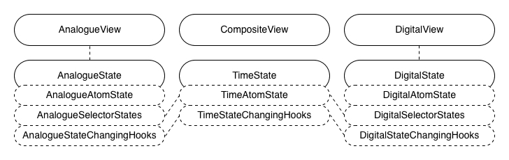
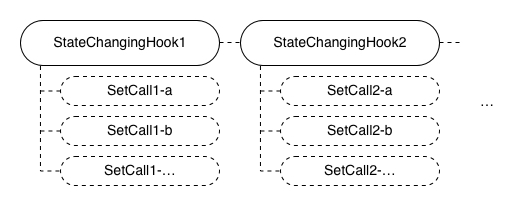
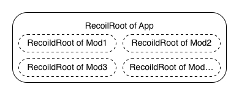

# Review of state management in React: facebook's experiment - Recoil

After reviewing reducer-like solutions, Redux and its family, in [the last article](../02-reducer-like-solutions-redux-and-its-family/README.md), continuing to answer the question #1 in [the initial article](../01-getting-started-with-an-mvc-example/README.md) , _How good are today's widely-accepted libraries of state management in React?_, I would look into facebook's experiment of state management in React, Recoil, by this article, to check out how facebook as maintainer of React does state management.

As mentioned previously, with [the example of the composite clock built with MVC pattern](https://github.com/licg9999/review-of-state-management-in-react/tree/master/01-getting-started-with-an-mvc-example) from the initial article as a baseline, for Recoil, I would rebuild the same example module with it and review how good it is in comparison with the baseline.

## Recalling the example module

Before that, let me recall the requirement of the example module a bit in case a reader might not have time to fully read the previous articles. If the previous articles have been read, this section can be skipped:


A composite clock is an interactive module that has 2 components, an analogue clock and a digital clock. The 2 child clocks always tick synchronously and can be set to new time by users. The analogue one can have its minute hand dragged. The digital one can have its text edited.

Although it's doable to use single big shared state for this example module, it's not always a good idea to use single big shared state for a real-world app because it brings poor maintainability of quality attributes([ISO/IEC 9126-1:2001](https://www.iso.org/standard/22749.html)). So, to closely emulate real-world situations, multiple related states are used here.

Then, there would be 3 related states seperately for the analogue clock, the digital clock and time itself. The state of time keeps a timestamp for the whole module. The states of the child clocks derive display data from the timestamp and accept user input data for setting the timestamp.


## Example module built with Recoil

Now, let me build the example module with Recoil. Again, `create-react-app` is used to initialize the React app. The option `--template typescript` is used to enable TypeScript:

```sh
$ npx create-react-app 03-facebook-s-experiment-recoil --template typescript
# ...
$ cd 03-facebook-s-experiment-recoil
```

The version of CRA in use is `5.0.1` and the generated directory structure looks as follows:

```sh
$ tree -I node_modules
.
├── README.md
├── package-lock.json
├── package.json
├── public
│   ├── favicon.ico
│   ├── index.html
│   ├── logo192.png
│   ├── logo512.png
│   ├── manifest.json
│   └── robots.txt
├── src
│   ├── App.css
│   ├── App.test.tsx
│   ├── App.tsx
│   ├── index.css
│   ├── index.tsx
│   ├── logo.svg
│   ├── react-app-env.d.ts
│   ├── reportWebVitals.ts
│   └── setupTests.ts
└── tsconfig.json

2 directories, 19 files
```

Then, `src/App.tsx` is cleared for later use:

```tsx
// src/App.tsx
import { FC } from 'react';

const App: FC = () => {
  return null;
};

export default App;
```

Following files are unused so removed:

```sh
$ rm src/App.css src/App.test.tsx src/logo.svg
```

Also, to help with time parsing and formating, `date-fns` is installed:

```sh
$ npm i date-fns
```

Then, to use Recoil, `recoil` is installed:

```sh
$ npm i recoil
```

The example module, the composite clock, would be all placed in `src/CompositeClock`. To match the 3 requried states, there would be 3 groups of atom states, selector states and state-changing hooks placed separately in `TimeState.ts`, `AnalogueState.ts` and `DigitalState.ts`. An atom state represents a state itself, a selector state represents the data deriving on one or more atom states or selector states, and a state-changing hook returns a function of state-changing logics to atom states or selector states.

And for view components, there are `AnalogueView.ts` for the analogue clock, `DigitalView.ts` for the digital clock, and `CompositeView.ts` as a glue. Besides, Recoil roots need to be initialized but doing it doesn't cost much.



In terms of coding, as the APIs whose names end with `_UNSTABLE` in Recoil are not yet finalized, I would avoid using them when possible.

The 3 groups of atom states, selector states and state-changing hooks are coded as follows:

```ts
// src/CompositeClock/TimeState.ts
import { atom, useRecoilCallback } from 'recoil';

export interface TimeStateValue {
  timestamp: number;
}

export const timeState = atom<TimeStateValue>({
  key: 'composite_clock-time',
  default: {
    timestamp: 0,
  },
});

export function useChangeTimestamp(): (timestamp: number) => void {
  return useRecoilCallback(
    ({ set }) =>
      (timestamp) => {
        set(timeState, (state) => ({ ...state, timestamp }));
      },
    []
  );
}
```

```ts
// src/CompositeClock/AnalogueState.ts
import { atom, selector, useRecoilCallback } from 'recoil';
import { timeState, useChangeTimestamp } from './TimeState';

const TWO_PI = 2 * Math.PI;

export interface AnalogueAngles {
  hour: number;
  minute: number;
  second: number;
}

export interface AnalogueStateValue {
  isEditMode: boolean;
  editModeAngles: AnalogueAngles;
}

export const analogueState = atom<AnalogueStateValue>({
  key: 'composite_clock-analogue',
  default: {
    isEditMode: false,
    editModeAngles: { hour: 0, minute: 0, second: 0 },
  },
});

export const displayAnglesState = selector<AnalogueAngles>({
  key: 'composite_clock-analogue_display_angles',
  get: ({ get }) => {
    const d = new Date(get(timeState).timestamp);
    return {
      hour: ((d.getHours() % 12) / 12) * TWO_PI + (d.getMinutes() / 60) * (TWO_PI / 12),
      minute: (d.getMinutes() / 60) * TWO_PI + (d.getSeconds() / 60) * (TWO_PI / 60),
      second: (d.getSeconds() / 60) * TWO_PI,
    };
  },
});

export function useEnterEditMode(): () => void {
  return useRecoilCallback(
    ({ snapshot, set }) =>
      () => {
        const { state: stateOfAnalogue, contents: analogue } = snapshot.getLoadable(analogueState);
        if (stateOfAnalogue !== 'hasValue') throw new Error('State of analogue not ready');

        if (analogue.isEditMode) return;

        const { state: stateOfDisplayAngles, contents: displayAngles } =
          snapshot.getLoadable(displayAnglesState);
        if (stateOfDisplayAngles !== 'hasValue')
          throw new Error('State of displayAngles not ready');

        set(analogueState, (state) => ({
          ...state,
          isEditMode: true,
          editModeAngles: displayAngles,
        }));
      },
    []
  );
}

export function useExitEditMode(): (submit?: boolean) => void {
  const changeTimestamp = useChangeTimestamp();

  return useRecoilCallback(
    ({ snapshot, set }) =>
      (submit = true) => {
        const { state: stateOfAnalogue, contents: analogue } = snapshot.getLoadable(analogueState);
        if (stateOfAnalogue !== 'hasValue') throw new Error('State of analogue not ready');

        if (!analogue.isEditMode) return;

        if (submit) {
          const { state: stateOfTime, contents: time } = snapshot.getLoadable(timeState);
          if (stateOfTime !== 'hasValue') throw new Error('State of time not ready');

          const d = new Date(time.timestamp);
          d.setHours(
            Math.floor((analogue.editModeAngles.hour / TWO_PI) * 12) +
              12 * Math.floor(d.getHours() / 12)
          );
          d.setMinutes((analogue.editModeAngles.minute / TWO_PI) * 60);
          d.setSeconds((analogue.editModeAngles.second / TWO_PI) * 60);
          changeTimestamp(d.getTime());
        }

        set(analogueState, (state) => ({ ...state, isEditMode: false }));
      },
    []
  );
}

export function useChangeEditModeMinuteAngle(): (minuteAngle: number) => void {
  return useRecoilCallback(({ set }) => (minuteAngle) => {
    set(analogueState, (state) => ({
      ...state,
      editModeAngles: {
        ...state.editModeAngles,
        minute: (minuteAngle + TWO_PI) % TWO_PI,
        hour:
          (Math.floor((state.editModeAngles.hour / TWO_PI) * 12) + minuteAngle / TWO_PI) *
          (TWO_PI / 12),
      },
    }));
  });
}
```

```ts
// src/CompositeClock/DigitalState.ts
import { format, isMatch, parse } from 'date-fns';
import { atom, selector, useRecoilCallback } from 'recoil';
import { timeState, useChangeTimestamp } from './TimeState';

export interface DigitalStateValue {
  isEditMode: boolean;
  editModeText: string;
}

export const DIGITAL_TEXT_FORMAT = 'HH:mm:ss';

export const digitalState = atom<DigitalStateValue>({
  key: 'composite_clock-digital',
  default: {
    isEditMode: false,
    editModeText: '',
  },
});

export const displayTextState = selector<string>({
  key: 'composite_clock-digital_display_text',
  get: ({ get }) => format(get(timeState).timestamp, DIGITAL_TEXT_FORMAT),
});

export const isEditModeTextValidState = selector<boolean>({
  key: 'composite_clock-digital_is_edit_mode_text_valid',
  get: ({ get }) => isMatch(get(digitalState).editModeText, DIGITAL_TEXT_FORMAT),
});

export function useEnterEditMode(): () => void {
  return useRecoilCallback(
    ({ snapshot, set }) =>
      () => {
        const { state: stateOfDigital, contents: digital } = snapshot.getLoadable(digitalState);
        if (stateOfDigital !== 'hasValue') throw new Error('State of digital not ready');

        if (digital.isEditMode) return;

        const { state: stateOfDisplayText, contents: displayText } =
          snapshot.getLoadable(displayTextState);
        if (stateOfDisplayText !== 'hasValue') throw new Error('State of displayText not ready');

        set(digitalState, (state) => ({ ...state, isEditMode: true, editModeText: displayText }));
      },
    []
  );
}

export function useExitEditMode(): (submit?: boolean) => void {
  const changeTimestamp = useChangeTimestamp();

  return useRecoilCallback(
    ({ snapshot, set }) =>
      (submit = true) => {
        const { state: stateOfDigital, contents: digital } = snapshot.getLoadable(digitalState);
        if (stateOfDigital !== 'hasValue') throw new Error('State of digital not ready');

        if (!digital.isEditMode) return;

        const { state: stateOfIsEditModeTextValid, contents: isEditModeTextValid } =
          snapshot.getLoadable(isEditModeTextValidState);
        if (stateOfIsEditModeTextValid !== 'hasValue')
          throw new Error('State of isEditModeTextValid not ready');

        if (submit && isEditModeTextValid) {
          const { state: stateOfTime, contents: time } = snapshot.getLoadable(timeState);
          if (stateOfTime !== 'hasValue') throw new Error('State of time not ready');

          changeTimestamp(
            parse(digital.editModeText, DIGITAL_TEXT_FORMAT, time.timestamp).getTime()
          );
        }
        set(digitalState, (state) => ({ ...state, isEditMode: false }));
      },
    [changeTimestamp]
  );
}

export function useChangeEditModeText(): (editModeText: string) => void {
  return useRecoilCallback(
    ({ set }) =>
      (editModeText) => {
        set(digitalState, (state) => ({ ...state, editModeText }));
      },
    []
  );
}
```

And, the view components are coded as follows:

```tsx
// src/CompositeClock/AnalogueView.tsx
import { FC, useCallback, useEffect } from 'react';
import { useRecoilValue } from 'recoil';
import {
  analogueState,
  displayAnglesState,
  useChangeEditModeMinuteAngle,
  useEnterEditMode,
  useExitEditMode,
} from './AnalogueState';
import styles from './AnalogueView.module.css';

const TWO_PI = 2 * Math.PI;

interface Props {
  className?: string;
}

export const AnalogueView: FC<Props> = ({ className }) => {
  const { isEditMode, editModeAngles } = useRecoilValue(analogueState);
  const displayAngles = useRecoilValue(displayAnglesState);

  const enterEditMode = useEnterEditMode();
  const exitEditMode = useExitEditMode();
  const changeEditModeMinuteAngle = useChangeEditModeMinuteAngle();

  const angles = isEditMode ? editModeAngles : displayAngles;

  const calcEditModeMinuteAngle = useCallback(
    (pointX: number, pointY: number): number => {
      const pointLen = Math.sqrt(Math.pow(pointX, 2) + Math.pow(pointY, 2));

      const normalizedX = pointX / pointLen;
      const normalizedY = pointY / pointLen;

      const oldX = Math.sin(editModeAngles.minute);
      const oldY = Math.cos(editModeAngles.minute);

      const rawMinuteAngle = Math.acos(normalizedY);

      const minuteAngle =
        normalizedY > 0 && oldY > 0
          ? normalizedX >= 0
            ? oldX < 0
              ? rawMinuteAngle + TWO_PI
              : rawMinuteAngle
            : oldX >= 0
            ? -rawMinuteAngle
            : -rawMinuteAngle + TWO_PI
          : normalizedX >= 0
          ? rawMinuteAngle
          : -rawMinuteAngle + TWO_PI;

      return minuteAngle;
    },
    [editModeAngles]
  );

  const onMinuteHandMouseDown = useCallback(
    (e: React.MouseEvent<HTMLDivElement>) => {
      e.preventDefault();
      enterEditMode();
    },
    [enterEditMode]
  );

  const onMouseLeave = useCallback(() => exitEditMode(), [exitEditMode]);

  const onMouseUp = useCallback(() => exitEditMode(), [exitEditMode]);

  const onKeyDown = useCallback(
    (e: KeyboardEvent): void => {
      if (isEditMode && e.key === 'Escape') {
        exitEditMode(false);
      }
    },
    [isEditMode, exitEditMode]
  );

  const onMouseMove = useCallback(
    (e: React.MouseEvent<HTMLDivElement>): void => {
      if (!isEditMode) return;

      const boundingBox = e.currentTarget.getBoundingClientRect();
      const originX = boundingBox.x + boundingBox.width / 2;
      const originY = boundingBox.y + boundingBox.height / 2;

      const pointX = e.clientX - originX;
      const pointY = originY - e.clientY;

      changeEditModeMinuteAngle(calcEditModeMinuteAngle(pointX, pointY));
    },
    [calcEditModeMinuteAngle, changeEditModeMinuteAngle, isEditMode]
  );

  useEffect(() => {
    window.addEventListener('keydown', onKeyDown);
    return () => window.removeEventListener('keydown', onKeyDown);
  }, [onKeyDown]);

  return (
    <div
      className={`${className ?? ''} ${styles.root} ${isEditMode ? styles.editMode : ''}`}
      onMouseLeave={onMouseLeave}
      onMouseUp={onMouseUp}
      onMouseMove={onMouseMove}
    >
      <div className={styles.axis} />
      <div
        className={`${styles.hand} ${styles.hour}`}
        style={{ transform: `rotateZ(${angles.hour}rad)` }}
      />
      <div
        className={`${styles.hand} ${styles.minute}`}
        style={{ transform: `rotateZ(${angles.minute}rad)` }}
        onMouseDown={onMinuteHandMouseDown}
      />
      <div
        className={`${styles.hand} ${styles.second}`}
        style={{ transform: `rotateZ(${angles.second}rad)` }}
      />
    </div>
  );
};
```

```css
/* src/CompositeClock/AnalogueView.module.css */
.root {
  margin: 12px;
  padding: 8px;
  width: 160px;
  height: 160px;
  border-radius: 100%;
  border: 1px solid black;
  position: relative;
}

.axis {
  position: absolute;
  background-color: black;
  left: 47.5%;
  top: 47.5%;
  width: 5%;
  height: 5%;
  border-radius: 100%;
}

.hand {
  position: absolute;
  background-color: black;
  transform-origin: bottom center;
}

.hand.hour {
  left: 48.5%;
  top: 25%;
  height: 25%;
  width: 3%;
}

.hand.minute {
  left: 49%;
  top: 10%;
  height: 40%;
  width: 2%;
  z-index: 10;
  cursor: pointer;
}

.hand.second {
  left: 49.5%;
  top: 10%;
  height: 40%;
  width: 1%;
}

.editMode.root {
  outline: 2px solid skyblue;
}
```

```tsx
// src/CompositeClock/DigitalView.tsx
import { FC, useCallback, useEffect, useRef } from 'react';
import { useRecoilValue } from 'recoil';
import {
  digitalState,
  DIGITAL_TEXT_FORMAT,
  displayTextState,
  isEditModeTextValidState,
  useChangeEditModeText,
  useEnterEditMode,
  useExitEditMode,
} from './DigitalState';
import styles from './DigitalView.module.css';

interface Props {
  className?: string;
}

export const DigitalView: FC<Props> = ({ className }) => {
  const { isEditMode, editModeText } = useRecoilValue(digitalState);
  const displayText = useRecoilValue(displayTextState);
  const isEditModeTextValid = useRecoilValue(isEditModeTextValidState);

  const enterEditMode = useEnterEditMode();
  const exitEditMode = useExitEditMode();
  const changeEditModeText = useChangeEditModeText();

  const refEditor = useRef<HTMLInputElement | null>(null);

  const onDisplayClick = enterEditMode;

  const onEditorBlur = useCallback(() => exitEditMode(false), [exitEditMode]);

  const onEditorChange = useCallback(
    (e: React.ChangeEvent<HTMLInputElement>) => changeEditModeText(e.target.value),
    [changeEditModeText]
  );

  const onEditorKeyDown = useCallback(
    (e: React.KeyboardEvent) => {
      if (e.key === 'Enter') {
        exitEditMode();
      }
    },
    [exitEditMode]
  );

  useEffect(() => {
    if (isEditMode && refEditor.current) {
      refEditor.current.select();
    }
  }, [isEditMode]);

  return (
    <div className={`${className ?? ''} ${styles.root} ${isEditMode ? styles.editMode : ''}`}>
      {isEditMode ? (
        <>
          <input
            className={styles.editor}
            type="text"
            ref={refEditor}
            value={editModeText}
            onBlur={onEditorBlur}
            onChange={onEditorChange}
            onKeyDown={onEditorKeyDown}
          />
          {!isEditModeTextValid && (
            <div className={styles.invalidHint}>
              The input time doesn't match the expected format which is '{DIGITAL_TEXT_FORMAT}'.
            </div>
          )}
        </>
      ) : (
        <div onClick={onDisplayClick}>{displayText}</div>
      )}
    </div>
  );
};
```

```css
/* src/CompositeClock/DigitalView.module.css */
.root {
  border: 1px solid black;
  width: 200px;
  line-height: 30px;
  text-align: center;
}

.editor {
  width: 100%;
  text-align: center;
  font-size: inherit;
  padding: 0;
  border: none;
  outline: none;
}

.invalidHint {
  line-height: 1.2;
}

.editMode.root {
  outline: 2px solid skyblue;
}
```

```tsx
// src/CompositeClock/CompositeView.tsx
import { FC, useEffect, useRef } from 'react';
import { useRecoilCallback, useRecoilValue } from 'recoil';
import { analogueState } from './AnalogueState';
import { AnalogueView } from './AnalogueView';
import styles from './CompositeView.module.css';
import { digitalState } from './DigitalState';
import { DigitalView } from './DigitalView';
import { timeState, useChangeTimestamp } from './TimeState';

export const CompositeView: FC = () => {
  const { isEditMode: isEditModeInAnalogueClock } = useRecoilValue(analogueState);
  const { isEditMode: isEditModeInDigitalClock } = useRecoilValue(digitalState);

  const changeTimestamp = useChangeTimestamp();

  const calcTimestampCorrection = useRecoilCallback(
    ({ snapshot }) =>
      () => {
        const { state: stateOfTime, contents: time } = snapshot.getLoadable(timeState);
        if (stateOfTime !== 'hasValue') throw new Error('State of time not ready');

        return time.timestamp - Date.now();
      },
    []
  );

  const refTimeCorrection = useRef<number>(calcTimestampCorrection());

  useEffect(() => {
    if (!isEditModeInAnalogueClock || !isEditModeInDigitalClock) {
      refTimeCorrection.current = calcTimestampCorrection();
    }
  }, [calcTimestampCorrection, isEditModeInAnalogueClock, isEditModeInDigitalClock]);

  useEffect(() => {
    const tickHandler = setInterval(
      () => changeTimestamp(Date.now() + refTimeCorrection.current),
      100
    );
    return () => clearInterval(tickHandler);
  }, [changeTimestamp]);

  return (
    <div className={styles.root}>
      <AnalogueView />
      <DigitalView />
    </div>
  );
};
```

```css
/* src/CompositeClock/CompositeView.module.css */
.root {
  margin: 16px 8px;
  font-size: 16px;
}
```

After that, Recoil roots are initialized per app for app-wide states and per module for module-wide states:

```tsx
// src/index.tsx
import React from 'react';
import ReactDOM from 'react-dom/client';
import { RecoilRoot } from 'recoil';
import App from './App';
import './index.css';
import reportWebVitals from './reportWebVitals';

const root = ReactDOM.createRoot(document.getElementById('root') as HTMLElement);
root.render(
  <React.StrictMode>
    <RecoilRoot>
      <App />
    </RecoilRoot>
  </React.StrictMode>
);

// If you want to start measuring performance in your app, pass a function
// to log results (for example: reportWebVitals(console.log))
// or send to an analytics endpoint. Learn more: https://bit.ly/CRA-vitals
reportWebVitals();
```

```diff
// src/CompositeClock/CompositeView.tsx
import { FC, useEffect, useRef } from 'react';
-import { useRecoilCallback, useRecoilValue } from 'recoil';
+import { RecoilRoot, useRecoilCallback, useRecoilValue } from 'recoil';

...

+export const CompositeClock: FC = () => {
+  return (
+    <RecoilRoot
+      initializeState={(snapshot) => {
+        snapshot.set(timeState, { timestamp: Date.now() });
+      }}
+    >
+      <CompositeView />
+    </RecoilRoot>
+  );
+};
```

Then, the composite clock is exported and used in `App.tsx`:

```ts
// src/CompositeClock/index.ts
export { CompositeClock } from './CompositeView';
```

```diff
// src/App.tsx
import { FC } from 'react';
+import { CompositeClock } from './CompositeClock';

const App: FC = () => {
-  return null;
+  return <CompositeClock />;
};

export default App;
```

The example module built with Recoil is complete. It can be previewed with the command `npm start` and its codebase is hosted at [review-of-state-management-in-react/03-facebook-s-experiment-recoil](https://github.com/licg9999/review-of-state-management-in-react/tree/master/03-facebook-s-experiment-recoil).

## Review of state management with Recoil

In terms of state management, compared with MVC pattern, the brightest pro of Recoil is, states changing is actually made by `set` calls, state-changing hooks are only for invoking `set` calls or other state-changing hooks, and `set` calls get no more state-changing hooks invoked, so state-changing logics can be easily tracked, which makes states changing predictable at limited cost on scaling up the app. It can be perceived by checking how state-changing hooks `TimeState.ts`, `AnalogueState.ts` and `DigitalState.ts` work. This benefits maintainability.



Meanwhile, another major pro of Recoil is, as Recoil roots can be nested easily, module-wide states can be hosted in the Recoil root of its own easily while app-wide states are hosted in the Recoil root of the app, which makes a module able to have multiple instances with independent states easily. In the example, the Recoil root in `src/index.tsx` hosts the app-wide states and the Recoil root in `src/CompositeClock/CompositeView.tsx` hosts the module-wide states. This benefits portability.



Though, the biggest con of Recoil is, as Recoil cares much about asynchronousness, reading a state in state-changing hooks always requires checking the state of the state, which takes unnecessary cost. (Although the not-yet-finalized API `useRecoilTransaction_UNSTABLE` provides an easier way to read a state, it can't be foreseen what it will eventually look like after asynchronousness is taken into consideration.) Besides, another major con of Recoil is, keys with unique names in the scope of the nearest Recoil root for atom states and selector states are always required, which takes extra cost.

To sum up, doing state management with Recoil achieves predictable states changing with a bit cost of tracking state-changing logics, reading states in hooks and naming unique keys for states.

## What's next

By far, reducer-like solutions, Redux and its family, and facebook's experiment, Recoil, have been reviewed compared with MVC pattern. Then, in the next article, continuing to answer the question #1 in the initial article, I would look into [kinds of lightweight trials of state management in React - MobX, Zustand, Jotai and Valtio](../04-kinds-of-lightweight-trials-zustand-mobx-jotai-and-valtio/README.md).
