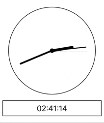
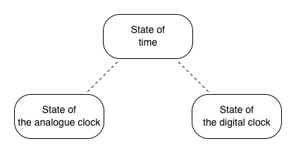
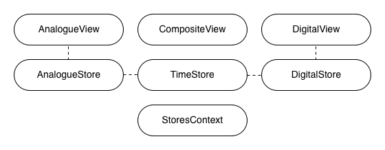
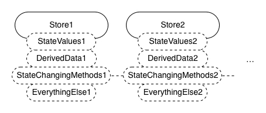
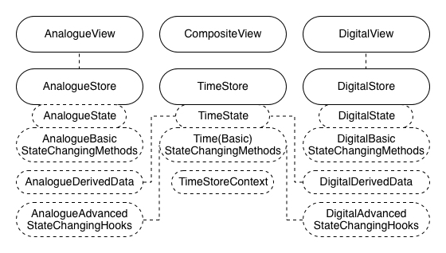
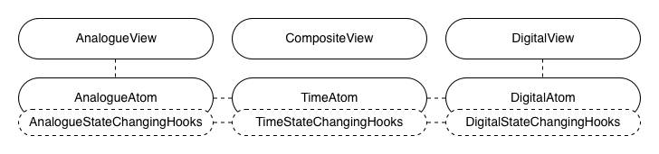
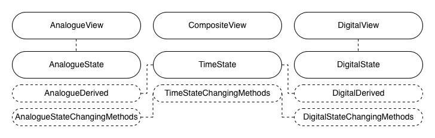

# Review of state management in React: kinds of lightweight trials - MobX, Zustand, Jotai and Valtio

After reviewing [reducer-like solutions](../02-reducer-like-solutions-redux-and-its-family/README.md) and [facebook's experiment](../03-facebook-s-experiment-recoil/README.md), continuing to answer the question #1 in [the initial article](../01-getting-started-with-an-mvc-example/README.md) , _How good are today's widely-accepted libraries of state management in React?_, I would look into kinds of lightweight trials of state management in React by this article, which includes the direct competitor of Redux - MobX, and some popular rising stars - Zustand, Jotai and Valtio.

As mentioned previously, with [the example of the composite clock built with MVC pattern](https://github.com/licg9999/review-of-state-management-in-react/tree/master/01-getting-started-with-an-mvc-example) from the initial article as a baseline, for each lightweight trial, I would rebuild the same example module with it and review how good it is in comparison with the baseline.

## Lightweight trials

By lightweight trials of state management, I mean those solutions that do state management in more straightforward ways unlike reducer-like solutions that always get states managed with multiple separate parts involved. A more straightforward solution can often result in lower cost but it may bring trouble in certain cases at the same time. It's worth figuring out what the straightforwardness of each widely-accepted lightweight trials would really end up with.

## Recalling the example module

Before that, let me recall the requirement of the example module a bit in case a reader might not have time to fully read the previous articles. If the previous articles have been read, this section can be skipped:



A composite clock is an interactive module that has 2 components, an analogue clock and a digital clock. The 2 child clocks always tick synchronously and can be set to new time by users. The analogue one can have its minute hand dragged. The digital one can have its text edited.

Although it's doable to use single big shared state for this example module, it's not always a good idea to use single big shared state for a real-world app because it brings poor maintainability of quality attributes([ISO/IEC 9126-1:2001](https://www.iso.org/standard/22749.html)). So, to closely emulate real-world situations, multiple related states are used here.

Then, there would be 3 related states seperately for the analogue clock, the digital clock and time itself. The state of time keeps a timestamp for the whole module. The states of the child clocks derive display data from the timestamp and accept user input data for setting the timestamp.



## Example module built with MobX

Firstly, I would look into MobX. Again, `create-react-app` is used to initialize the React app. The option `--template typescript` is used to enable TypeScript:

```sh
$ npx create-react-app 04-kinds-of-lightweight-trials-mobx-zustand-jotai-and-valtio/8baa6b2 --template typescript
# ...
$ cd 04-kinds-of-lightweight-trials-mobx-zustand-jotai-and-valtio/8baa6b2
```

The version of CRA in use is `5.0.1` and the generated directory structure looks as follows:

```sh
$ tree -I node_modules
.
├── README.md
├── package-lock.json
├── package.json
├── public
│   ├── favicon.ico
│   ├── index.html
│   ├── logo192.png
│   ├── logo512.png
│   ├── manifest.json
│   └── robots.txt
├── src
│   ├── App.css
│   ├── App.test.tsx
│   ├── App.tsx
│   ├── index.css
│   ├── index.tsx
│   ├── logo.svg
│   ├── react-app-env.d.ts
│   ├── reportWebVitals.ts
│   └── setupTests.ts
└── tsconfig.json

2 directories, 19 files
```

Then, `src/App.tsx` is cleared for later use:

```tsx
// 8baa6b2/src/App.tsx
import { FC } from 'react';

const App: FC = () => {
  return null;
};

export default App;
```

Following files are unused so removed:

```sh
$ rm src/App.css src/App.test.tsx src/logo.svg
```

Also, to help with time parsing and formating, `date-fns` is installed:

```sh
$ npm i date-fns
```

Then, to use MobX, `mobx` and `mobx-react-lite` are installed:

```sh
$ npm i mobx mobx-react-lite
```

The example module, the composite clock, would be all placed in `src/CompositeClock`. To match the 3 requried states, there would be 3 stores, `TimeStore.ts`, `AnalogueStore.ts` and `DigitalStore.ts`. In MobX, a store hosts a state's values, the derived data, the state-changing methods as well as the references to other stores.

And for view components, there are `AnalogueView.ts` for the analogue clock, `DigitalView.ts` for the digital clock, and `CompositeView.ts` as a glue. Besides, a React context that provides the stores is needed so stores can be initialized and accessed.



The 3 stores are coded as follows:

```ts
// 8baa6b2/src/CompositeClock/TimeStore.ts
import { makeAutoObservable } from 'mobx';

export class TimeStore {
  timestamp: number;

  constructor(timestamp?: number) {
    makeAutoObservable(this);
    this.timestamp = timestamp ?? Date.now();
  }

  changeTimestamp = (timestamp: number): void => {
    this.timestamp = timestamp;
  };
}
```

```ts
// 8baa6b2/src/CompositeClock/AnalogueStore.ts
import { makeAutoObservable } from 'mobx';
import { TimeStore } from './TimeStore';

const TWO_PI = 2 * Math.PI;

export interface AnalogueAngles {
  hour: number;
  minute: number;
  second: number;
}

export class AnalogueStore {
  private timeStore: TimeStore;

  isEditMode: boolean;
  editModeAngles: AnalogueAngles;

  get displayAngles(): AnalogueAngles {
    const d = new Date(this.timeStore.timestamp);
    return {
      hour: ((d.getHours() % 12) / 12) * TWO_PI + (d.getMinutes() / 60) * (TWO_PI / 12),
      minute: (d.getMinutes() / 60) * TWO_PI + (d.getSeconds() / 60) * (TWO_PI / 60),
      second: (d.getSeconds() / 60) * TWO_PI,
    };
  }

  constructor(timeStore: TimeStore) {
    makeAutoObservable(this);
    this.timeStore = timeStore;
    this.isEditMode = false;
    this.editModeAngles = this.displayAngles;
  }

  enterEditMode = (): void => {
    if (this.isEditMode) return;
    this.isEditMode = true;
    this.editModeAngles = this.displayAngles;
  };

  exitEditMode = (submit: boolean = true): void => {
    if (!this.isEditMode) return;
    this.isEditMode = false;
    if (submit) {
      const d = new Date(this.timeStore.timestamp);
      d.setHours(
        Math.floor((this.editModeAngles.hour / TWO_PI) * 12) + 12 * Math.floor(d.getHours() / 12)
      );
      d.setMinutes((this.editModeAngles.minute / TWO_PI) * 60);
      d.setSeconds((this.editModeAngles.second / TWO_PI) * 60);
      this.timeStore.changeTimestamp(d.getTime());
    }
  };

  changeEditModeMinuteAngle = (minuteAngle: number): void => {
    this.editModeAngles.minute = (minuteAngle + TWO_PI) % TWO_PI;
    this.editModeAngles.hour =
      (Math.floor((this.editModeAngles.hour / TWO_PI) * 12) + minuteAngle / TWO_PI) * (TWO_PI / 12);
  };
}
```

```ts
// 8baa6b2/src/CompositeClock/DigitalStore.ts
import { format, isMatch, parse } from 'date-fns';
import { makeAutoObservable } from 'mobx';
import { TimeStore } from './TimeStore';

export class DigitalStore {
  static readonly FORMAT = 'HH:mm:ss';

  private timeStore: TimeStore;

  isEditMode: boolean;
  editModeText: string;

  get displayText(): string {
    return format(this.timeStore.timestamp, DigitalStore.FORMAT);
  }

  get isEditModeTextValid(): boolean {
    return isMatch(this.editModeText, DigitalStore.FORMAT);
  }

  constructor(timeStore: TimeStore) {
    makeAutoObservable(this);
    this.timeStore = timeStore;
    this.isEditMode = false;
    this.editModeText = this.displayText;
  }

  enterEditMode = (): void => {
    if (this.isEditMode) return;
    this.isEditMode = true;
    this.editModeText = this.displayText;
  };

  exitEditMode = (submit: boolean = true): void => {
    if (!this.isEditMode) return;
    this.isEditMode = false;
    if (submit && this.isEditModeTextValid) {
      this.timeStore.changeTimestamp(
        parse(this.editModeText, DigitalStore.FORMAT, this.timeStore.timestamp).getTime()
      );
    }
  };

  changeEditModeText = (editModeText: string): void => {
    this.editModeText = editModeText;
  };
}
```

Then, the stores context is coded as follows:

```tsx
// 8baa6b2/src/CompositeClock/StoresContext.tsx
import { createContext, FC, PropsWithChildren, useContext, useMemo } from 'react';
import { AnalogueStore } from './AnalogueStore';
import { DigitalStore } from './DigitalStore';
import { TimeStore } from './TimeStore';

export interface Stores {
  time: TimeStore;
  analogue: AnalogueStore;
  digital: DigitalStore;
}

const StoresContext = createContext<Stores | null>(null);

export const StoresProvider: FC<PropsWithChildren> = ({ children }) => {
  const stores: Stores = useMemo(() => {
    const time = new TimeStore();
    const analogue = new AnalogueStore(time);
    const digital = new DigitalStore(time);
    return { time, analogue, digital };
  }, []);
  return <StoresContext.Provider value={stores}>{children}</StoresContext.Provider>;
};

export function useStores(): Stores {
  const stores = useContext(StoresContext);
  if (!stores) throw new Error('StoresContext not found');
  return stores;
}
```

And, the view components are coded as follows:

```tsx
// 8baa6b2/src/CompositeClock/AnalogueView.tsx
import { observer } from 'mobx-react-lite';
import { FC, useCallback, useEffect } from 'react';
import styles from './AnalogueView.module.css';
import { useStores } from './StoresContext';

const TWO_PI = 2 * Math.PI;

interface Props {
  className?: string;
}

export const AnalogueView: FC<Props> = observer(({ className }) => {
  const {
    isEditMode,
    editModeAngles,
    displayAngles,
    enterEditMode,
    exitEditMode,
    changeEditModeMinuteAngle,
  } = useStores().analogue;

  const angles = isEditMode ? editModeAngles : displayAngles;

  const calcEditModeMinuteAngle = useCallback(
    (pointX: number, pointY: number): number => {
      const pointLen = Math.sqrt(Math.pow(pointX, 2) + Math.pow(pointY, 2));

      const normalizedX = pointX / pointLen;
      const normalizedY = pointY / pointLen;

      const oldX = Math.sin(editModeAngles.minute);
      const oldY = Math.cos(editModeAngles.minute);

      const rawMinuteAngle = Math.acos(normalizedY);

      const minuteAngle =
        normalizedY > 0 && oldY > 0
          ? normalizedX >= 0
            ? oldX < 0
              ? rawMinuteAngle + TWO_PI
              : rawMinuteAngle
            : oldX >= 0
            ? -rawMinuteAngle
            : -rawMinuteAngle + TWO_PI
          : normalizedX >= 0
          ? rawMinuteAngle
          : -rawMinuteAngle + TWO_PI;

      return minuteAngle;
    },
    [editModeAngles]
  );

  const onMinuteHandMouseDown = useCallback(
    (e: React.MouseEvent<HTMLDivElement>) => {
      e.preventDefault();
      enterEditMode();
    },
    [enterEditMode]
  );

  const onMouseLeave = useCallback(() => exitEditMode(), [exitEditMode]);

  const onMouseUp = useCallback(() => exitEditMode(), [exitEditMode]);

  const onKeyDown = useCallback(
    (e: KeyboardEvent): void => {
      if (isEditMode && e.key === 'Escape') {
        exitEditMode(false);
      }
    },
    [exitEditMode, isEditMode]
  );

  const onMouseMove = useCallback(
    (e: React.MouseEvent<HTMLDivElement>): void => {
      if (!isEditMode) return;

      const boundingBox = e.currentTarget.getBoundingClientRect();
      const originX = boundingBox.x + boundingBox.width / 2;
      const originY = boundingBox.y + boundingBox.height / 2;

      const pointX = e.clientX - originX;
      const pointY = originY - e.clientY;

      changeEditModeMinuteAngle(calcEditModeMinuteAngle(pointX, pointY));
    },
    [calcEditModeMinuteAngle, changeEditModeMinuteAngle, isEditMode]
  );

  useEffect(() => {
    window.addEventListener('keydown', onKeyDown);
    return () => window.removeEventListener('keydown', onKeyDown);
  }, [onKeyDown]);

  return (
    <div
      className={`${className ?? ''} ${styles.root} ${isEditMode ? styles.editMode : ''}`}
      onMouseLeave={onMouseLeave}
      onMouseUp={onMouseUp}
      onMouseMove={onMouseMove}
    >
      <div className={styles.axis} />
      <div
        className={`${styles.hand} ${styles.hour}`}
        style={{ transform: `rotateZ(${angles.hour}rad)` }}
      />
      <div
        className={`${styles.hand} ${styles.minute}`}
        style={{ transform: `rotateZ(${angles.minute}rad)` }}
        onMouseDown={onMinuteHandMouseDown}
      />
      <div
        className={`${styles.hand} ${styles.second}`}
        style={{ transform: `rotateZ(${angles.second}rad)` }}
      />
    </div>
  );
});
```

```css
/* 8baa6b2/src/CompositeClock/AnalogueView.module.css */
.root {
  margin: 12px;
  padding: 8px;
  width: 160px;
  height: 160px;
  border-radius: 100%;
  border: 1px solid black;
  position: relative;
}

.axis {
  position: absolute;
  background-color: black;
  left: 47.5%;
  top: 47.5%;
  width: 5%;
  height: 5%;
  border-radius: 100%;
}

.hand {
  position: absolute;
  background-color: black;
  transform-origin: bottom center;
}

.hand.hour {
  left: 48.5%;
  top: 25%;
  height: 25%;
  width: 3%;
}

.hand.minute {
  left: 49%;
  top: 10%;
  height: 40%;
  width: 2%;
  z-index: 10;
  cursor: pointer;
}

.hand.second {
  left: 49.5%;
  top: 10%;
  height: 40%;
  width: 1%;
}

.editMode.root {
  outline: 2px solid skyblue;
}
```

```tsx
// 8baa6b2/src/CompositeClock/DigitalView.tsx
import { observer } from 'mobx-react-lite';
import { FC, useCallback, useEffect, useRef } from 'react';
import { DigitalStore } from './DigitalStore';
import styles from './DigitalView.module.css';
import { useStores } from './StoresContext';

interface Props {
  className?: string;
}

export const DigitalView: FC<Props> = observer(({ className }) => {
  const {
    isEditMode,
    editModeText,
    displayText,
    isEditModeTextValid,
    enterEditMode,
    exitEditMode,
    changeEditModeText,
  } = useStores().digital;

  const refEditor = useRef<HTMLInputElement | null>(null);

  const onDisplayClick = enterEditMode;

  const onEditorBlur = useCallback(() => exitEditMode(false), [exitEditMode]);

  const onEditorChange = useCallback(
    (e: React.ChangeEvent<HTMLInputElement>) => changeEditModeText(e.target.value),
    [changeEditModeText]
  );

  const onEditorKeyDown = useCallback(
    (e: React.KeyboardEvent) => {
      if (e.key === 'Enter') {
        exitEditMode();
      }
    },
    [exitEditMode]
  );

  useEffect(() => {
    if (isEditMode && refEditor.current) {
      refEditor.current.select();
    }
  }, [isEditMode]);

  return (
    <div className={`${className ?? ''} ${styles.root} ${isEditMode ? styles.editMode : ''}`}>
      {isEditMode ? (
        <>
          <input
            className={styles.editor}
            type="text"
            ref={refEditor}
            value={editModeText}
            onBlur={onEditorBlur}
            onChange={onEditorChange}
            onKeyDown={onEditorKeyDown}
          />
          {!isEditModeTextValid && (
            <div className={styles.invalidHint}>
              The input time doesn't match the expected format which is '{DigitalStore.FORMAT}'.
            </div>
          )}
        </>
      ) : (
        <div onClick={onDisplayClick}>{displayText}</div>
      )}
    </div>
  );
});
```

```css
/* 8baa6b2/src/CompositeClock/DigitalView.module.css */
.root {
  border: 1px solid black;
  width: 200px;
  line-height: 30px;
  text-align: center;
}

.editor {
  width: 100%;
  text-align: center;
  font-size: inherit;
  padding: 0;
  border: none;
  outline: none;
}

.invalidHint {
  line-height: 1.2;
}

.editMode.root {
  outline: 2px solid skyblue;
}
```

```tsx
// 8baa6b2/src/CompositeClock/CompositeView.tsx
import { observer } from 'mobx-react-lite';
import { FC, useCallback, useEffect, useRef } from 'react';
import { AnalogueView } from './AnalogueView';
import styles from './CompositeView.module.css';
import { DigitalView } from './DigitalView';
import { StoresProvider, useStores } from './StoresContext';

export const CompositeView: FC = observer(() => {
  const {
    time: { timestamp, changeTimestamp },
    analogue: { isEditMode: isEditModeInAnalogueClock },
    digital: { isEditMode: isEditModeInDigitalClock },
  } = useStores();

  const calcTimestampCorrection = useCallback(() => timestamp - Date.now(), [timestamp]);

  const refTimeCorrection = useRef<number>(calcTimestampCorrection());

  useEffect(() => {
    if (!isEditModeInAnalogueClock || !isEditModeInDigitalClock) {
      refTimeCorrection.current = calcTimestampCorrection();
    }
  }, [calcTimestampCorrection, isEditModeInAnalogueClock, isEditModeInDigitalClock]);

  useEffect(() => {
    const tickHandler = setInterval(
      () => changeTimestamp(Date.now() + refTimeCorrection.current),
      100
    );
    return () => clearInterval(tickHandler);
  }, [changeTimestamp]);

  return (
    <div className={styles.root}>
      <AnalogueView />
      <DigitalView />
    </div>
  );
});

export const CompositeClock: FC = () => {
  return (
    <StoresProvider>
      <CompositeView />
    </StoresProvider>
  );
};
```

```css
/* 8baa6b2/src/CompositeClock/CompositeView.module.css */
.root {
  margin: 16px 8px;
  font-size: 16px;
}
```

After that, the composite clock is exported and used in `App.tsx`:

```ts
// 8baa6b2/src/CompositeClock/index.ts
export { CompositeClock } from './CompositeView';
```

```diff
// 8baa6b2/src/App.tsx
import { FC } from 'react';
+import { CompositeClock } from './CompositeClock';

const App: FC = () => {
-  return null;
+  return <CompositeClock />;
};

export default App;
```

The example module built with MobX is complete. It can be previewed with the command `npm start` and its codebase is hosted at [review-of-state-management-in-react/04-kinds-of-lightweight-trials-mobx-zustand-jotai-and-valtio/8baa6b2](https://github.com/licg9999/review-of-state-management-in-react/tree/master/04-kinds-of-lightweight-trials-mobx-zustand-jotai-and-valtio/8baa6b2).

## Review of state management with MobX

In terms of state management, compared with MVC pattern, the brightest pro of MobX is, although state-changing methods invoke other state-changing methods and trigger side effects of states changing, derived data changing as well as views rerendering, the side effects don't get any more state-changing logics invoked so the state-changing logics can be easily tracked, which makes states changing predictable at limited cost on scaling up the app. Meanwhile, similar to MVC pattern, another major pro of MobX is, each state leads to a store that hosts everything needed to get it managed including the state's values, the derived data, the state-changing methods, the references to other stores and more, which makes the app domain clearly split. It can be perceived by checking how `TimeStore.ts`, `AnalogueStore.ts` and `DigitalStore.ts` work. This benefits maintainability.



On the other hand, the biggest con of MobX is, as MobX works very independently from React, a strong understanding of MobX's subscription mechanism is needed so to build the stores context and wrap view components with `observer` correctly, which takes extra cost of development. It can be seen by checking how `StoresContext.tsx`, `AnalogueView.tsx` and `DigitalView.tsx` are constructed.

As a sum-up, doing state management with MobX achieves predictable states changing with a bit cost of tracking state-changing logics and correctly using the subscription mechanism.

## Example module built with Zustand

Next, I would take a look at Zustand. Again, the React app is initialized with `create-react-app --template typescript`, `src/App.tsx` is cleared for later use, unused files are removed, the package of time helpers is installed:

```sh
$ npx create-react-app 04-kinds-of-lightweight-trials-mobx-zustand-jotai-and-valtio/61afc7d --template typescript
# ...
$ cd 04-kinds-of-lightweight-trials-mobx-zustand-jotai-and-valtio/61afc7d
```

```tsx
// 61afc7d/src/App.tsx
import { FC } from 'react';

const App: FC = () => {
  return null;
};

export default App;
```

```sh
$ rm src/App.css src/App.test.tsx src/logo.svg
```

```sh
$ npm i date-fns
```

Then, to use Zustand, `zustand` is installed:

```sh
$ npm i zustand
```

Similar to the implementation with MobX, the composite clock would be all placed in `src/CompositeClock`. To match the 3 requried states, there would be 3 stores, `TimeStore.ts`, `AnalogueStore.ts` and `DigitalStore.ts`. In Zustand, a store only hosts a state's values and basic state-changing methods that only change its own state's values. And, no official support is given to derive data from states or invoke state-changing methods across stores, so I would, on my own, make getters for data deriving and hooks for states changing across stores.

And for view components, there are `AnalogueView.ts` for the analogue clock, `DigitalView.ts` for the digital clock, and `CompositeView.ts` as a glue. Another noticeable tip is, the default practice of creating a store in Zustand only assigns the initial state statically on its creation but not dynamically on a view component initialization, so I would follow [the official guide](https://github.com/pmndrs/zustand/blob/main/docs/guides/initialize-state-with-props.md) to use a React context for assigning the initial state dynamically on a view component initialization when needed.



Then, the store for the state of time is coded as follows:

```ts
// 61afc7d/src/CompositeClock/TimeStore.tsx
import { createContext, FC, PropsWithChildren, useContext, useMemo } from 'react';
import { createStore, useStore } from 'zustand';

export interface TimeState {
  timestamp: number;
}

export interface TimeActions {
  changeTimestamp(timestamp: number): void;
}

function createTimeStore(initialState: Partial<TimeState> = {}) {
  return createStore<TimeState & TimeActions>((set) => ({
    timestamp: 0,
    ...initialState,
    changeTimestamp(timestamp) {
      set({ timestamp });
    },
  }));
}

const TimeStoreContext = createContext<ReturnType<typeof createTimeStore> | null>(null);

export const TimeStoreProvider: FC<PropsWithChildren & Partial<TimeState>> = ({
  children,
  ...initialState
}) => {
  const timeStore = useMemo(() => createTimeStore(initialState), [initialState]);
  return <TimeStoreContext.Provider value={timeStore}>{children}</TimeStoreContext.Provider>;
};

export function useTimeStore(): TimeState & TimeActions;
export function useTimeStore<T>(selector: (state: TimeState & TimeActions) => T): T;
export function useTimeStore<T>(
  selector?: (state: TimeState & TimeActions) => T
): (TimeState & TimeActions) | T {
  const timeStore = useContext(TimeStoreContext);
  if (!timeStore) throw new Error('TimeStoreContext not found');
  return useStore(timeStore, (state) => (selector ? selector(state) : state));
}
```

And, the stores for the states of the analogue clock and the digital clock are coded as follows:

```ts
// 61afc7d/src/CompositeClock/AnalogueStore.ts
import { useCallback } from 'react';
import { create } from 'zustand';
import { TimeState, useTimeStore } from './TimeStore';

const TWO_PI = 2 * Math.PI;

export interface AnalogueAngles {
  hour: number;
  minute: number;
  second: number;
}

export interface AnalogueState {
  isEditMode: boolean;
  editModeAngles: AnalogueAngles;
}

export interface AnalogueBasicActions {
  _enterEditMode(editModeAngles: AnalogueAngles): void;
  _exitEditMode(): void;
  changeEditModeMinuteAngle(minuteAngle: number): void;
}

export const useAnalogueStore = create<AnalogueState & AnalogueBasicActions>((set, get) => ({
  isEditMode: false,
  editModeAngles: { hour: 0, minute: 0, second: 0 },

  _enterEditMode(editModeAngles) {
    set({ isEditMode: true, editModeAngles });
  },

  _exitEditMode() {
    set({ isEditMode: false });
  },

  changeEditModeMinuteAngle(minuteAngle) {
    const { editModeAngles } = get();
    set({
      editModeAngles: {
        ...editModeAngles,
        minute: (minuteAngle + TWO_PI) % TWO_PI,
        hour:
          (Math.floor((editModeAngles.hour / TWO_PI) * 12) + minuteAngle / TWO_PI) * (TWO_PI / 12),
      },
    });
  },
}));

export function useEnterEditMode(): () => void {
  const state = useAnalogueStore();
  const timeState = useTimeStore();

  return useCallback(() => {
    const { isEditMode, _enterEditMode } = state;
    const displayAngles = getDisplayAngles(timeState);
    if (isEditMode) return;
    _enterEditMode(displayAngles);
  }, [state, timeState]);
}

export function useExitEditMode(): (submit?: boolean) => void {
  const state = useAnalogueStore();
  const timeState = useTimeStore();

  return useCallback(
    (submit = true) => {
      const { isEditMode, editModeAngles, _exitEditMode } = state;
      const { timestamp, changeTimestamp } = timeState;
      if (!isEditMode) return;
      if (submit) {
        const d = new Date(timestamp);
        d.setHours(
          Math.floor((editModeAngles.hour / TWO_PI) * 12) + 12 * Math.floor(d.getHours() / 12)
        );
        d.setMinutes((editModeAngles.minute / TWO_PI) * 60);
        d.setSeconds((editModeAngles.second / TWO_PI) * 60);
        changeTimestamp(d.getTime());
      }
      _exitEditMode();
    },
    [state, timeState]
  );
}

export function getDisplayAngles(timeState: TimeState): AnalogueAngles {
  const d = new Date(timeState.timestamp);
  return {
    hour: ((d.getHours() % 12) / 12) * TWO_PI + (d.getMinutes() / 60) * (TWO_PI / 12),
    minute: (d.getMinutes() / 60) * TWO_PI + (d.getSeconds() / 60) * (TWO_PI / 60),
    second: (d.getSeconds() / 60) * TWO_PI,
  };
}
```

```ts
// 61afc7d/src/CompositeClock/DigitalStore.ts
import { format, isMatch, parse } from 'date-fns';
import { useCallback } from 'react';
import { create } from 'zustand';
import { TimeState, useTimeStore } from './TimeStore';

export interface DigitalState {
  isEditMode: boolean;
  editModeText: string;
}

export interface DigitalBasicActions {
  _enterEditMode(editModeText: string): void;
  _exitEditMode(): void;
  changeEditModeText(editModeText: string): void;
}

export const DIGITAL_TEXT_FORMAT = 'HH:mm:ss';

export const useDigitalStore = create<DigitalState & DigitalBasicActions>((set) => ({
  isEditMode: false,
  editModeText: '',

  _enterEditMode(editModeText) {
    set({ isEditMode: true, editModeText });
  },

  _exitEditMode() {
    set({ isEditMode: false });
  },

  changeEditModeText(editModeText) {
    set({ editModeText });
  },
}));

export function useEnterEditMode(): () => void {
  const state = useDigitalStore();
  const timeState = useTimeStore();

  return useCallback(() => {
    const { isEditMode, _enterEditMode } = state;
    if (isEditMode) return;
    _enterEditMode(getDisplayText(timeState));
  }, [state, timeState]);
}

export function useExitEditMode(): (submit?: boolean) => void {
  const state = useDigitalStore();
  const timeState = useTimeStore();

  return useCallback(
    (submit = true) => {
      const { isEditMode, editModeText, _exitEditMode } = state;
      const { timestamp, changeTimestamp } = timeState;
      if (!isEditMode) return;
      if (submit && isEditModeTextValid(state)) {
        changeTimestamp(parse(editModeText, DIGITAL_TEXT_FORMAT, timestamp).getTime());
      }
      _exitEditMode();
    },
    [state, timeState]
  );
}

export function isEditModeTextValid(state: DigitalState): boolean {
  return isMatch(state.editModeText, DIGITAL_TEXT_FORMAT);
}

export function getDisplayText(timeState: TimeState): string {
  return format(timeState.timestamp, DIGITAL_TEXT_FORMAT);
}
```

Then, the view components are coded as follows:

```tsx
// 61afc7d/src/CompositeClock/AnalogueView.tsx
import { FC, useCallback, useEffect } from 'react';
import {
  getDisplayAngles,
  useAnalogueStore,
  useEnterEditMode,
  useExitEditMode,
} from './AnalogueStore';
import styles from './AnalogueView.module.css';
import { useTimeStore } from './TimeStore';

const TWO_PI = 2 * Math.PI;

interface Props {
  className?: string;
}

export const AnalogueView: FC<Props> = ({ className }) => {
  const state = useAnalogueStore();
  const { isEditMode, editModeAngles, changeEditModeMinuteAngle } = state;
  const displayAngles = useTimeStore(getDisplayAngles);

  const enterEditMode = useEnterEditMode();
  const exitEditMode = useExitEditMode();

  const angles = isEditMode ? editModeAngles : displayAngles;

  const calcEditModeMinuteAngle = useCallback(
    (pointX: number, pointY: number): number => {
      const pointLen = Math.sqrt(Math.pow(pointX, 2) + Math.pow(pointY, 2));

      const normalizedX = pointX / pointLen;
      const normalizedY = pointY / pointLen;

      const oldX = Math.sin(editModeAngles.minute);
      const oldY = Math.cos(editModeAngles.minute);

      const rawMinuteAngle = Math.acos(normalizedY);

      const minuteAngle =
        normalizedY > 0 && oldY > 0
          ? normalizedX >= 0
            ? oldX < 0
              ? rawMinuteAngle + TWO_PI
              : rawMinuteAngle
            : oldX >= 0
            ? -rawMinuteAngle
            : -rawMinuteAngle + TWO_PI
          : normalizedX >= 0
          ? rawMinuteAngle
          : -rawMinuteAngle + TWO_PI;

      return minuteAngle;
    },
    [editModeAngles]
  );

  const onMinuteHandMouseDown = useCallback(
    (e: React.MouseEvent<HTMLDivElement>) => {
      e.preventDefault();
      enterEditMode();
    },
    [enterEditMode]
  );

  const onMouseLeave = useCallback(() => exitEditMode(), [exitEditMode]);

  const onMouseUp = useCallback(() => exitEditMode(), [exitEditMode]);

  const onKeyDown = useCallback(
    (e: KeyboardEvent): void => {
      if (isEditMode && e.key === 'Escape') {
        exitEditMode(false);
      }
    },
    [exitEditMode, isEditMode]
  );

  const onMouseMove = useCallback(
    (e: React.MouseEvent<HTMLDivElement>): void => {
      if (!isEditMode) return;

      const boundingBox = e.currentTarget.getBoundingClientRect();
      const originX = boundingBox.x + boundingBox.width / 2;
      const originY = boundingBox.y + boundingBox.height / 2;

      const pointX = e.clientX - originX;
      const pointY = originY - e.clientY;

      changeEditModeMinuteAngle(calcEditModeMinuteAngle(pointX, pointY));
    },
    [calcEditModeMinuteAngle, changeEditModeMinuteAngle, isEditMode]
  );

  useEffect(() => {
    window.addEventListener('keydown', onKeyDown);
    return () => window.removeEventListener('keydown', onKeyDown);
  }, [onKeyDown]);

  return (
    <div
      className={`${className ?? ''} ${styles.root} ${isEditMode ? styles.editMode : ''}`}
      onMouseLeave={onMouseLeave}
      onMouseUp={onMouseUp}
      onMouseMove={onMouseMove}
    >
      <div className={styles.axis} />
      <div
        className={`${styles.hand} ${styles.hour}`}
        style={{ transform: `rotateZ(${angles.hour}rad)` }}
      />
      <div
        className={`${styles.hand} ${styles.minute}`}
        style={{ transform: `rotateZ(${angles.minute}rad)` }}
        onMouseDown={onMinuteHandMouseDown}
      />
      <div
        className={`${styles.hand} ${styles.second}`}
        style={{ transform: `rotateZ(${angles.second}rad)` }}
      />
    </div>
  );
};
```

```css
/* 61afc7d/src/CompositeClock/AnalogueView.module.css */
.root {
  margin: 12px;
  padding: 8px;
  width: 160px;
  height: 160px;
  border-radius: 100%;
  border: 1px solid black;
  position: relative;
}

.axis {
  position: absolute;
  background-color: black;
  left: 47.5%;
  top: 47.5%;
  width: 5%;
  height: 5%;
  border-radius: 100%;
}

.hand {
  position: absolute;
  background-color: black;
  transform-origin: bottom center;
}

.hand.hour {
  left: 48.5%;
  top: 25%;
  height: 25%;
  width: 3%;
}

.hand.minute {
  left: 49%;
  top: 10%;
  height: 40%;
  width: 2%;
  z-index: 10;
  cursor: pointer;
}

.hand.second {
  left: 49.5%;
  top: 10%;
  height: 40%;
  width: 1%;
}

.editMode.root {
  outline: 2px solid skyblue;
}
```

```tsx
// 61afc7d/src/CompositeClock/DigitalView.tsx
import { FC, useCallback, useEffect, useRef } from 'react';
import {
  DIGITAL_TEXT_FORMAT,
  getDisplayText,
  isEditModeTextValid,
  useDigitalStore,
  useEnterEditMode,
  useExitEditMode,
} from './DigitalStore';
import styles from './DigitalView.module.css';
import { useTimeStore } from './TimeStore';

interface Props {
  className?: string;
}

export const DigitalView: FC<Props> = ({ className }) => {
  const state = useDigitalStore();
  const { isEditMode, editModeText, changeEditModeText } = state;
  const displayText = useTimeStore(getDisplayText);

  const enterEditMode = useEnterEditMode();
  const exitEditMode = useExitEditMode();

  const refEditor = useRef<HTMLInputElement | null>(null);

  const onDisplayClick = enterEditMode;

  const onEditorBlur = useCallback(() => exitEditMode(false), [exitEditMode]);

  const onEditorChange = useCallback(
    (e: React.ChangeEvent<HTMLInputElement>) => changeEditModeText(e.target.value),
    [changeEditModeText]
  );

  const onEditorKeyDown = useCallback(
    (e: React.KeyboardEvent) => {
      if (e.key === 'Enter') {
        exitEditMode();
      }
    },
    [exitEditMode]
  );

  useEffect(() => {
    if (isEditMode && refEditor.current) {
      refEditor.current.select();
    }
  }, [isEditMode]);

  return (
    <div className={`${className ?? ''} ${styles.root} ${isEditMode ? styles.editMode : ''}`}>
      {isEditMode ? (
        <>
          <input
            className={styles.editor}
            type="text"
            ref={refEditor}
            value={editModeText}
            onBlur={onEditorBlur}
            onChange={onEditorChange}
            onKeyDown={onEditorKeyDown}
          />
          {!isEditModeTextValid(state) && (
            <div className={styles.invalidHint}>
              The input time doesn't match the expected format which is '{DIGITAL_TEXT_FORMAT}'.
            </div>
          )}
        </>
      ) : (
        <div onClick={onDisplayClick}>{displayText}</div>
      )}
    </div>
  );
};
```

```css
/* 61afc7d/src/CompositeClock/DigitalView.module.css */
.root {
  border: 1px solid black;
  width: 200px;
  line-height: 30px;
  text-align: center;
}

.editor {
  width: 100%;
  text-align: center;
  font-size: inherit;
  padding: 0;
  border: none;
  outline: none;
}

.invalidHint {
  line-height: 1.2;
}

.editMode.root {
  outline: 2px solid skyblue;
}
```

```tsx
// 61afc7d/src/CompositeClock/CompositeView.tsx
import { FC, useCallback, useEffect, useRef } from 'react';
import { useAnalogueStore } from './AnalogueStore';
import { AnalogueView } from './AnalogueView';
import styles from './CompositeView.module.css';
import { useDigitalStore } from './DigitalStore';
import { DigitalView } from './DigitalView';
import { TimeStoreProvider, useTimeStore } from './TimeStore';

export const CompositeView: FC = () => {
  const { timestamp, changeTimestamp } = useTimeStore();
  const isEditModeInAnalogueClock = useAnalogueStore(({ isEditMode }) => isEditMode);
  const isEditModeInDigitalClock = useDigitalStore(({ isEditMode }) => isEditMode);

  const calcTimestampCorrection = useCallback(() => timestamp - Date.now(), [timestamp]);

  const refTimeCorrection = useRef<number>(calcTimestampCorrection());

  useEffect(() => {
    if (!isEditModeInAnalogueClock || !isEditModeInDigitalClock) {
      refTimeCorrection.current = calcTimestampCorrection();
    }
  }, [calcTimestampCorrection, isEditModeInAnalogueClock, isEditModeInDigitalClock]);

  useEffect(() => {
    const tickHandler = setInterval(
      () => changeTimestamp(Date.now() + refTimeCorrection.current),
      100
    );
    return () => clearInterval(tickHandler);
  }, [changeTimestamp]);

  return (
    <div className={styles.root}>
      <AnalogueView />
      <DigitalView />
    </div>
  );
};

export const CompositeClock: FC = () => {
  return (
    <TimeStoreProvider timestamp={Date.now()}>
      <CompositeView />
    </TimeStoreProvider>
  );
};
```

```css
/* 61afc7d/src/CompositeClock/CompositeView.module.css */
.root {
  margin: 16px 8px;
  font-size: 16px;
}
```

After that, the composite clock is exported and used in `App.tsx`:

```ts
// 61afc7d/src/CompositeClock/index.ts
export { CompositeClock } from './CompositeView';
```

```diff
// 61afc7d/src/App.tsx
import { FC } from 'react';
+import { CompositeClock } from './CompositeClock';

const App: FC = () => {
-  return null;
+  return <CompositeClock />;
};

export default App;
```

The example module built with Zustand is complete. Its codebase is hosted at [review-of-state-management-in-react/04-kinds-of-lightweight-trials-mobx-zustand-jotai-and-valtio/61afc7d](https://github.com/licg9999/review-of-state-management-in-react/tree/master/04-kinds-of-lightweight-trials-mobx-zustand-jotai-and-valtio/61afc7d).

## Review of state management with Zustand

In terms of state management, compared with MVC pattern, the brightest pro of Zustand is, available state-changing logics on each state are clearly defined in each store, self-made hooks for states changing across stores don't do anything more than invoking defined state-changing logics in stores, and state-changing logics in stores don't get more state-changing logics somewhere else invoked regardless of how they get invoked, so states changing becomes predictable despite the scale of the app. It can be perceived by checking how `TimeStore.ts`, `AnalogueStore.ts` and `DigitalStore.ts` work. This benefits maintainability.

But meanwhile, the biggest con of Zustand is, it doesn't provide direct support for deriving data from states, invoking state-changing methods across stores, assigning initial states dynamically on a view component initialization and organizing non-app-wide states, so extra cost of development is needed to fulfill these usages. Also, even if there is direct support for these usages, states changing across stores would still be costly as long as Zustand continues holding its brightest pro. A worth-mentioning tip is, as a store can provide latest-state-accessing methods using the `get` callbacks, self-made hooks for states changing across stores can access latest states immediately after changing states so to make up any kinds of state-changing logics.

To sum up, doing state management with Zustand achieves predictable states changing despite the scale of the app but with a bit high cost of development. Further more, if comparing Zustand with Redux Toolkit(RTK), it's not hard to find that a Zustand store is pretty much like a RTK slice because each of them all hosts a state's values and basic state-changing methods that only change its own state's values, which also makes the 2 solutions end up with very similar usages and pros.

## Example module built with Jotai

Next, let me check out Jotai. Again, the React app is initialized with `create-react-app --template typescript`, `src/App.tsx` is cleared for later use, unused files are removed, the package of time helpers is installed:

```sh
$ npx create-react-app 04-kinds-of-lightweight-trials-mobx-zustand-jotai-and-valtio/d6f8289 --template typescript
# ...
$ cd 04-kinds-of-lightweight-trials-mobx-zustand-jotai-and-valtio/d6f8289
```

```tsx
// d6f8289/src/App.tsx
import { FC } from 'react';

const App: FC = () => {
  return null;
};

export default App;
```

```sh
$ rm src/App.css src/App.test.tsx src/logo.svg
```

```sh
$ npm i date-fns
```

Then, to use Jotai, `jotai` is installed:

```sh
$ npm i jotai
```

Similarly, the composite clock would be all placed in `src/CompositeClock`. To match the 3 requried states, there would be 3 groups of atoms and state-changing hooks placed seperately in `TimeAtom.ts`, `AnalogueAtom.ts` and `DigitalAtom.ts`. An atom represents a state or a derived datum, and a state-changing hook returns a function of state-changing logics to atoms.

And for view components, there are `AnalogueView.ts` for the analogue clock, `DigitalView.ts` for the digital clock, and `CompositeView.ts` as a glue. Besides, Jotai providers need to be initialized but doing it costs little.



The 3 groups of atom states and state-changing hooks are coded as follows:

```ts
// d6f8289/src/CompositeClock/TimeAtom.ts
import { atom, useSetAtom } from 'jotai';
import { useCallback } from 'react';

export interface TimeState {
  timestamp: number;
}

export const timeAtom = atom<TimeState>({
  timestamp: 0,
});

export function useChangeTimestamp(): (timestamp: number) => void {
  const setTime = useSetAtom(timeAtom);
  return useCallback(
    (timestamp) => {
      setTime((state) => ({ ...state, timestamp }));
    },
    [setTime]
  );
}
```

```ts
// d6f8289/src/CompositeClock/AnalogueAtom.ts
import { atom, useAtom, useAtomValue, useSetAtom } from 'jotai';
import { useCallback } from 'react';
import { timeAtom, useChangeTimestamp } from './TimeAtom';

const TWO_PI = 2 * Math.PI;

export interface AnalogueAngles {
  hour: number;
  minute: number;
  second: number;
}

export interface AnalogueState {
  isEditMode: boolean;
  editModeAngles: AnalogueAngles;
}

export const analogueAtom = atom<AnalogueState>({
  isEditMode: false,
  editModeAngles: { hour: 0, minute: 0, second: 0 },
});

export const displayAnglesAtom = atom<AnalogueAngles>((get) => {
  const d = new Date(get(timeAtom).timestamp);
  return {
    hour: ((d.getHours() % 12) / 12) * TWO_PI + (d.getMinutes() / 60) * (TWO_PI / 12),
    minute: (d.getMinutes() / 60) * TWO_PI + (d.getSeconds() / 60) * (TWO_PI / 60),
    second: (d.getSeconds() / 60) * TWO_PI,
  };
});

export function useEnterEditMode(): () => void {
  const [analogue, setAnalogue] = useAtom(analogueAtom);
  const displayAngles = useAtomValue(displayAnglesAtom);

  return useCallback(() => {
    if (analogue.isEditMode) return;
    setAnalogue((state) => ({ ...state, isEditMode: true, editModeAngles: displayAngles }));
  }, [analogue, displayAngles, setAnalogue]);
}

export function useExitEditMode(): (submit?: boolean) => void {
  const [analogue, setAnalogue] = useAtom(analogueAtom);
  const time = useAtomValue(timeAtom);
  const changeTimestamp = useChangeTimestamp();

  return useCallback(
    (submit = true) => {
      if (!analogue.isEditMode) return;
      if (submit) {
        const d = new Date(time.timestamp);
        d.setHours(
          Math.floor((analogue.editModeAngles.hour / TWO_PI) * 12) +
            12 * Math.floor(d.getHours() / 12)
        );
        d.setMinutes((analogue.editModeAngles.minute / TWO_PI) * 60);
        d.setSeconds((analogue.editModeAngles.second / TWO_PI) * 60);
        changeTimestamp(d.getTime());
      }
      setAnalogue((state) => ({ ...state, isEditMode: false }));
    },
    [analogue, changeTimestamp, setAnalogue, time]
  );
}

export function useChangeEditModeMinuteAngle(): (minuteAngle: number) => void {
  const setAnalogue = useSetAtom(analogueAtom);

  return useCallback(
    (minuteAngle) => {
      setAnalogue((state) => ({
        ...state,
        editModeAngles: {
          ...state.editModeAngles,
          minute: (minuteAngle + TWO_PI) % TWO_PI,
          hour:
            (Math.floor((state.editModeAngles.hour / TWO_PI) * 12) + minuteAngle / TWO_PI) *
            (TWO_PI / 12),
        },
      }));
    },
    [setAnalogue]
  );
}
```

```ts
// d6f8289/src/CompositeClock/DigitalAtom.ts
import { format, isMatch, parse } from 'date-fns';
import { atom, useAtom, useAtomValue, useSetAtom } from 'jotai';
import { useCallback } from 'react';
import { timeAtom, useChangeTimestamp } from './TimeAtom';

export interface DigitalState {
  isEditMode: boolean;
  editModeText: string;
}

export const DIGITAL_TEXT_FORMAT = 'HH:mm:ss';

export const digitalAtom = atom<DigitalState>({
  isEditMode: false,
  editModeText: '',
});

export const displayTextAtom = atom<string>((get) =>
  format(get(timeAtom).timestamp, DIGITAL_TEXT_FORMAT)
);

export const isEditModeTextValidAtom = atom<boolean>((get) =>
  isMatch(get(digitalAtom).editModeText, DIGITAL_TEXT_FORMAT)
);

export function useEnterEditMode(): () => void {
  const [digital, setDigital] = useAtom(digitalAtom);
  const displayText = useAtomValue(displayTextAtom);

  return useCallback(() => {
    if (digital.isEditMode) return;
    setDigital((state) => ({ ...state, isEditMode: true, editModeText: displayText }));
  }, [digital, displayText, setDigital]);
}

export function useExitEditMode(): (submit?: boolean) => void {
  const [digital, setDigital] = useAtom(digitalAtom);
  const isEditModeTextValid = useAtom(isEditModeTextValidAtom);
  const time = useAtomValue(timeAtom);
  const changeTimestamp = useChangeTimestamp();

  return useCallback(
    (submit = true) => {
      if (!digital.isEditMode) return;
      if (submit && isEditModeTextValid) {
        changeTimestamp(parse(digital.editModeText, DIGITAL_TEXT_FORMAT, time.timestamp).getTime());
      }
      setDigital((state) => ({ ...state, isEditMode: false }));
    },
    [changeTimestamp, digital, isEditModeTextValid, setDigital, time]
  );
}

export function useChangeEditModeText(): (editModeText: string) => void {
  const setDigital = useSetAtom(digitalAtom);

  return useCallback(
    (editModeText) => {
      setDigital((state) => ({ ...state, editModeText }));
    },
    [setDigital]
  );
}
```

And, the view components are coded as follows:

```tsx
// d6f8289/src/CompositeClock/AnalogueView.tsx
import { useAtomValue } from 'jotai';
import { FC, useCallback, useEffect } from 'react';
import {
  analogueAtom,
  displayAnglesAtom,
  useChangeEditModeMinuteAngle,
  useEnterEditMode,
  useExitEditMode,
} from './AnalogueAtom';
import styles from './AnalogueView.module.css';

const TWO_PI = 2 * Math.PI;

interface Props {
  className?: string;
}

export const AnalogueView: FC<Props> = ({ className }) => {
  const { isEditMode, editModeAngles } = useAtomValue(analogueAtom);
  const displayAngles = useAtomValue(displayAnglesAtom);

  const enterEditMode = useEnterEditMode();
  const exitEditMode = useExitEditMode();
  const changeEditModeMinuteAngle = useChangeEditModeMinuteAngle();

  const angles = isEditMode ? editModeAngles : displayAngles;

  const calcEditModeMinuteAngle = useCallback(
    (pointX: number, pointY: number): number => {
      const pointLen = Math.sqrt(Math.pow(pointX, 2) + Math.pow(pointY, 2));

      const normalizedX = pointX / pointLen;
      const normalizedY = pointY / pointLen;

      const oldX = Math.sin(editModeAngles.minute);
      const oldY = Math.cos(editModeAngles.minute);

      const rawMinuteAngle = Math.acos(normalizedY);

      const minuteAngle =
        normalizedY > 0 && oldY > 0
          ? normalizedX >= 0
            ? oldX < 0
              ? rawMinuteAngle + TWO_PI
              : rawMinuteAngle
            : oldX >= 0
            ? -rawMinuteAngle
            : -rawMinuteAngle + TWO_PI
          : normalizedX >= 0
          ? rawMinuteAngle
          : -rawMinuteAngle + TWO_PI;

      return minuteAngle;
    },
    [editModeAngles]
  );

  const onMinuteHandMouseDown = useCallback(
    (e: React.MouseEvent<HTMLDivElement>) => {
      e.preventDefault();
      enterEditMode();
    },
    [enterEditMode]
  );

  const onMouseLeave = useCallback(() => exitEditMode(), [exitEditMode]);

  const onMouseUp = useCallback(() => exitEditMode(), [exitEditMode]);

  const onKeyDown = useCallback(
    (e: KeyboardEvent): void => {
      if (isEditMode && e.key === 'Escape') {
        exitEditMode(false);
      }
    },
    [isEditMode, exitEditMode]
  );

  const onMouseMove = useCallback(
    (e: React.MouseEvent<HTMLDivElement>): void => {
      if (!isEditMode) return;

      const boundingBox = e.currentTarget.getBoundingClientRect();
      const originX = boundingBox.x + boundingBox.width / 2;
      const originY = boundingBox.y + boundingBox.height / 2;

      const pointX = e.clientX - originX;
      const pointY = originY - e.clientY;

      changeEditModeMinuteAngle(calcEditModeMinuteAngle(pointX, pointY));
    },
    [calcEditModeMinuteAngle, changeEditModeMinuteAngle, isEditMode]
  );

  useEffect(() => {
    window.addEventListener('keydown', onKeyDown);
    return () => window.removeEventListener('keydown', onKeyDown);
  }, [onKeyDown]);

  return (
    <div
      className={`${className ?? ''} ${styles.root} ${isEditMode ? styles.editMode : ''}`}
      onMouseLeave={onMouseLeave}
      onMouseUp={onMouseUp}
      onMouseMove={onMouseMove}
    >
      <div className={styles.axis} />
      <div
        className={`${styles.hand} ${styles.hour}`}
        style={{ transform: `rotateZ(${angles.hour}rad)` }}
      />
      <div
        className={`${styles.hand} ${styles.minute}`}
        style={{ transform: `rotateZ(${angles.minute}rad)` }}
        onMouseDown={onMinuteHandMouseDown}
      />
      <div
        className={`${styles.hand} ${styles.second}`}
        style={{ transform: `rotateZ(${angles.second}rad)` }}
      />
    </div>
  );
};
```

```css
/* d6f8289/src/CompositeClock/AnalogueView.module.css */
.root {
  margin: 12px;
  padding: 8px;
  width: 160px;
  height: 160px;
  border-radius: 100%;
  border: 1px solid black;
  position: relative;
}

.axis {
  position: absolute;
  background-color: black;
  left: 47.5%;
  top: 47.5%;
  width: 5%;
  height: 5%;
  border-radius: 100%;
}

.hand {
  position: absolute;
  background-color: black;
  transform-origin: bottom center;
}

.hand.hour {
  left: 48.5%;
  top: 25%;
  height: 25%;
  width: 3%;
}

.hand.minute {
  left: 49%;
  top: 10%;
  height: 40%;
  width: 2%;
  z-index: 10;
  cursor: pointer;
}

.hand.second {
  left: 49.5%;
  top: 10%;
  height: 40%;
  width: 1%;
}

.editMode.root {
  outline: 2px solid skyblue;
}
```

```tsx
// d6f8289/src/CompositeClock/DigitalView.tsx
import { useAtomValue } from 'jotai';
import { FC, useCallback, useEffect, useRef } from 'react';
import {
  digitalAtom,
  DIGITAL_TEXT_FORMAT,
  displayTextAtom,
  isEditModeTextValidAtom,
  useChangeEditModeText,
  useEnterEditMode,
  useExitEditMode,
} from './DigitalAtom';
import styles from './DigitalView.module.css';

interface Props {
  className?: string;
}

export const DigitalView: FC<Props> = ({ className }) => {
  const { isEditMode, editModeText } = useAtomValue(digitalAtom);
  const displayText = useAtomValue(displayTextAtom);
  const isEditModeTextValid = useAtomValue(isEditModeTextValidAtom);

  const enterEditMode = useEnterEditMode();
  const exitEditMode = useExitEditMode();
  const changeEditModeText = useChangeEditModeText();

  const refEditor = useRef<HTMLInputElement | null>(null);

  const onDisplayClick = enterEditMode;

  const onEditorBlur = useCallback(() => exitEditMode(false), [exitEditMode]);

  const onEditorChange = useCallback(
    (e: React.ChangeEvent<HTMLInputElement>) => changeEditModeText(e.target.value),
    [changeEditModeText]
  );

  const onEditorKeyDown = useCallback(
    (e: React.KeyboardEvent) => {
      if (e.key === 'Enter') {
        exitEditMode();
      }
    },
    [exitEditMode]
  );

  useEffect(() => {
    if (isEditMode && refEditor.current) {
      refEditor.current.select();
    }
  }, [isEditMode]);

  return (
    <div className={`${className ?? ''} ${styles.root} ${isEditMode ? styles.editMode : ''}`}>
      {isEditMode ? (
        <>
          <input
            className={styles.editor}
            type="text"
            ref={refEditor}
            value={editModeText}
            onBlur={onEditorBlur}
            onChange={onEditorChange}
            onKeyDown={onEditorKeyDown}
          />
          {!isEditModeTextValid && (
            <div className={styles.invalidHint}>
              The input time doesn't match the expected format which is '{DIGITAL_TEXT_FORMAT}'.
            </div>
          )}
        </>
      ) : (
        <div onClick={onDisplayClick}>{displayText}</div>
      )}
    </div>
  );
};
```

```css
/* d6f8289/src/CompositeClock/DigitalView.module.css */
.root {
  border: 1px solid black;
  width: 200px;
  line-height: 30px;
  text-align: center;
}

.editor {
  width: 100%;
  text-align: center;
  font-size: inherit;
  padding: 0;
  border: none;
  outline: none;
}

.invalidHint {
  line-height: 1.2;
}

.editMode.root {
  outline: 2px solid skyblue;
}
```

```tsx
// d6f8289/src/CompositeClock/CompositeView.tsx
import { useAtomValue } from 'jotai';
import { useHydrateAtoms } from 'jotai/utils';
import { FC, useCallback, useEffect, useRef } from 'react';
import { analogueAtom } from './AnalogueAtom';
import { AnalogueView } from './AnalogueView';
import styles from './CompositeView.module.css';
import { digitalAtom } from './DigitalAtom';
import { DigitalView } from './DigitalView';
import { timeAtom, useChangeTimestamp } from './TimeAtom';

export const CompositeView: FC = () => {
  useHydrateAtoms([[timeAtom, { timestamp: Date.now() }] as const]);

  const { isEditMode: isEditModeInAnalogueClock } = useAtomValue(analogueAtom);
  const { isEditMode: isEditModeInDigitalClock } = useAtomValue(digitalAtom);
  const { timestamp } = useAtomValue(timeAtom);

  const changeTimestamp = useChangeTimestamp();

  const calcTimestampCorrection = useCallback(() => {
    return timestamp - Date.now();
  }, [timestamp]);

  const refTimeCorrection = useRef<number>(calcTimestampCorrection());

  useEffect(() => {
    if (!isEditModeInAnalogueClock || !isEditModeInDigitalClock) {
      refTimeCorrection.current = calcTimestampCorrection();
    }
  }, [calcTimestampCorrection, isEditModeInAnalogueClock, isEditModeInDigitalClock]);

  useEffect(() => {
    const tickHandler = setInterval(
      () => changeTimestamp(Date.now() + refTimeCorrection.current),
      100
    );
    return () => clearInterval(tickHandler);
  }, [changeTimestamp]);

  return (
    <div className={styles.root}>
      <AnalogueView />
      <DigitalView />
    </div>
  );
};
```

```css
/* d6f8289/src/CompositeClock/CompositeView.module.css */
.root {
  margin: 16px 8px;
  font-size: 16px;
}
```

After that, Jotai providers are initialized per app for app-wide states and per module for module-wide states:

```tsx
// d6f8289/src/index.tsx
import { Provider } from 'jotai';
import React from 'react';
import ReactDOM from 'react-dom/client';
import App from './App';
import './index.css';
import reportWebVitals from './reportWebVitals';

const root = ReactDOM.createRoot(document.getElementById('root') as HTMLElement);
root.render(
  <React.StrictMode>
    <Provider>
      <App />
    </Provider>
  </React.StrictMode>
);

// If you want to start measuring performance in your app, pass a function
// to log results (for example: reportWebVitals(console.log))
// or send to an analytics endpoint. Learn more: https://bit.ly/CRA-vitals
reportWebVitals();
```

```diff
// d6f8289/src/CompositeClock/CompositeView.tsx
-import { useAtomValue } from 'jotai';
+import { Provider, useAtomValue } from 'jotai';

...

+export const CompositeClock: FC = () => {
+  return (
+    <Provider>
+      <CompositeView />
+    </Provider>
+  );
+};
```

Then, the composite clock is exported and used in `App.tsx`:

```ts
// d6f8289/src/CompositeClock/index.ts
export { CompositeClock } from './CompositeView';
```

```diff
// d6f8289/src/App.tsx
import { FC } from 'react';
+import { CompositeClock } from './CompositeClock';

const App: FC = () => {
-  return null;
+  return <CompositeClock />;
};

export default App;
```

The example module built with Jotai is complete. Its codebase is hosted at [review-of-state-management-in-react/04-kinds-of-lightweight-trials-mobx-zustand-jotai-and-valtio/d6f8289](https://github.com/licg9999/review-of-state-management-in-react/tree/master/04-kinds-of-lightweight-trials-mobx-zustand-jotai-and-valtio/d6f8289).

## Review of state management with Jotai

In terms of state management, compared with MVC pattern, the brightest pro of Jotai is, although state-changing hooks make side effects of changing one or more states and invoke zero or more other state-changing hooks, the very last step of any state-changing logics is all made by the `set` calls that change only one state at a time and don't get any more state-changing logics invoked, so state-changing logics can be easily tracked, which makes states changing predictable at limited cost on scaling up the app. It can be perceived by checking how state-changing hooks `TimeAtom.ts`, `AnalogueAtom.ts` and `DigitalAtom.ts` work. This benefits maintainability.

Meanwhile, another major pro of Jotai is, as Jotai providers can be nested easily, module-wide states can be hosted in the Jotai provider of its own easily while app-wide states are hosted in the Jotai provider of the app, which makes a module able to have multiple instances with independent states easily. In the example, the Jotai provider in `src/index.tsx` hosts the app-wide states and the Jotai provider in `src/CompositeClock/CompositeView.tsx` hosts the module-wide states. This benefits portability.

For the cons of Jotai, I don't think there is noticeable one. It might look that, in the example, latest states can't be accessed in state-changing hooks immediately after states changing. But, it can be resolved by accessing the store from the nearest Jotai provider with the help of `useStore`.

As a sum-up, doing state management with Jotai achieves predictable states changing with a bit cost of tracking state-changing logics. By the way, if comparing Jotai with Recoil, it's easy to find that Jotai is just like a tailored version of Recoil and they have similar usages and pros.

## Example module built with Valtio

Lastly, I would visit Valtio. Again, the React app is initialized with `create-react-app --template typescript`, `src/App.tsx` is cleared for later use, unused files are removed, the package of time helpers is installed:

```sh
$ npx create-react-app 04-kinds-of-lightweight-trials-mobx-zustand-jotai-and-valtio/f8e6217 --template typescript
# ...
$ cd 04-kinds-of-lightweight-trials-mobx-zustand-jotai-and-valtio/f8e6217
```

```tsx
// f8e6217/src/App.tsx
import { FC } from 'react';

const App: FC = () => {
  return null;
};

export default App;
```

```sh
$ rm src/App.css src/App.test.tsx src/logo.svg
```

```sh
$ npm i date-fns
```

Then, to use Valtio, `valtio` is installed:

```sh
$ npm i valtio
```

The example module, the composite clock, would be all placed in `src/CompositeClock`, too. To match the 3 requried states, there would be 3 groups of proxies and state-changing methods placed seperately in `TimeState.ts`, `AnalogueState.ts` and `DigitalState.ts`. In addition, a proxy in Valtio hosts a state's values and derived data.

And for view components, there are `AnalogueView.ts` for the analogue clock, `DigitalView.ts` for the digital clock, and `CompositeView.ts` as a glue. Besides, I would build helpers to set initial states on a view component initialization as needed.



The 3 groups of proxies and state-changing methods are coded as follows:

```ts
// f8e6217/src/CompositeClock/TimeState.ts
import { useInsertionEffect } from 'react';
import { proxy } from 'valtio';

export const timeState = proxy({
  timestamp: 0,
});

export function changeTimestamp(timestamp: number): void {
  timeState.timestamp = timestamp;
}

export function useHydrateTimeState(initialState: Partial<typeof timeState> = {}): void {
  useInsertionEffect(() => {
    Object.assign(timeState, initialState);
  }, []);
}
```

```ts
// f8e6217/src/CompositeClock/DigitalState.ts
import { format, isMatch, parse } from 'date-fns';
import { proxy } from 'valtio';
import { derive } from 'valtio/utils';
import { changeTimestamp, timeState } from './TimeState';

export const DIGITAL_TEXT_FORMAT = 'HH:mm:ss';

export const digitalState = proxy({
  isEditMode: false,
  editModeText: '',
  get isEditModeTextValid() {
    return isMatch(this.editModeText, DIGITAL_TEXT_FORMAT);
  },
});

export const digitalDerived = derive({
  displayText: (get) => format(get(timeState).timestamp, DIGITAL_TEXT_FORMAT),
});

export function enterEditMode(): void {
  if (digitalState.isEditMode) return;
  digitalState.isEditMode = true;
  digitalState.editModeText = digitalDerived.displayText;
}

export function exitEditMode(submit: boolean = true): void {
  if (!digitalState.isEditMode) return;
  digitalState.isEditMode = false;
  if (submit && digitalState.isEditModeTextValid) {
    changeTimestamp(
      parse(digitalState.editModeText, DIGITAL_TEXT_FORMAT, timeState.timestamp).getTime()
    );
  }
}

export function changeEditModeText(editModeText: string): void {
  digitalState.editModeText = editModeText;
}
```

```ts
// f8e6217/src/CompositeClock/AnalogueState.ts
import { proxy } from 'valtio';
import { derive } from 'valtio/utils';
import { changeTimestamp, timeState } from './TimeState';

const TWO_PI = 2 * Math.PI;

export interface AnalogueAngles {
  hour: number;
  minute: number;
  second: number;
}

export const analogueState = proxy({
  isEditMode: false,
  editModeAngles: { hour: 0, minute: 0, second: 0 } as AnalogueAngles,
});

export const analogueDerived = derive({
  displayAngles: (get) => {
    const d = new Date(get(timeState).timestamp);
    return {
      hour: ((d.getHours() % 12) / 12) * TWO_PI + (d.getMinutes() / 60) * (TWO_PI / 12),
      minute: (d.getMinutes() / 60) * TWO_PI + (d.getSeconds() / 60) * (TWO_PI / 60),
      second: (d.getSeconds() / 60) * TWO_PI,
    };
  },
});

export function enterEditMode(): void {
  if (analogueState.isEditMode) return;
  analogueState.isEditMode = true;
  analogueState.editModeAngles = analogueDerived.displayAngles;
}

export function exitEditMode(submit: boolean = true): void {
  if (!analogueState.isEditMode) return;
  analogueState.isEditMode = false;
  if (submit) {
    const d = new Date(timeState.timestamp);
    d.setHours(
      Math.floor((analogueState.editModeAngles.hour / TWO_PI) * 12) +
        12 * Math.floor(d.getHours() / 12)
    );
    d.setMinutes((analogueState.editModeAngles.minute / TWO_PI) * 60);
    d.setSeconds((analogueState.editModeAngles.second / TWO_PI) * 60);
    changeTimestamp(d.getTime());
  }
}

export function changeEditModeMinuteAngle(minuteAngle: number): void {
  analogueState.editModeAngles.minute = (minuteAngle + TWO_PI) % TWO_PI;
  analogueState.editModeAngles.hour =
    (Math.floor((analogueState.editModeAngles.hour / TWO_PI) * 12) + minuteAngle / TWO_PI) *
    (TWO_PI / 12);
}
```

And, the view components are coded as follows:

```tsx
// f8e6217/src/CompositeClock/AnalogueView.tsx
import { FC, useCallback, useEffect } from 'react';
import { useSnapshot } from 'valtio';
import {
  analogueDerived,
  analogueState,
  changeEditModeMinuteAngle,
  enterEditMode,
  exitEditMode,
} from './AnalogueState';
import styles from './AnalogueView.module.css';

const TWO_PI = 2 * Math.PI;

interface Props {
  className?: string;
}

export const AnalogueView: FC<Props> = ({ className }) => {
  const { isEditMode, editModeAngles } = useSnapshot(analogueState);
  const { displayAngles } = useSnapshot(analogueDerived);

  const angles = isEditMode ? editModeAngles : displayAngles;

  const calcEditModeMinuteAngle = useCallback(
    (pointX: number, pointY: number): number => {
      const pointLen = Math.sqrt(Math.pow(pointX, 2) + Math.pow(pointY, 2));

      const normalizedX = pointX / pointLen;
      const normalizedY = pointY / pointLen;

      const oldX = Math.sin(editModeAngles.minute);
      const oldY = Math.cos(editModeAngles.minute);

      const rawMinuteAngle = Math.acos(normalizedY);

      const minuteAngle =
        normalizedY > 0 && oldY > 0
          ? normalizedX >= 0
            ? oldX < 0
              ? rawMinuteAngle + TWO_PI
              : rawMinuteAngle
            : oldX >= 0
            ? -rawMinuteAngle
            : -rawMinuteAngle + TWO_PI
          : normalizedX >= 0
          ? rawMinuteAngle
          : -rawMinuteAngle + TWO_PI;

      return minuteAngle;
    },
    [editModeAngles]
  );

  const onMinuteHandMouseDown = useCallback((e: React.MouseEvent<HTMLDivElement>) => {
    e.preventDefault();
    enterEditMode();
  }, []);

  const onMouseLeave = useCallback(() => exitEditMode(), []);

  const onMouseUp = useCallback(() => exitEditMode(), []);

  const onKeyDown = useCallback(
    (e: KeyboardEvent): void => {
      if (isEditMode && e.key === 'Escape') {
        exitEditMode(false);
      }
    },
    [isEditMode]
  );

  const onMouseMove = useCallback(
    (e: React.MouseEvent<HTMLDivElement>): void => {
      if (!isEditMode) return;

      const boundingBox = e.currentTarget.getBoundingClientRect();
      const originX = boundingBox.x + boundingBox.width / 2;
      const originY = boundingBox.y + boundingBox.height / 2;

      const pointX = e.clientX - originX;
      const pointY = originY - e.clientY;

      changeEditModeMinuteAngle(calcEditModeMinuteAngle(pointX, pointY));
    },
    [calcEditModeMinuteAngle, isEditMode]
  );

  useEffect(() => {
    window.addEventListener('keydown', onKeyDown);
    return () => window.removeEventListener('keydown', onKeyDown);
  }, [onKeyDown]);

  return (
    <div
      className={`${className ?? ''} ${styles.root} ${isEditMode ? styles.editMode : ''}`}
      onMouseLeave={onMouseLeave}
      onMouseUp={onMouseUp}
      onMouseMove={onMouseMove}
    >
      <div className={styles.axis} />
      <div
        className={`${styles.hand} ${styles.hour}`}
        style={{ transform: `rotateZ(${angles.hour}rad)` }}
      />
      <div
        className={`${styles.hand} ${styles.minute}`}
        style={{ transform: `rotateZ(${angles.minute}rad)` }}
        onMouseDown={onMinuteHandMouseDown}
      />
      <div
        className={`${styles.hand} ${styles.second}`}
        style={{ transform: `rotateZ(${angles.second}rad)` }}
      />
    </div>
  );
};
```

```css
/* f8e6217/src/CompositeClock/AnalogueView.module.css */
.root {
  margin: 12px;
  padding: 8px;
  width: 160px;
  height: 160px;
  border-radius: 100%;
  border: 1px solid black;
  position: relative;
}

.axis {
  position: absolute;
  background-color: black;
  left: 47.5%;
  top: 47.5%;
  width: 5%;
  height: 5%;
  border-radius: 100%;
}

.hand {
  position: absolute;
  background-color: black;
  transform-origin: bottom center;
}

.hand.hour {
  left: 48.5%;
  top: 25%;
  height: 25%;
  width: 3%;
}

.hand.minute {
  left: 49%;
  top: 10%;
  height: 40%;
  width: 2%;
  z-index: 10;
  cursor: pointer;
}

.hand.second {
  left: 49.5%;
  top: 10%;
  height: 40%;
  width: 1%;
}

.editMode.root {
  outline: 2px solid skyblue;
}
```

```tsx
// f8e6217/src/CompositeClock/DigitalView.tsx
import { FC, useCallback, useEffect, useRef } from 'react';
import { useSnapshot } from 'valtio';
import {
  changeEditModeText,
  digitalDerived,
  digitalState,
  DIGITAL_TEXT_FORMAT,
  enterEditMode,
  exitEditMode,
} from './DigitalState';
import styles from './DigitalView.module.css';

interface Props {
  className?: string;
}

export const DigitalView: FC<Props> = ({ className }) => {
  const { isEditMode, editModeText, isEditModeTextValid } = useSnapshot(digitalState, {
    sync: true,
  });
  const { displayText } = useSnapshot(digitalDerived);

  const refEditor = useRef<HTMLInputElement | null>(null);

  const onDisplayClick = enterEditMode;

  const onEditorBlur = useCallback(() => exitEditMode(false), []);

  const onEditorChange = useCallback(
    (e: React.ChangeEvent<HTMLInputElement>) => changeEditModeText(e.target.value),
    []
  );

  const onEditorKeyDown = useCallback((e: React.KeyboardEvent) => {
    if (e.key === 'Enter') {
      exitEditMode();
    }
  }, []);

  useEffect(() => {
    if (isEditMode && refEditor.current) {
      refEditor.current.select();
    }
  }, [isEditMode]);

  return (
    <div className={`${className ?? ''} ${styles.root} ${isEditMode ? styles.editMode : ''}`}>
      {isEditMode ? (
        <>
          <input
            className={styles.editor}
            type="text"
            ref={refEditor}
            value={editModeText}
            onBlur={onEditorBlur}
            onChange={onEditorChange}
            onKeyDown={onEditorKeyDown}
          />
          {!isEditModeTextValid && (
            <div className={styles.invalidHint}>
              The input time doesn't match the expected format which is '{DIGITAL_TEXT_FORMAT}'.
            </div>
          )}
        </>
      ) : (
        <div onClick={onDisplayClick}>{displayText}</div>
      )}
    </div>
  );
};
```

```css
/* f8e6217/src/CompositeClock/DigitalView.module.css */
.root {
  border: 1px solid black;
  width: 200px;
  line-height: 30px;
  text-align: center;
}

.editor {
  width: 100%;
  text-align: center;
  font-size: inherit;
  padding: 0;
  border: none;
  outline: none;
}

.invalidHint {
  line-height: 1.2;
}

.editMode.root {
  outline: 2px solid skyblue;
}
```

```tsx
// f8e6217/src/CompositeClock/CompositeView.tsx
import { FC, useCallback, useEffect, useRef } from 'react';
import { useSnapshot } from 'valtio';
import { analogueState } from './AnalogueState';
import { AnalogueView } from './AnalogueView';
import styles from './CompositeView.module.css';
import { digitalState } from './DigitalState';
import { DigitalView } from './DigitalView';
import { changeTimestamp, timeState, useHydrateTimeState } from './TimeState';

export const CompositeView: FC = () => {
  useHydrateTimeState({ timestamp: Date.now() });

  const { isEditMode: isEditModeInAnalogueClock } = useSnapshot(analogueState);
  const { isEditMode: isEditModeInDigitalClock } = useSnapshot(digitalState);

  const calcTimestampCorrection = useCallback(() => timeState.timestamp - Date.now(), []);

  const refTimeCorrection = useRef<number>(calcTimestampCorrection());

  useEffect(() => {
    if (!isEditModeInAnalogueClock || !isEditModeInDigitalClock) {
      refTimeCorrection.current = calcTimestampCorrection();
    }
  }, [calcTimestampCorrection, isEditModeInAnalogueClock, isEditModeInDigitalClock]);

  useEffect(() => {
    const tickHandler = setInterval(
      () => changeTimestamp(Date.now() + refTimeCorrection.current),
      100
    );
    return () => clearInterval(tickHandler);
  }, []);

  return (
    <div className={styles.root}>
      <AnalogueView />
      <DigitalView />
    </div>
  );
};
```

```css
/* f8e6217/src/CompositeClock/CompositeView.module.css */
.root {
  margin: 16px 8px;
  font-size: 16px;
}
```

Then, the composite clock is exported and used in `App.tsx`:

```ts
// f8e6217/src/CompositeClock/index.ts
export { CompositeView as CompositeClock } from './CompositeView';
```

```diff
// d6f8289/src/App.tsx
import { FC } from 'react';
+import { CompositeClock } from './CompositeClock';

const App: FC = () => {
-  return null;
+  return <CompositeClock />;
};

export default App;
```

The example module built with Valtio is complete. Its codebase is hosted at [review-of-state-management-in-react/04-kinds-of-lightweight-trials-mobx-zustand-jotai-and-valtio/f8e6217](https://github.com/licg9999/review-of-state-management-in-react/tree/master/04-kinds-of-lightweight-trials-mobx-zustand-jotai-and-valtio/f8e6217).

## Review of state management with Valtio

In terms of state management, compared with MVC pattern, the brightest pro of Valtio is, although state-changing methods invoke other state-changing methods and trigger side effects of states changing, derived data changing as well as views rerendering, the side effects don't get any more state-changing logics invoked so the state-changing logics can be easily tracked, which makes states changing predictable at limited cost on scaling up the app. It can be perceived by checking how `TimeState.ts`, `AnalogueState.ts` and `DigitalState.ts` work. This benefits maintainability.

But meanwhile, the biggest con of Valtio is, a module built with Valtio is actually not completely modularized by default, because when a module gets instantiated multiple times, these instances are sharing exactly the same app-wide states in fact. To resolve the modularity issue, proxies need to hosted in React contexts and state-changing methods need to be returned from hooks. But this brings extra cost.

To sum up, doing state management with MobX achieves predictable states changing with a bit cost of tracking state-changing logics and taking care of the modularity issue. Also, if comparing Valtio with MobX, it's not difficult to find that Valtio is like a simplified version of MobX and they have similar usages and pros.

## Summary

After reviewing the 4 lightweight trials of state management, MobX, Zustand, Jotai and Valtio, I think the most insightful finding can be, they actually work no worse than reducer-like solutions and with no less cost of development. Because state-changing logics can be either easily tracked or clearly defined, they all achieve predictable states changing. Because different preferences on state management are taken, they result in extra cost of development on different aspects. Because reading, writing, read-write, write-read state-changing logics can be all fulfilled, they have no inability in state management.

Besides, another interesting insight is, Zustand is designed like a lightweight version of RTK, Jotai is designed like a lightweight version of Recoil, Valtio is designed like a lightweight version of MobX. I mention this because noticing this might help user devs have a more comprehensive understanding on these libraries, but it's hard to tell whether the authors designed them in these ways on purpose or by accident.

## What's next

By far, as widely-accepted libraries of state management including reducer-like solutions, facebook's experiment, and lightweight trials have been reviewed, I think the question #1 in the initial article is answered well enough. Then, in the next article, I would make an overall summary and look into the question #2 in the initial article, _What does a better library of state management in React look like?_.
