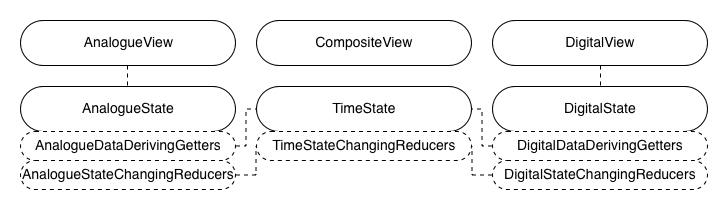

# Review of state management in React: summary and prospect

In [the initial article](../01-getting-started-with-an-mvc-example/README.md), thinking that doing good state management is necessary to develop a good React app but there is no clear winner yet among today's widely-accepted libraries of state management in React, 2 questions were raised:

1. How good are today's widely-accepted libraries of state management in React?
1. What does a better library of state management in React look like?

Then, with [the example of the composite clock built with MVC pattern](https://github.com/licg9999/review-of-state-management-in-react/tree/master/01-getting-started-with-an-mvc-example) from the initial article as a baseline, in the previous articles, for each widely-accepted library of [reducer-like solutions](../02-reducer-like-solutions-redux-and-its-family/README.md), [facebook's experiment](../03-facebook-s-experiment-recoil/README.md), [lightweight trials](../04-kinds-of-lightweight-trials-mobx-zustand-jotai-and-valtio/README.md), I've rebuilt the same example module with it and reviewed how good it is in comparison with the baseline to answer the question #1.

And now, by this article, I would summarize all of those reviews for a more comprehensive overall understanding of today's widely-accepted libraries of state management in React, then find out useful insights and try to give a prospect of a better library to answer the question #2.

## Table of contents

- [Summary for today's widely-accepted libraries](#summary_for_today_s_widely_accepted_libraries)
- [Prospect of a better library](#prospect_of_a_better_library)
- [Postscript](#postscript)

## Summary for today's widely-accepted libraries<a id="summary_for_today_s_widely_accepted_libraries"></a>

Firstly, for an easy reference, let me collect briefs of all the previous reviews from the previous articles as follows:

_MVC pattern:_

- _Pros:_ The app domain being clearly split.
- _Cons:_ Unpredictable states changing due to difficulties in fully tracking state-changing events.
- _Sum-up:_ Unpredictable states changing (but with limited benefits in other aspects).

_Redux family:_

- _Pros:_ Predictable one-state changing at no cost of tracking any state-changing logics and predictable multi-state changing at limited cost of tracking reducers/slices and actions.
- _Cons:_ (1) High coupling between reducers and their actions. (2) Incomplete modularization by default.
- _Sum-up_: Predictable states changing at limited cost of only tracking multi-state changing logics but at high overall cost of development.

_Recoil:_

- _Pros:_ (1) Predictable states changing at limited cost of tracking state-changing hooks. (2) Nestability of Recoil roots.
- _Cons:_ (1) Handling asynchronousness burdens. (2) Naming unique keys for states.
- _Sum-up:_ Predictable states changing at limited cost of tracking state-changing logics as well as at extra cost of handling asynchronousness burdens and naming unique keys for states.

_MobX:_

- _Pros:_ (1) Predictable states changing at limited cost of tracking store methods. (2) The app domain being clearing split.
- _Cons:_ A strong understanding of MobX's subscription mechanism needed.
- _Sum-up:_ Predictable states changing at limited cost of tracking state-changing logics as well as at extra cost of correctly using the subscription mechanism.

_Zustand:_

- _Pros:_ Predictable one-state changing at no cost of tracking any state-changing logics and predictable multi-state changing at limited cost of tracking store functions and multi-state changing hooks.
- _Cons:_ (1) High coupling between stores and their multi-state changing hooks. (2) Incomplete modularization by default. (3) No strong support is provided for data deriving and initial states assigning.
- _Sum-up:_ Predictable states changing at limited cost of only tracking multi-state changing logics but at a bit high overall cost of development.

_Jotai:_

- _Pros:_ (1) Predictable states changing at limited cost of tracking state-changing hooks. (2) Nestability of Jotai store providers.
- _Cons:_ Not much.
- _Sum-up:_ Predictable states changing at limited cost of tracking state-changing logics.

_Valtio:_

- _Pros:_ Predictable states changing at limited cost of tracking state-changing hooks.
- _Cons:_ (1) Incomplete modularization by default. (2) No strong support is provided for initial states assigning.
- _Sum-up:_ Predictable states changing at limited cost of tracking state-changing logics as well as at extra cost of resolving incomplete modularization.

Some details referenced later might not be listed here but you can always find them in the previous articles.

In terms of the pros of the widely-accepted libraries, they all achieve predictable states changing at limited cost of tracking state-changing logics to some extent. (1) Libraries like Redux family and Zustand achieve predictable states changing at limited cost of only tracking multi-state changing logics. In libraries of this kind, a one-state changing procedure is defined in a way of getting what one state it changes to be understood clearly by only checking its declarative information. A multi-state changing procedure is defined by involving one-state changing procedures arbitrarily. (2) Libraries like Recoil and MobX achieve predictable states changing at limited cost of tracking both one-state changing logics and multi-state changing logics. In libraries of this kind, a state-changing procedure is defined by invoking state-changing calls to one or more states arbitrarily.

Libraries of kind #1 achieve more predictable states changing than those of kind #2, because the less state-changing logics need to be tracked, the less chances of untracked state-changing logics for unpredictability come. But, on the other hand, because high coupling between one-state changing precedures and multi-state changing procedures in libraries of kind #1 is unavoidable, overall cost of development with libraries of kind #1 is high. So, it's hard to tell libraries of which kind are better.

In terms of the cons of the widely-accepted libraries, except the by-design cons like high coupling that are binded with the pros, the cons are mostly caused by the preferences. (1) Like Redux, RTK, Zustand and Valtio, the preference of organizing states as app-wide ones by default leads to incomplete modularization by default. (2) Like Recoil, the preference of caring much about asynchronousness lets in burdens of handling it. (3) Like MobX, the preference of working independently from React results in a strong understanding of MobX's subscription mechanism. (4) Like Zustand and Valtio, the preference of no strong support for fundamental usages like data deriving and initial states assigning decreases the usability.

The by-preference cons bring more inconvenience than convenience in state managemenet, so the less cons of this kind are there, the better a library becomes. From the perspective of this, Jotai stands out a bit.

## Prospect of a better library<a id="prospect_of_a_better_library"></a>

Next, let me get into the question #2, _What does a better library of state management in React look like?_. Today, some libraries achieve predictable states changing at limited cost of only tracking multi-state changing logics but at high overall cost of development, other libraries achieve predictable states changing at limited cost of tracking both one-state changing logics and multi-state changing logics but can end up with acceptable overall cost. So, what if here comes a new library that achieves predictable states changing without tracking either one-state changing logics or multi-state changing logics? Then, that will be the better library that achieve more predictable state changing than ever. And, the question becomes, how to design a new library of that kind?

Thinking of Redux, one-state changing logics are defined by reducers. Because each reducer is a pure function that processes one state to return a new state of the one without any side effects, what one state a reducer changes can be clearly understood by only reading the reducer's function declaration, which makes one-state changing in Redux predictable at no cost of tracking any state-changing logics. So, what if, in the new library, both one-state changing logics and multi-state changing logics can be defined by reducers? Then, both one-state changing and multi-state changing become predictable at no cost of tracking any state-changing logics. Also, as multi-state changing logics don't have to depend on one-state changing logics any more, high coupling between one-state changing and multi-state changing in Redux gets eliminated, which lowers overall cost of development. Reducers of that kind can be depicted as follows:

```ts
type Reducer<TStates, TPayloads extends []> = (
  oneOrMoreStates: TStates,
  ...payloads: TPayloads
) => TStates;
```

Further more, every rest part involved in state management is supposed to be designed for low cost, too. For representing a state, the simplest form would be a state config that identifies the state and provides the default state along with the state type. Then, a Plain Old JavaScript Object(POJO) can do the job well. To distinguish state configs from the states they represent, I can put the prefix `$` to names of these POJOs of state configs. For representing a derived datum, the simplest form would be the calculation procedure itself. Then, a pure function of a getter on one or more states can work. They can be depicted as follows:

```ts
// The config of the 'stateA'
const $stateA: StateA = {
  ...
};

interface StateA {
  ...
}

// The calculation procedure of the 'derivedDatumX'
function getDerivedDatumX(...): ... {
  ...
};
```

I would call this new library of state management in React as 'MyLib' for now. The minimal interfaces provided by MyLib are can be listed as follows. The 'operate' invokes reducers for states changing. The 'snapshot' accesses states for rendering. The 'store' along with the store provider host states:

```ts
import type { PropsWithChildren } from 'react';

export interface MyBaseState {}

export interface MyOperate {
  <TFn extends AnyFn>(
    $oneOrMoreStates: Parameter0<TFn>,
    fn: TFn,
    ...payloads: ParametersExcept0<TFn>
  ): ReturnType<typeof fn>;
}

export function useMyOperate(): MyOperate;

export function useMySnapshot<TState extends MyBaseState>($state: TState): TState;
export function useMySnapshot<TState extends MyBaseState, TValue = TState>(
  $state: TState,
  select: (state: TState) => TValue
): TValue;

export interface MyStore {
  getState<TState extends MyBaseState>($state: TState): TState;

  setState<TState extends MyBaseState>(
    $state: TState,
    stateOrGetState: TState | ((oldState: TState) => TState)
  ): TState;
}

export interface MyStoreProviderProps extends PropsWithChildren {
  initialize?(store: MyStore): void;
}

export function MyStoreProvider(props: MyStoreProviderProps): ReactElement;

export function useMyStore(): MyStore;

type AnyFn = (...args: any) => any;

type Parameter0<TFn extends AnyFn> = TFn extends (arg0: infer P, ...args: any) => any ? P : never;

type ParametersExcept0<TFn extends AnyFn> = TFn extends (arg0: any, ...args: infer P) => any
  ? P
  : never;
```

The preliminary implementation of MyLib is hosted at [review-of-state-management-in-react/05-summary-and-prospect/src/MyLib](https://github.com/licg9999/review-of-state-management-in-react/tree/master/05-summary-and-prospect/src/MyLib). Now, let me rebuild the baseline example module with MyLib to check out how good it is in comparison.

For the requirement of the example module, let me recall it a bit in case a reader might not have time to fully read the previous articles. If the previous articles have been read, following paragraphs can be skipped:


A composite clock is an interactive module that has 2 components, an analogue clock and a digital clock. The 2 child clocks always tick synchronously and can be set to new time by users. The analogue one can have its minute hand dragged. The digital one can have its text edited.

Although it's doable to use single big shared state for this example module, it's not always a good idea to use single big shared state for a real-world app because it brings poor maintainability of quality attributes([ISO/IEC 9126-1:2001](https://www.iso.org/standard/22749.html)). So, to closely emulate real-world situations, multiple related states are used here.

Then, there would be 3 related states seperately for the analogue clock, the digital clock and time itself. The state of time keeps a timestamp for the whole module. The states of the child clocks derive display data from the timestamp and accept user input data for setting the timestamp.


Then, `create-react-app` is used to initialize the React app. The option `--template typescript` is used to enable TypeScript:

```sh
$ npx create-react-app 05-summary-and-prospect --template typescript
# ...
$ cd 05-summary-and-prospect
```

The version of CRA in use is `5.0.1` and the generated directory structure looks as follows:

```sh
$ tree -I node_modules
.
├── README.md
├── package-lock.json
├── package.json
├── public
│   ├── favicon.ico
│   ├── index.html
│   ├── logo192.png
│   ├── logo512.png
│   ├── manifest.json
│   └── robots.txt
├── src
│   ├── App.css
│   ├── App.test.tsx
│   ├── App.tsx
│   ├── index.css
│   ├── index.tsx
│   ├── logo.svg
│   ├── react-app-env.d.ts
│   ├── reportWebVitals.ts
│   └── setupTests.ts
└── tsconfig.json

2 directories, 19 files
```

Then, `src/App.tsx` is cleared for later use, unused files are removed, the package of time helpers is installed:

```tsx
// src/App.tsx
import { FC } from 'react';

const App: FC = () => {
  return null;
};

export default App;
```

```sh
$ rm src/App.css src/App.test.tsx src/logo.svg
```

```sh
$ npm i date-fns
```

Then, to use MyLib, let me copy [it](https://github.com/licg9999/review-of-state-management-in-react/tree/master/05-summary-and-prospect/src/MyLib) into `src/MyLib`. Besides, to get `for...of` statements in MyLib to work, `tsconfig.json` needs to be adjusted a bit:

```diff
{
  "compilerOptions": {
    "target": "es5",
    "lib": ["dom", "dom.iterable", "esnext"],
    "allowJs": true,
    "skipLibCheck": true,
    "esModuleInterop": true,
    "allowSyntheticDefaultImports": true,
    "strict": true,
    "forceConsistentCasingInFileNames": true,
    "noFallthroughCasesInSwitch": true,
    "module": "esnext",
    "moduleResolution": "node",
    "resolveJsonModule": true,
    "isolatedModules": true,
    "noEmit": true,
-    "jsx": "react-jsx"
+    "jsx": "react-jsx",
+    "downlevelIteration": true
  },
  "include": ["src"]
}
```

The example module, the composite clock, would be all placed in `src/CompositeClock`. To match the 3 requried states, there would be 3 groups of state configs, data deriving getters and state-changing reducers.

And for view components, there are `AnalogueView.ts` for the analogue clock, `DigitalView.ts` for the digital clock, and `CompositeView.ts` as a glue. Besides, store providers are initialized at little cost.



The 3 groups of state configs, data deriving getters and state-changing reducers are coded as follows:

```ts
// src/CompositeClock/TimeState.ts
export interface TimeState {
  timestamp: number;
}

export const $timeState: TimeState = {
  timestamp: 0,
};

export function changeTimestamp(timeState: TimeState, timestamp: number): TimeState {
  return { ...timeState, timestamp };
}
```

```ts
// src/CompositeClock/AnalogueState.ts
import { changeTimestamp, TimeState } from './TimeState';

const TWO_PI = 2 * Math.PI;

export interface AnalogueAngles {
  hour: number;
  minute: number;
  second: number;
}

export interface AnalogueState {
  isEditMode: boolean;
  editModeAngles: AnalogueAngles;
}

export const $analogueState: AnalogueState = {
  isEditMode: false,
  editModeAngles: { hour: 0, minute: 0, second: 0 },
};

export function getDisplayAngles(timeState: TimeState): AnalogueAngles {
  const d = new Date(timeState.timestamp);
  return {
    hour: ((d.getHours() % 12) / 12) * TWO_PI + (d.getMinutes() / 60) * (TWO_PI / 12),
    minute: (d.getMinutes() / 60) * TWO_PI + (d.getSeconds() / 60) * (TWO_PI / 60),
    second: (d.getSeconds() / 60) * TWO_PI,
  };
}

export function enterEditMode([state, timeState]: [AnalogueState, TimeState]): [
  AnalogueState,
  TimeState
] {
  if (state.isEditMode) return [state, timeState];
  return [{ ...state, isEditMode: true, editModeAngles: getDisplayAngles(timeState) }, timeState];
}

export function exitEditMode(
  [state, timeState]: [AnalogueState, TimeState],
  submit: boolean = true
): [AnalogueState, TimeState] {
  if (!state.isEditMode) return [state, timeState];
  if (submit) {
    const d = new Date(timeState.timestamp);
    d.setHours(
      Math.floor((state.editModeAngles.hour / TWO_PI) * 12) + 12 * Math.floor(d.getHours() / 12)
    );
    d.setMinutes((state.editModeAngles.minute / TWO_PI) * 60);
    d.setSeconds((state.editModeAngles.second / TWO_PI) * 60);
    timeState = changeTimestamp(timeState, d.getTime());
  }
  return [{ ...state, isEditMode: false }, timeState];
}

export function changeEditModeMinuteAngle(
  state: AnalogueState,
  minuteAngle: number
): AnalogueState {
  return {
    ...state,
    editModeAngles: {
      ...state.editModeAngles,
      minute: (minuteAngle + TWO_PI) % TWO_PI,
      hour:
        (Math.floor((state.editModeAngles.hour / TWO_PI) * 12) + minuteAngle / TWO_PI) *
        (TWO_PI / 12),
    },
  };
}
```

```ts
// src/CompositeClock/DigitalState.ts
import { format, isMatch, parse } from 'date-fns';
import { changeTimestamp, TimeState } from './TimeState';

export const DIGITAL_TEXT_FORMAT = 'HH:mm:ss';

export interface DigitalState {
  isEditMode: boolean;
  editModeText: string;
}

export const $digitalState: DigitalState = {
  isEditMode: false,
  editModeText: '',
};

export function getDisplayText(timeState: TimeState): string {
  return format(timeState.timestamp, DIGITAL_TEXT_FORMAT);
}

export function isEditModeTextValid(state: DigitalState): boolean {
  return isMatch(state.editModeText, DIGITAL_TEXT_FORMAT);
}

export function enterEditMode([state, timeState]: [DigitalState, TimeState]): [
  DigitalState,
  TimeState
] {
  if (state.isEditMode) return [state, timeState];
  return [{ ...state, isEditMode: true, editModeText: getDisplayText(timeState) }, timeState];
}

export function exitEditMode(
  [state, timeState]: [DigitalState, TimeState],
  submit: boolean = true
): [DigitalState, TimeState] {
  if (!state.isEditMode) return [state, timeState];
  if (submit && isEditModeTextValid(state)) {
    timeState = changeTimestamp(
      timeState,
      parse(state.editModeText, DIGITAL_TEXT_FORMAT, timeState.timestamp).getTime()
    );
  }
  return [{ ...state, isEditMode: false }, timeState];
}

export function changeEditModeText(state: DigitalState, editModeText: string): DigitalState {
  return { ...state, editModeText };
}
```

And, view components are coded as follows:

```tsx
// src/CompositeClock/AnalogueView.tsx
import { FC, useCallback, useEffect } from 'react';
import { useMyOperate, useMySnapshot } from '../MyLib';
import {
  $analogueState,
  changeEditModeMinuteAngle,
  enterEditMode,
  exitEditMode,
  getDisplayAngles,
} from './AnalogueState';
import styles from './AnalogueView.module.css';
import { $timeState } from './TimeState';

const TWO_PI = 2 * Math.PI;

interface Props {
  className?: string;
}

export const AnalogueView: FC<Props> = ({ className }) => {
  const operate = useMyOperate();
  const { isEditMode, editModeAngles } = useMySnapshot($analogueState);
  const displayAngles = useMySnapshot($timeState, getDisplayAngles);

  const angles = isEditMode ? editModeAngles : displayAngles;

  const calcEditModeMinuteAngle = useCallback(
    (pointX: number, pointY: number): number => {
      const pointLen = Math.sqrt(Math.pow(pointX, 2) + Math.pow(pointY, 2));

      const normalizedX = pointX / pointLen;
      const normalizedY = pointY / pointLen;

      const oldX = Math.sin(editModeAngles.minute);
      const oldY = Math.cos(editModeAngles.minute);

      const rawMinuteAngle = Math.acos(normalizedY);

      const minuteAngle =
        normalizedY > 0 && oldY > 0
          ? normalizedX >= 0
            ? oldX < 0
              ? rawMinuteAngle + TWO_PI
              : rawMinuteAngle
            : oldX >= 0
            ? -rawMinuteAngle
            : -rawMinuteAngle + TWO_PI
          : normalizedX >= 0
          ? rawMinuteAngle
          : -rawMinuteAngle + TWO_PI;

      return minuteAngle;
    },
    [editModeAngles]
  );

  const onMinuteHandMouseDown = useCallback(
    (e: React.MouseEvent<HTMLDivElement>) => {
      e.preventDefault();
      operate([$analogueState, $timeState], enterEditMode);
    },
    [operate]
  );

  const onMouseLeave = useCallback(() => {
    operate([$analogueState, $timeState], exitEditMode);
  }, [operate]);

  const onMouseUp = useCallback(() => {
    operate([$analogueState, $timeState], exitEditMode);
  }, [operate]);

  const onKeyDown = useCallback(
    (e: KeyboardEvent): void => {
      if (isEditMode && e.key === 'Escape') {
        operate([$analogueState, $timeState], exitEditMode, false);
      }
    },
    [operate, isEditMode]
  );

  const onMouseMove = useCallback(
    (e: React.MouseEvent<HTMLDivElement>): void => {
      if (!isEditMode) return;

      const boundingBox = e.currentTarget.getBoundingClientRect();
      const originX = boundingBox.x + boundingBox.width / 2;
      const originY = boundingBox.y + boundingBox.height / 2;

      const pointX = e.clientX - originX;
      const pointY = originY - e.clientY;

      operate($analogueState, changeEditModeMinuteAngle, calcEditModeMinuteAngle(pointX, pointY));
    },
    [operate, calcEditModeMinuteAngle, isEditMode]
  );

  useEffect(() => {
    window.addEventListener('keydown', onKeyDown);
    return () => window.removeEventListener('keydown', onKeyDown);
  }, [onKeyDown]);

  return (
    <div
      className={`${className ?? ''} ${styles.root} ${isEditMode ? styles.editMode : ''}`}
      onMouseLeave={onMouseLeave}
      onMouseUp={onMouseUp}
      onMouseMove={onMouseMove}
    >
      <div className={styles.axis} />
      <div
        className={`${styles.hand} ${styles.hour}`}
        style={{ transform: `rotateZ(${angles.hour}rad)` }}
      />
      <div
        className={`${styles.hand} ${styles.minute}`}
        style={{ transform: `rotateZ(${angles.minute}rad)` }}
        onMouseDown={onMinuteHandMouseDown}
      />
      <div
        className={`${styles.hand} ${styles.second}`}
        style={{ transform: `rotateZ(${angles.second}rad)` }}
      />
    </div>
  );
};
```

```css
/* src/CompositeClock/AnalogueView.module.css */
.root {
  margin: 12px;
  padding: 8px;
  width: 160px;
  height: 160px;
  border-radius: 100%;
  border: 1px solid black;
  position: relative;
}

.axis {
  position: absolute;
  background-color: black;
  left: 47.5%;
  top: 47.5%;
  width: 5%;
  height: 5%;
  border-radius: 100%;
}

.hand {
  position: absolute;
  background-color: black;
  transform-origin: bottom center;
}

.hand.hour {
  left: 48.5%;
  top: 25%;
  height: 25%;
  width: 3%;
}

.hand.minute {
  left: 49%;
  top: 10%;
  height: 40%;
  width: 2%;
  z-index: 10;
  cursor: pointer;
}

.hand.second {
  left: 49.5%;
  top: 10%;
  height: 40%;
  width: 1%;
}

.editMode.root {
  outline: 2px solid skyblue;
}
```

```tsx
// src/CompositeClock/DigitalView.tsx
import { FC, useCallback, useEffect, useRef } from 'react';
import { useMyOperate, useMySnapshot } from '../MyLib';
import {
  $digitalState,
  changeEditModeText,
  DIGITAL_TEXT_FORMAT,
  enterEditMode,
  exitEditMode,
  getDisplayText,
  isEditModeTextValid,
} from './DigitalState';
import styles from './DigitalView.module.css';
import { $timeState } from './TimeState';

interface Props {
  className?: string;
}

export const DigitalView: FC<Props> = ({ className }) => {
  const operate = useMyOperate();
  const state = useMySnapshot($digitalState);
  const { isEditMode, editModeText } = state;
  const displayText = useMySnapshot($timeState, getDisplayText);

  const refEditor = useRef<HTMLInputElement | null>(null);

  const onDisplayClick = useCallback(() => {
    operate([$digitalState, $timeState], enterEditMode);
  }, [operate]);

  const onEditorBlur = useCallback(() => {
    operate([$digitalState, $timeState], exitEditMode, false);
  }, [operate]);

  const onEditorChange = useCallback(
    (e: React.ChangeEvent<HTMLInputElement>) => {
      operate($digitalState, changeEditModeText, e.target.value);
    },
    [operate]
  );

  const onEditorKeyDown = useCallback(
    (e: React.KeyboardEvent) => {
      if (e.key === 'Enter') {
        operate([$digitalState, $timeState], exitEditMode);
      }
    },
    [operate]
  );

  useEffect(() => {
    if (isEditMode && refEditor.current) {
      refEditor.current.select();
    }
  }, [isEditMode]);

  return (
    <div className={`${className ?? ''} ${styles.root} ${isEditMode ? styles.editMode : ''}`}>
      {isEditMode ? (
        <>
          <input
            className={styles.editor}
            type="text"
            ref={refEditor}
            value={editModeText}
            onBlur={onEditorBlur}
            onChange={onEditorChange}
            onKeyDown={onEditorKeyDown}
          />
          {!isEditModeTextValid(state) && (
            <div className={styles.invalidHint}>
              The input time doesn't match the expected format which is '{DIGITAL_TEXT_FORMAT}'.
            </div>
          )}
        </>
      ) : (
        <div onClick={onDisplayClick}>{displayText}</div>
      )}
    </div>
  );
};
```

```css
/* src/CompositeClock/DigitalView.module.css */
.root {
  border: 1px solid black;
  width: 200px;
  line-height: 30px;
  text-align: center;
}

.editor {
  width: 100%;
  text-align: center;
  font-size: inherit;
  padding: 0;
  border: none;
  outline: none;
}

.invalidHint {
  line-height: 1.2;
}

.editMode.root {
  outline: 2px solid skyblue;
}
```

```tsx
// src/CompositeClock/CompositeView.tsx
import { FC, useCallback, useEffect, useRef } from 'react';
import { useMyOperate, useMySnapshot, useMyStore } from '../MyLib';
import { $analogueState } from './AnalogueState';
import { AnalogueView } from './AnalogueView';
import styles from './CompositeView.module.css';
import { $digitalState } from './DigitalState';
import { DigitalView } from './DigitalView';
import { $timeState, changeTimestamp } from './TimeState';

export const CompositeView: FC = () => {
  const operate = useMyOperate();
  const store = useMyStore();
  const isEditModeInAnalogueClock = useMySnapshot(
    $analogueState,
    (analogueState) => analogueState.isEditMode
  );
  const isEditModeInDigitalClock = useMySnapshot(
    $digitalState,
    (digitalState) => digitalState.isEditMode
  );

  const calcTimestampCorrection = useCallback(
    () => store.getState($timeState).timestamp - Date.now(),
    [store]
  );

  const refTimeCorrection = useRef<number>(calcTimestampCorrection());

  useEffect(() => {
    if (!isEditModeInAnalogueClock || !isEditModeInDigitalClock) {
      refTimeCorrection.current = calcTimestampCorrection();
    }
  }, [calcTimestampCorrection, isEditModeInAnalogueClock, isEditModeInDigitalClock]);

  useEffect(() => {
    const tickHandler = setInterval(
      () => operate($timeState, changeTimestamp, Date.now() + refTimeCorrection.current),
      100
    );
    return () => clearInterval(tickHandler);
  }, [operate]);

  return (
    <div className={styles.root}>
      <AnalogueView />
      <DigitalView />
    </div>
  );
};
```

```css
/* src/CompositeClock/CompositeView.module.css */
.root {
  margin: 16px 8px;
  font-size: 16px;
}
```

After that, store providers are initialized per app for app-wide states and per module for module-wide states:

```tsx
// src/index.tsx
import React from 'react';
import ReactDOM from 'react-dom/client';
import App from './App';
import './index.css';
import { MyStoreProvider } from './MyLib';
import reportWebVitals from './reportWebVitals';

const root = ReactDOM.createRoot(document.getElementById('root') as HTMLElement);
root.render(
  <React.StrictMode>
    <MyStoreProvider>
      <App />
    </MyStoreProvider>
  </React.StrictMode>
);

// If you want to start measuring performance in your app, pass a function
// to log results (for example: reportWebVitals(console.log))
// or send to an analytics endpoint. Learn more: https://bit.ly/CRA-vitals
reportWebVitals();
```

```diff
// src/CompositeClock/CompositeView.tsx
import { FC, useCallback, useEffect, useRef } from 'react';
-import { useMyOperate, useMySnapshot, useMyStore } from '../MyLib';
+import { MyStoreProvider, useMyOperate, useMySnapshot, useMyStore } from '../MyLib';

...

+export const CompositeClock: FC = () => {
+  return (
+    <MyStoreProvider
+      initialize={(store) => {
+        store.setState($timeState, { timestamp: Date.now() });
+      }}
+    >
+      <CompositeView />
+    </MyStoreProvider>
+  );
+};
```

Then, the composite clock is exported and used in `App.tsx`:

```ts
// src/CompositeClock/index.ts
export { CompositeClock } from './CompositeView';
```

```diff
import { FC } from 'react';
+import { CompositeClock } from './CompositeClock';

const App: FC = () => {
-  return null;
+  return <CompositeClock />;
};

export default App;
```

The example module built with MyLib is complete. It can be previewed with the command `npm start` and its codebase is hosted at [review-of-state-management-in-react/05-summary-and-prospect](https://github.com/licg9999/review-of-state-management-in-react/tree/master/05-summary-and-prospect).

In MyLib, both one-state changing logics and multi-state changing logics are defined by reducers. Because each reducer is a pure function that processes one or multi state to return new states of the one or the multi without any side effects, what states a reducer changes can be clearly understood by only reading the reducer's function declaration, which makes both one-state changing and multi-state changing in MyLib predictable at no cost of tracking any state-changing logics. Predictable states changing without tracking any function bodies makes up the brightest pro of MyLib.

Meanwhile, as multi-state changing logics don't have to depend on one-state changing logics, there is no more high coupling between one-state changing and multi-state changing. Also, as all the previously found by-preference cons are resolved by design, no extra cost of development is taken. So, there is no noticeable con.

As a sum-up, doing state management with MyLib achieves predictable states changing without tracking any state-changing logics and at low overall cost of development. In this way, a better library of state management in React can be designed.

## Postscript<a id="postscript"></a>

By far, the series of articles entitled with 'Review of state management in React: ...' gets finalized. All the today's widely-accepted libraries of state management have been reviewed and a prospect of a better library has been given. The whole codebase of articles and examples is hosted at [licg9999/review-of-state-management-in-react](https://github.com/licg9999/review-of-state-management-in-react). To develop a good React app, doing good state management is necessary. To do good state management, a good solution of state management is necessary. I believe these articles are not either the first ones or the last ones searching for better solutions of state management. But, at lease, I only wish these articles can get us developers one step closer to one of them.
